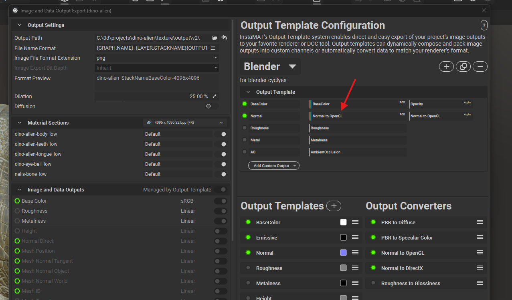

# Game Development Notes

Notes to make an awesome game

## other tools

- pure ref
- ScreenToGif

# TODO

## Tutorials

### face animation

- [live link](https://www.youtube.com/watch?v=aM_cGEgkCV0)
- [face animation using shapes](https://www.youtube.com/watch?v=LS-U18p9LhQ&t=81s)

## skins

- [reptile scales](https://www.youtube.com/@GetLearnt/search?query=scales)

## hair

- how to make hair textures

# AI

https://github.com/DreamTechAI/Direct3D-S2

# software alternatives

- substance painter and designer - [InstaMat](https://instamaterial.com/)

# Issues

## if the cavities appear inwards or outwards oddly

- make sure the openGL or directX is configured properly before maps export
- 
- 3d software requirement
  - unreal - direct x
    - but if the gltf will be setup in blender, then export from the first software as openGL
    - the target software while importing will re process it later
  - blender - openGL
