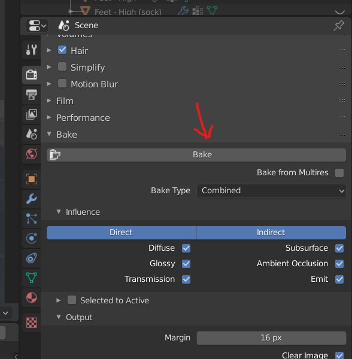
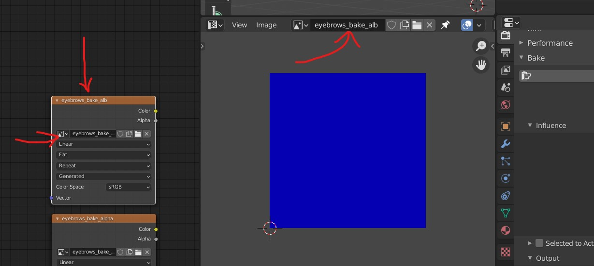
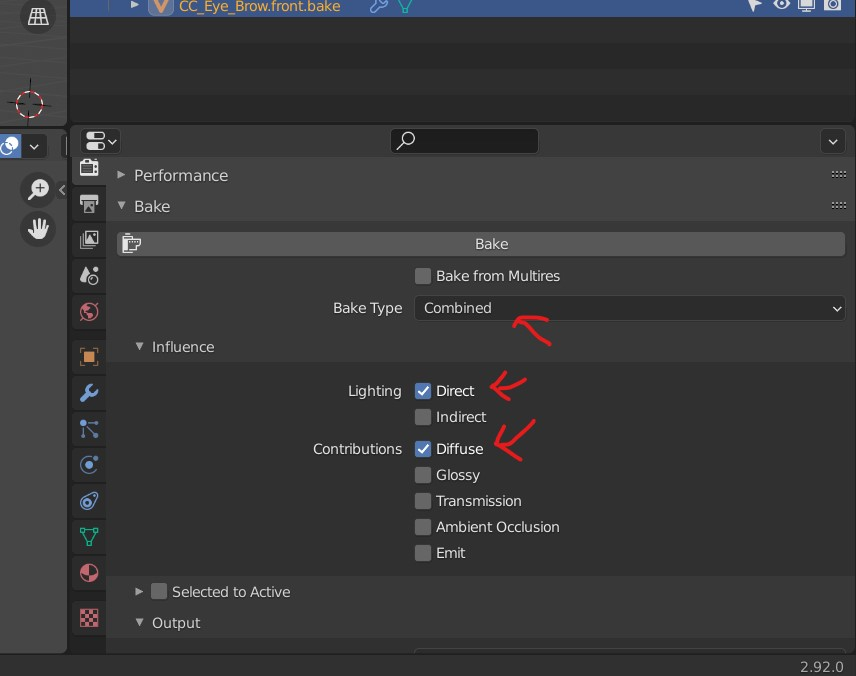
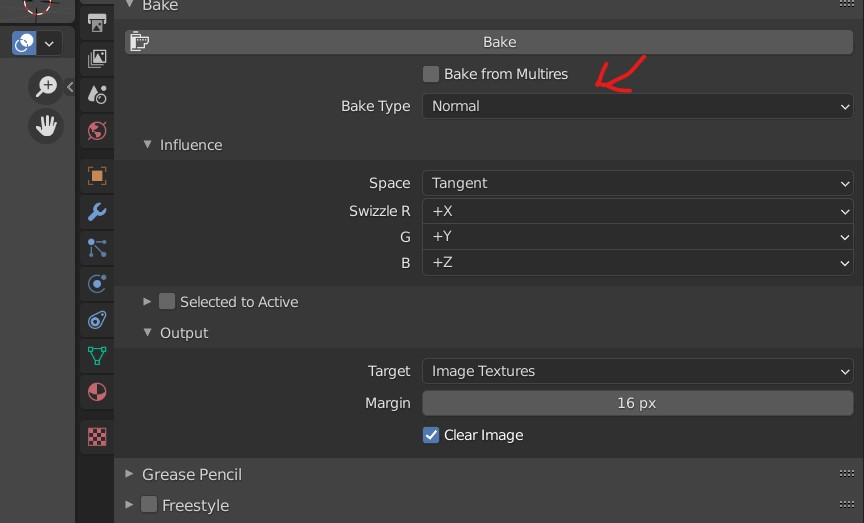
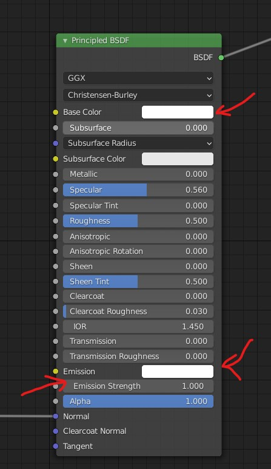
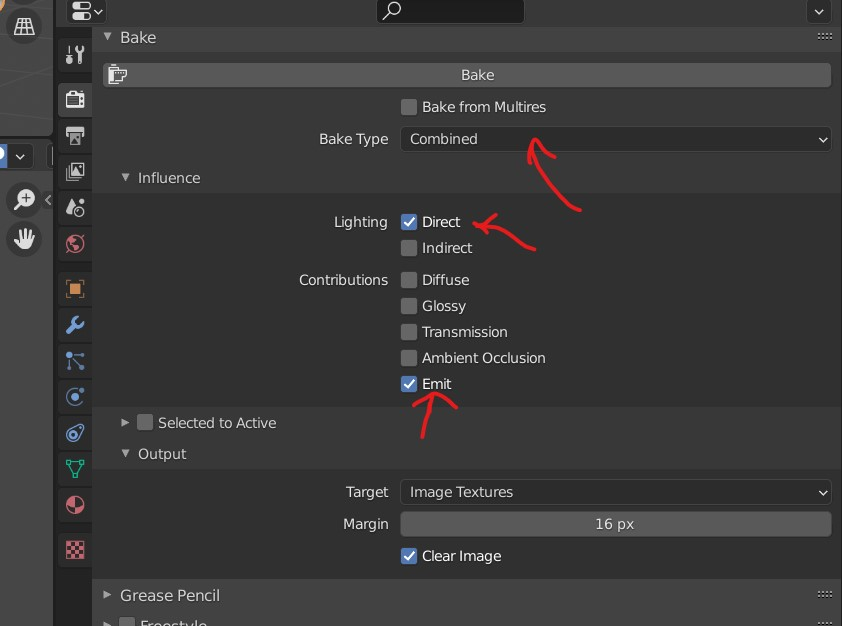

# Baking

## Create an image for "Baking"

This gives us the UV Map - only after the uv are baked and saved in image file we can edit the UV mesh

- Once the unwrap is done
- go to camera tool
- 
- Bake it to write maps in the file

## select node and UV

- in the `Shader Editor`, select image texture node
- in the `UV Editor` select the image from the above node
- 

## sampling settings

- Render - 32
- Viewport - 32

## Albedo (all colors)

- setting for the Bake engine
- 

## Normals

- setting for the Bake engine
- 

## alpha

- detach the color and set it to white
- make `Emission Strength` to 1.0
- 
- setting for the Bake engine
- 
