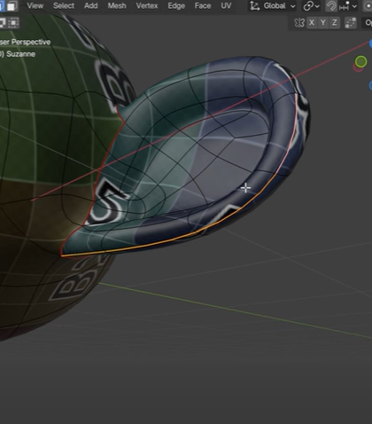

# **unwrap guide**

**TODO**: image of marking the seams

# human

mark seam around the following

- neck - to seperate the head and body
- cut from forehead to back where the hair base ends
- mark the ears where they start
- 

# quadruped

- mark seam around the following
  - neck - to seperate the head and body
  - cut the throat
