# UV Editing

**Note:** before beginning please make sure the scale is applied

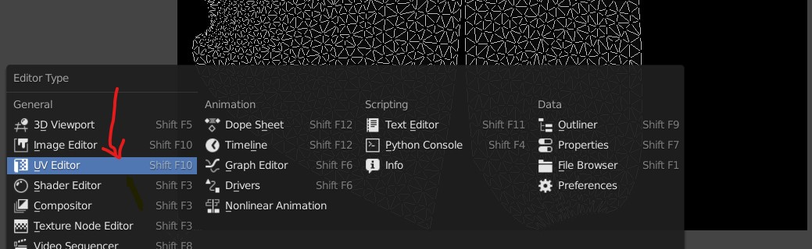

## UV editor viewport

### Reset UV unwrap

- Select the object you want to reset the UV
- Press <kbd>U</kbd> for UV editing menu
- Reset

### Enable Heat maps (show stretching)

- 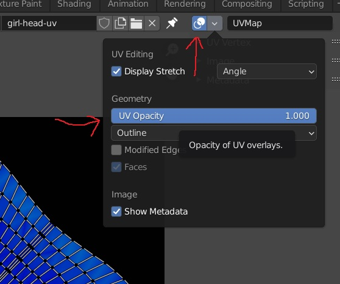

### keep the UV without mesh selection

Enable Uv Sync selection

- 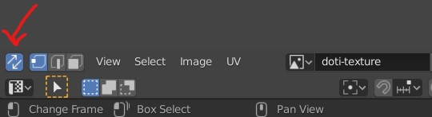

<b>Note:</b> when the sync selection is ON, pressing <kbd>L</kbd> wont work to select connected `UVs`

## UV unwrap

### create a UV image

this is just a UV checker image

- 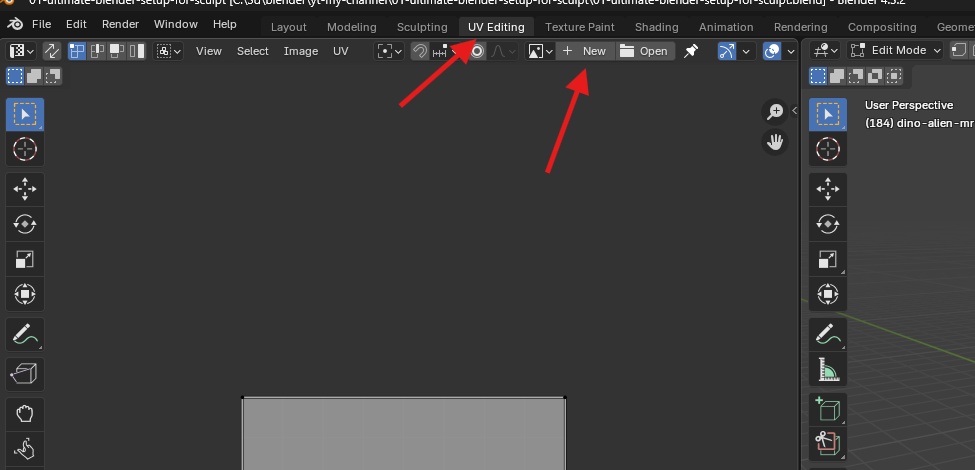
- give name like "UV.checker"
- 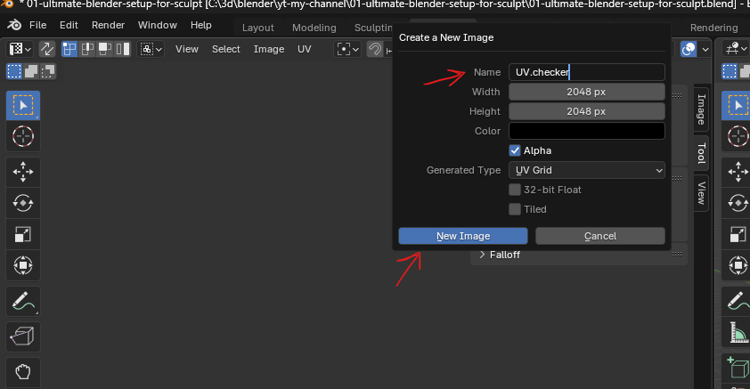
- 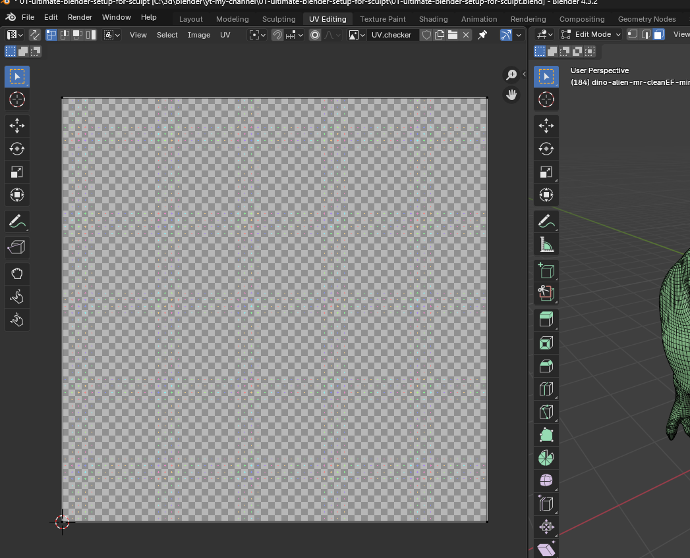

### map uvs

- first reset the faces if any
- 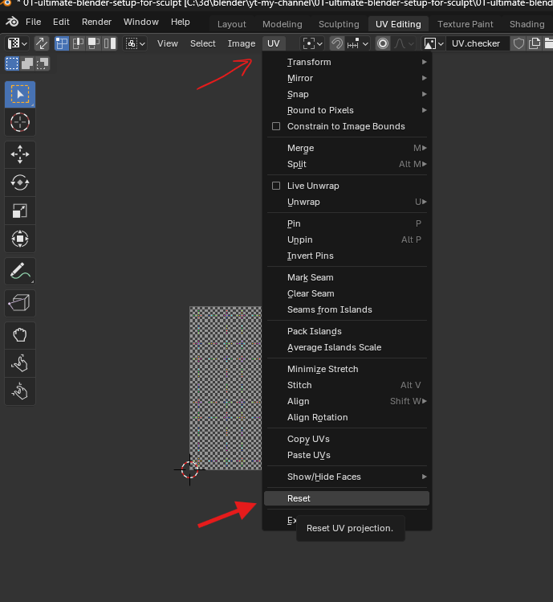
- change the view, which naturally describes the primary feature of the subject
- 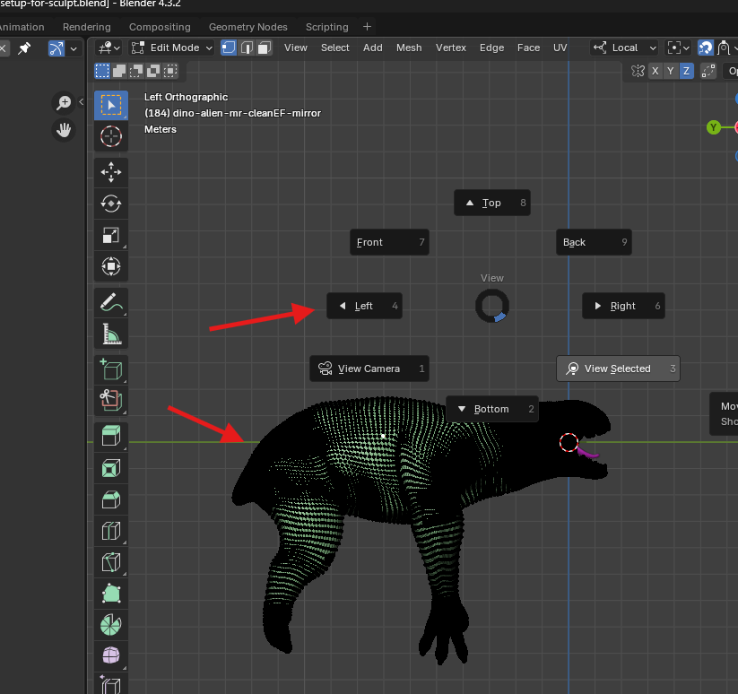
- enable the x ray mode (alt + z or from menu)
- 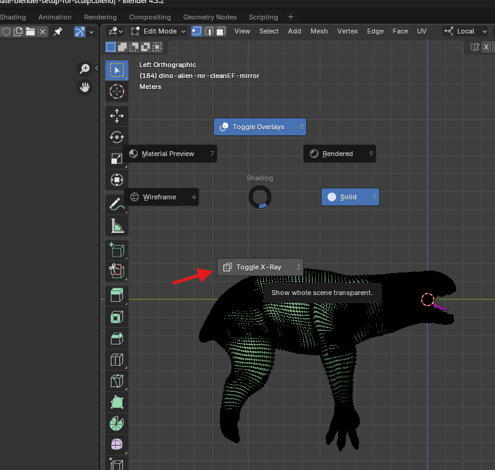
- select all the vertices
- go to UV menu and select "Project from view"
- 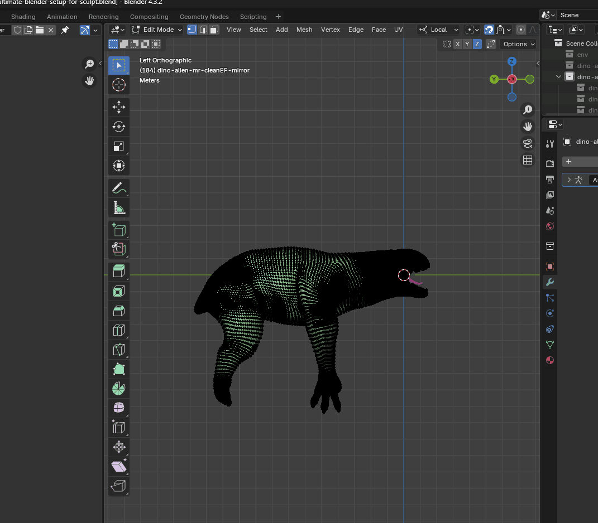
- scale and move the mapped UV
- 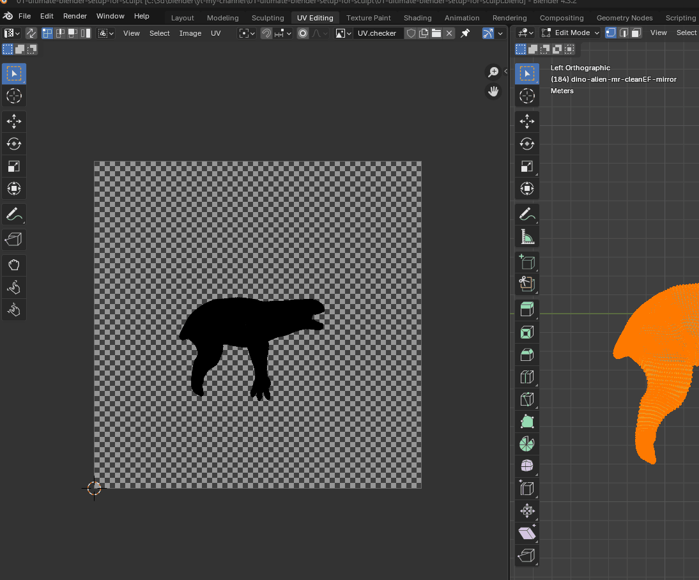

### enable the UV checker image in the material

- 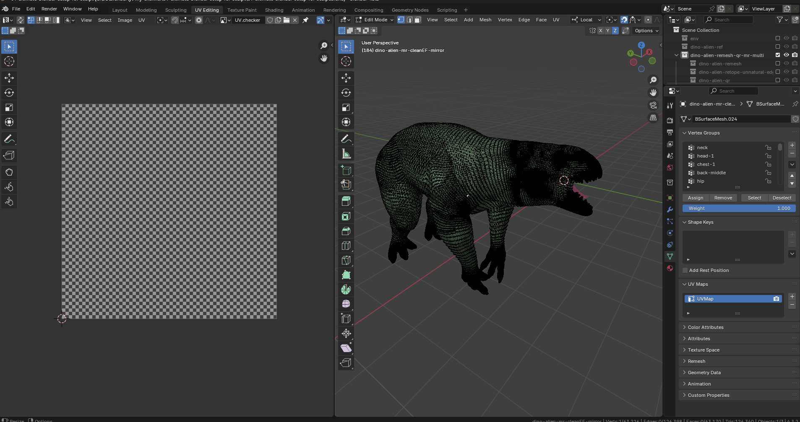
- go to shading -> select use nodes -> change the base color to image texture
- select the texture node and press ctrl + t
  - also make sure the add on "Node Wrangler" is enabled
- in the UV editor switch from solid to material mode

**Note:** the texture coordinates are important, otherwise the UV won't show correctly

### mark seam

- select the edges -> right click (or press u) -> mark seam

### mirror seam

- make a selection
- go to select menu and "select mirror"

### Perform UV editing

- select the lines on the object and <kbd>Right Click</kbd> and Mark Seam
- in the UV editor right click and unwrap
  - NOT in the edit mode editor
  - Press <kbd>U</kbd> for UV editing menu and select `Unwrap`
- also we can use the <kbd>CTRL</kbd> + <kbd>E</kbd> edge menu to mark seam

### Aling the edge

align the edges horizontaly or vertically (along X or Y axis)

- <kbd>SHIFT</kbd> + <kbd>W</kbd>
- 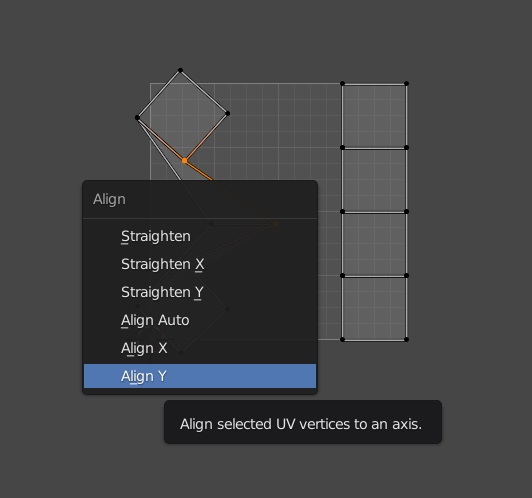

### straighten up the islands

- TODO - https://www.youtube.com/watch?v=8nvgo266xG4&ab_channel=StevenScott%28OnlineRender%29

### live unwrap

- enable live unwrap
- pin few vertices on ur uv map
- scale rest of the map

## exporting uv map

- select the map by pressing the <kbd>A</kdb>
- to go menu option `UV` and select
- 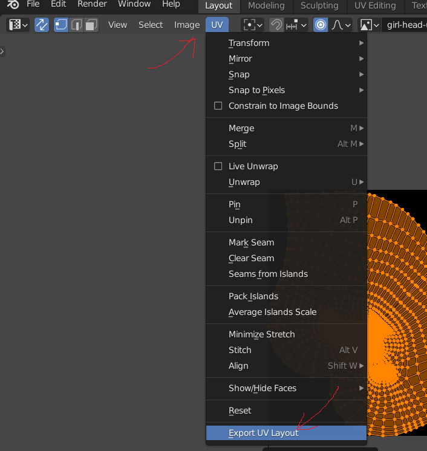

## Create normal map

### Baking nodes

- select the node where the blender should save the bake to
- do not join the node to diffuse BSDF or the output node
- 

### bake settings

settings for the creating the normal map from high poly mesh to low poly mesh

- select the mesh u want to have as normal (source mesh)
- select the destination mesh
- 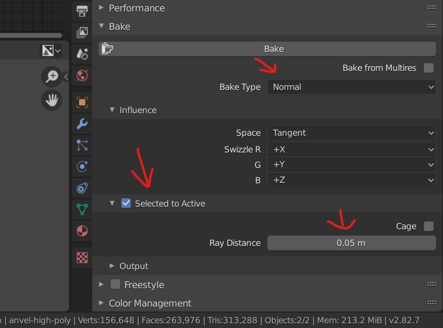
- keep the `ray distance` as low but slightyly higher than 0

#### Bug of normal maps with low resolution details

- keep the ray distance to 0.1m when placing the objects exactly overlapping on each others
- reduce the ray distance to 0.05 if the normal map doesnt give enough details

## Error while UV unwrap

- [solution](../blender.md#object-has-non-uniform-scale)
