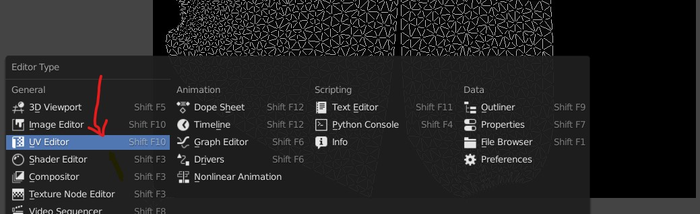
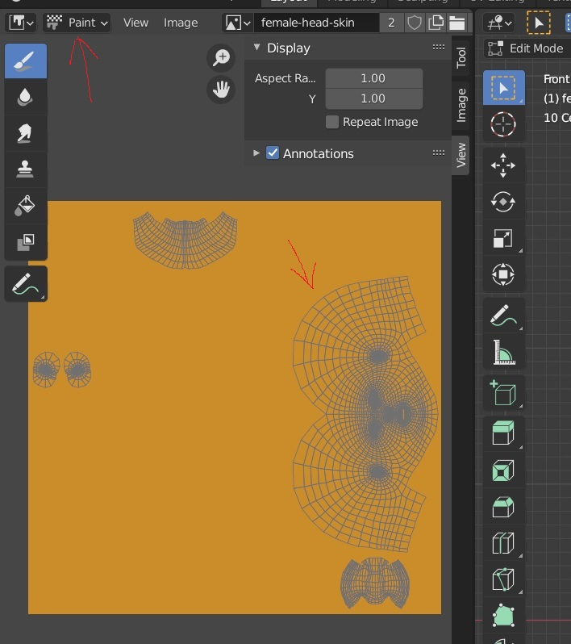
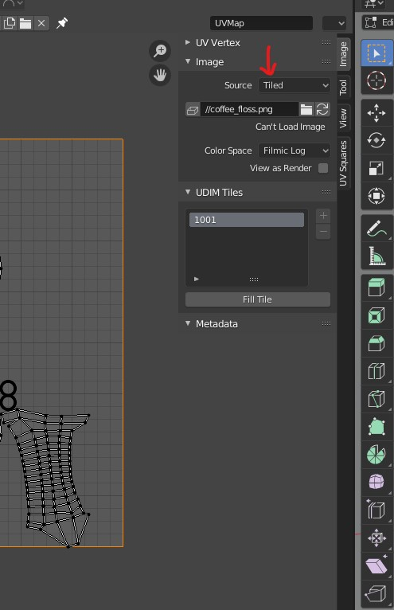
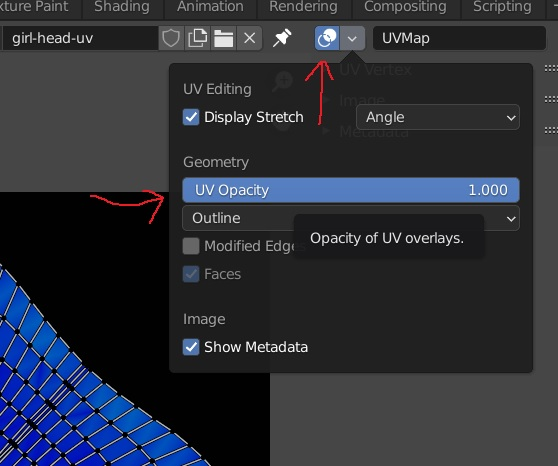
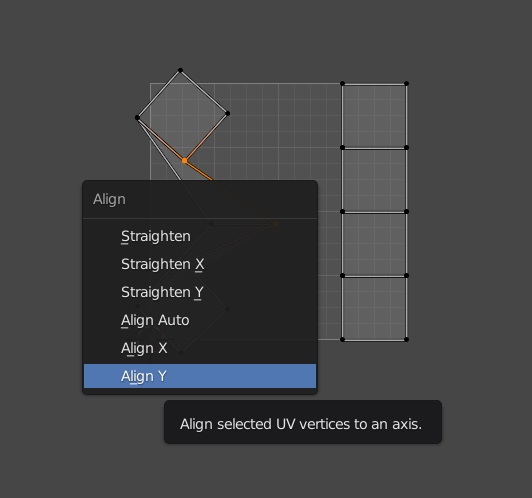
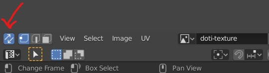
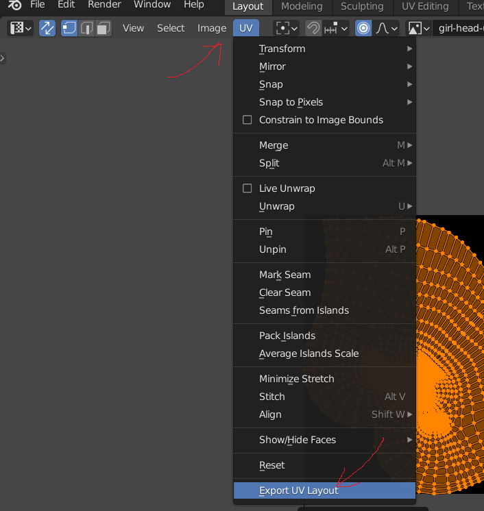
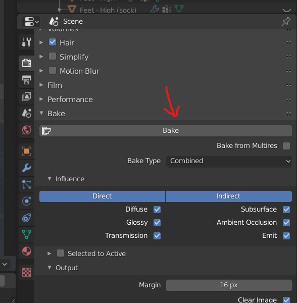
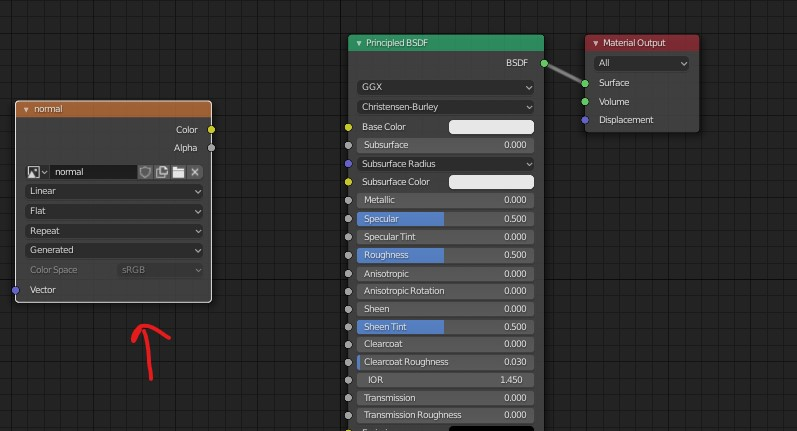
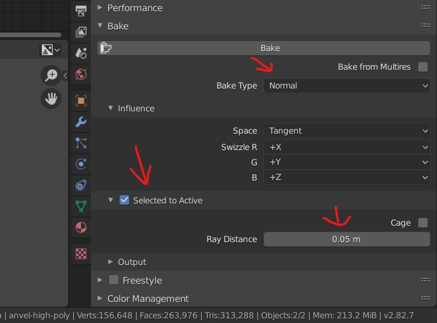

# UV Editing

## enable UVs

- go to `UV Editor`
- Enable `UV sync selection`
- go back to the image editor
- - 
- make sure the `paint` is also selected - refer above image

## UV Menu

- 

### Enable Heat maps (show stretching)

- 

## Aling the edge

align the edges horizontaly or vertically (along X or Y axis)

- <kbd>SHIFT</kbd> + <kbd>W</kbd>
- 

## Perform UV editing

- select the lines on the object and <kbd>Right Click</kbd> and Mark Seam
- Press <kbd>U</kbd> for UV editing menu and select `Unwrap`
- also we can use the <kbd>CTRL</kbd> + <kbd>E</kbd> edge menu to mark seam

### brush select

- Press <kbd>C</kbd>
  - <kbd>Right Click</kbd> to exit
  - Scroll up / down for brush size

### Reset UV unwrap

- Select the object you want to reset the UV
- Press <kbd>U</kbd> for UV editing menu
- Reset

### keep the UV without mesh selection

Enable Uv Sync selection

- 

<b>Note:</b> when the sync selection is ON, pressing <kbd>L</kbd> wont work to select connected `UVs`

## exporting uv map

- select the map by pressing the <kbd>A</kdb>
- to go menu option `UV` and select
- 

## Create an image (Baking)

This gives us the UV Map - only after the uv are baked and saved in image file we can edit the UV mesh

- Once the unwrap is done
- go to camera tool
- 
- Bake it to write maps in the file

## Create normal map

### Baking nodes

- select the node where the blender should save the bake to
- do not join the node to diffuse BSDF or the output node
- 

### bake settings

settings for the creating the normal map from high poly mesh to low poly mesh

- select the mesh u want to have as normal (source mesh)
- select the destination mesh
- 
- keep the `ray distance` as low but slightyly higher than 0

#### Bug of normal maps with low resolution details

- keep the ray distance to 0.1m when placing the objects exactly overlapping on each others
- reduce the ray distance to 0.05 if the normal map doesnt give enough details

## Error while UV unwrap

- [solution](../blender.md#object-has-non-uniform-scale)
