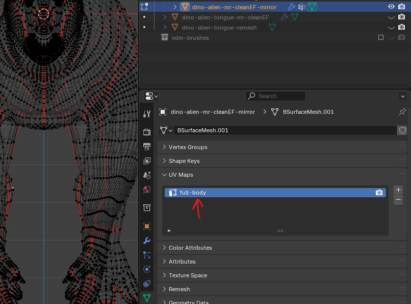

# UV Editing

**Note:** before beginning please make sure the scale is applied

## UV editor viewport

### Reset UV unwrap

- Select the object you want to reset the UV
- Press <kbd>U</kbd> for UV editing menu
- Reset
- 

### mark seam

- select the edges -> right click (or press u) -> mark seam

### Enable Heat maps (show stretching)

- 

### Sync Selection - OFF

#### selection mode

- 

### Sync Selection - ON

- if the sync selection is ON, we can select from the edit mode window (right side window), and this will select individual vertices
- 

## UV unwrap

### create a UV image

this is just a UV checker image

- 
- give name like "UV.checker"
- 
- 

### map uvs

- first reset the faces (refer above for reset)
- for hard surface do as follows
  - if change the view, which naturally describes the primary feature of the subject (ignore the organic example in the images 😉)
  - 
  - enable the x ray mode (alt + z or from menu)
  - 
  - select all the vertices
  - go to UV menu and select "Project from view"
  - 
  - scale and move the mapped UV
  - 
- for organic select the edges -> mark seam using key u -> mark seams

### enable the UV checker image in the material

- 
- go to shading -> select use nodes -> change the base color to image texture
- select the texture node and press ctrl + t
  - also make sure the add on "Node Wrangler" is enabled
- in the UV editor switch from solid to material mode

**Note:** the texture coordinates are important, otherwise the UV won't show correctly

### mirror seam

- make a selection
- go to select menu and "select mirror"

### Perform UV editing

- select the lines on the object and <kbd>Right Click</kbd> and Mark Seam
- in the UV editor right click and unwrap
  - NOT in the edit mode editor
  - Press <kbd>U</kbd> for UV editing menu and select `Unwrap`
- also we can use the <kbd>CTRL</kbd> + <kbd>E</kbd> edge menu to mark seam

### Aling the edge

align the edges horizontaly or vertically (along X or Y axis)

- <kbd>SHIFT</kbd> + <kbd>W</kbd>
- 

### make two island of same size

- 

## live unwrap

- enable live unwrap
- pin few vertices on ur uv map
- scale rest of the map

## Use multiple uv maps (NOT ideal for substance painter)

**Note:**

- that each uv map should be assigned to a new material
- also substance painter cant have seperate UV Map, even for multiple materials
  - so only the first UV map from UV map side panel will be picked
  - not even the active for rendering
  - 
  - keep like this, i.e. no extra UV map

 
 

- add a new uv map in the side panel of the mesh
- 
- select the map
- 
- create a new material - (refer blender basics note - duplcate material)
- go to edit mode and assign faces to this material (refer blender basics note - assign custom faces to material)
- configure shader editor setting for using multiple uv map
  - use `UV Map` node and select the uv map
  - connect the output to `image texture` node
  - connect `image texture` node to base color of `Principled BSDF` node
  - 

## exporting uv map

### pack islands (to save space)

- 
- 

### export uvs

- select the map by pressing the <kbd>A</kdb>
- to go menu option `UV` and select
- 

## Create normal map

### Baking nodes

- select the node where the blender should save the bake to
- do not join the node to diffuse BSDF or the output node
- 

### bake settings

settings for the creating the normal map from high poly mesh to low poly mesh

- select the mesh u want to have as normal (source mesh)
- select the destination mesh
- 
- keep the `ray distance` as low but slightyly higher than 0

#### Bug of normal maps with low resolution details

- keep the ray distance to 0.1m when placing the objects exactly overlapping on each others
- reduce the ray distance to 0.05 if the normal map doesnt give enough details

## Error while UV unwrap

- [solution](../blender.md#object-has-non-uniform-scale)
