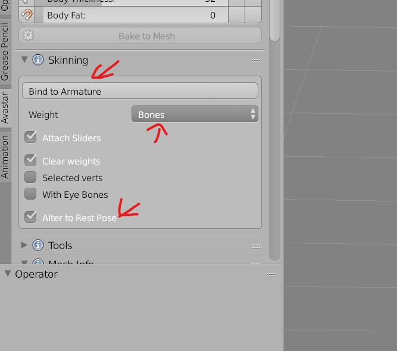
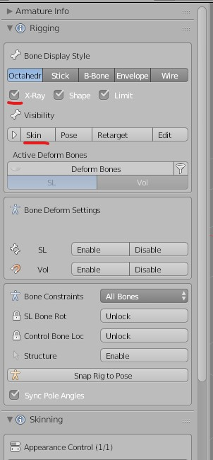
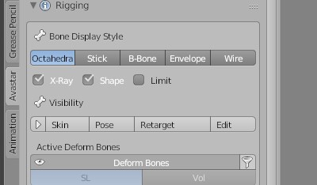
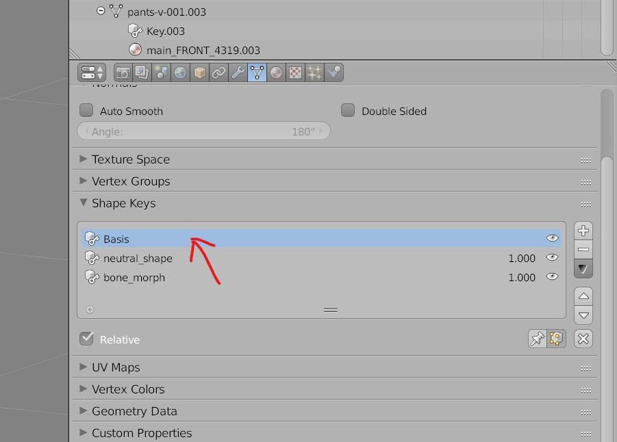

# Avastar

## Bind the mesh to armature (Avatar)
So that the mesh (cloths) move with the armature (avatar)
- Select the Mesh and the avatar mesh
- 

## Turn On Bones
- make sure the avatar is visible
- Select the avatar (from the scene)
- 

## Reset Bones pose
- Click on Pose under `Bone Display Style`

## Change the Bone Display Style
- Go to Avastar tab
  - 
- Select the style

## Edit Mode
- make sure the shape keys basis is selected and the 'Apply Shape keys in edit mode' is off
- 