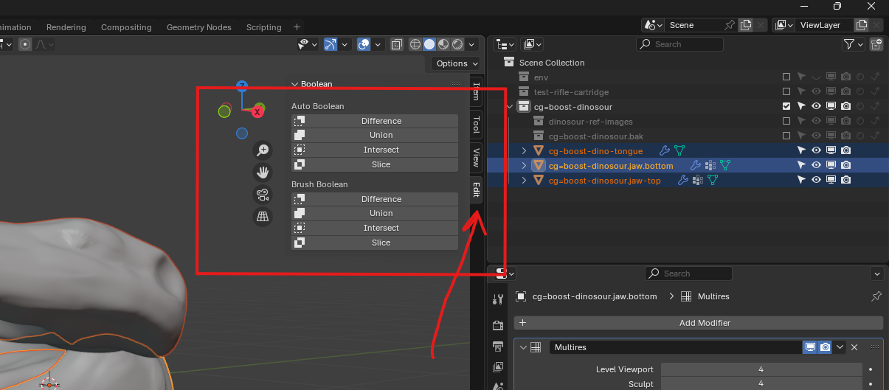
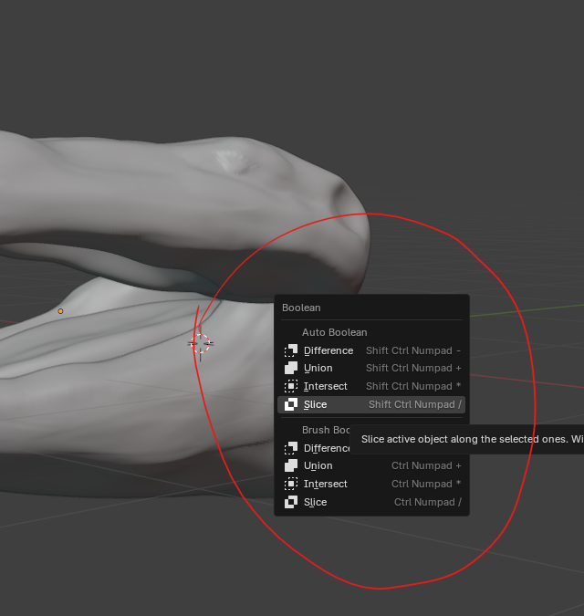
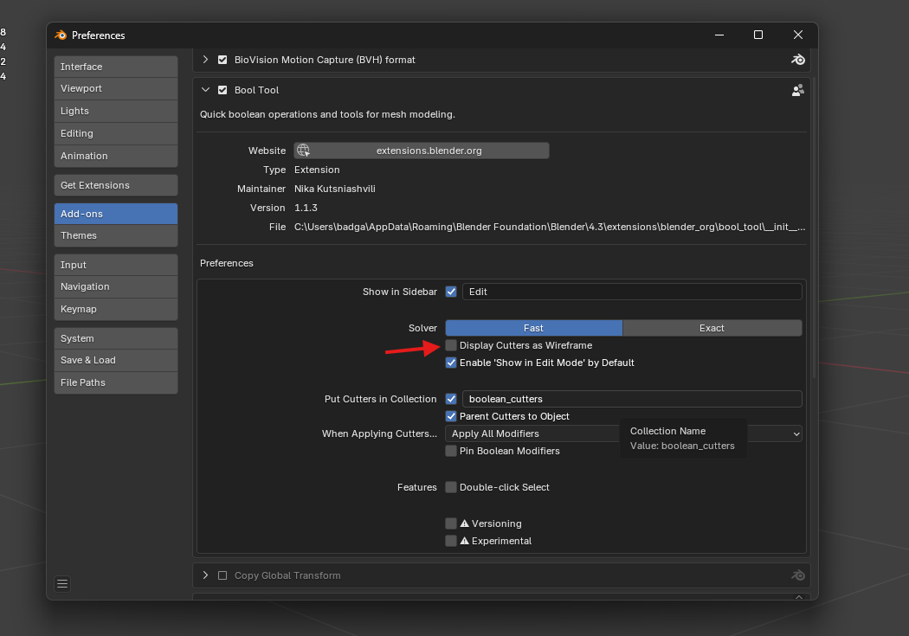
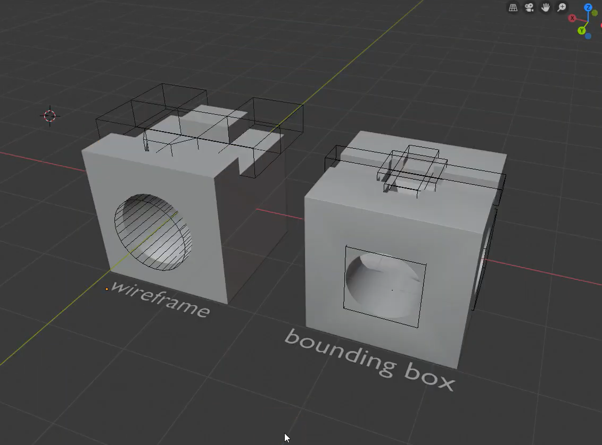

# Bool tool

- once enabled you will see the side bar menu
- 
- or press ctrl + shift + b
- 
- different type of bool tool visualizations
- 
- 

## options

- auto boolean is permanent
- Brush box is dynamic
