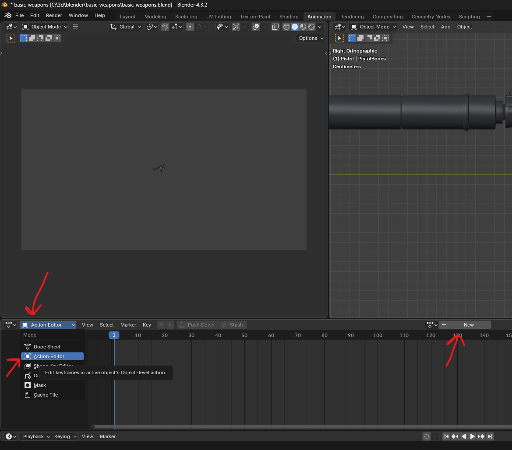
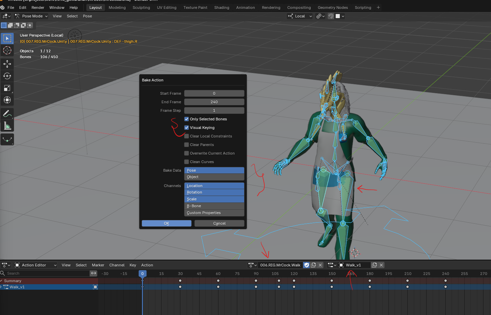
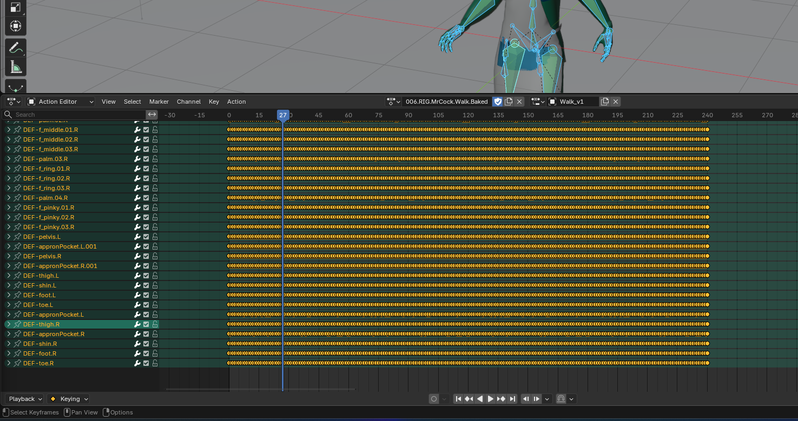
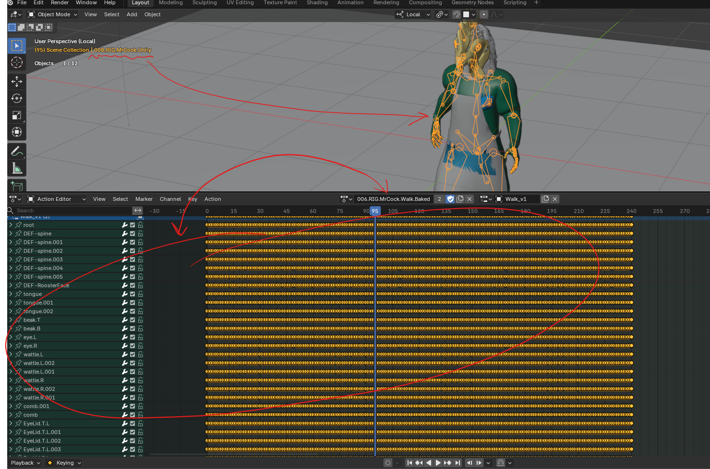

# blender animation

# Viewport

## animation layout

- 
- change from dope sheet to action editor
- select all the bones
- press new and rename to animation name
- press i to insert default position

# bake animation

- go to pose mode
- pose menu -> animation -> Bake Animation
- 
- 

## Clear Constraints → OFF

- with this the original rig wont do any baked animation, because the constraints have higher priority for the bones movement
- the goal is to use the baked animation on a non constraint rig
- 

# Export Animation

## Steps to Export full model with animation

- Step 1 - Export Armature and Mesh without mesh (geometry)
  - select the armature, with geometry
  - export as FBX
  - name the file as armature@animation-name.fbx
    - ex MrCock-unity-rig-v01@Walk.fbx
  - settings
    - Include
      - Limit to selected objects
      - Object Types - Armature and mesh
    - Transform and Geometry - default
    - Armature
      - all default except Disable add leaf bone
    - Animation - OFF
- Step 2 - Export animation only
  - Make sure the armature name is same from the step 1
  - select the armature, no geometry
  - export as FBX
  - settings
    - Include
      - Limit to selected objects
      - Object Types - Armature only
    - Transform and Geometry - default
    - Armature
      - all default except Disable add leaf bone
    - Animation
      - key all bones - ON
      - NLA Strips - OFF
      - All action - ON
        - this settings can export all actions, but renames the amimation action properly, otherwise the name is "Scene"
      - simplify - 1.0
        - if the animation are too big, simplify can shorten file size and also some other issues, so keep it ON
