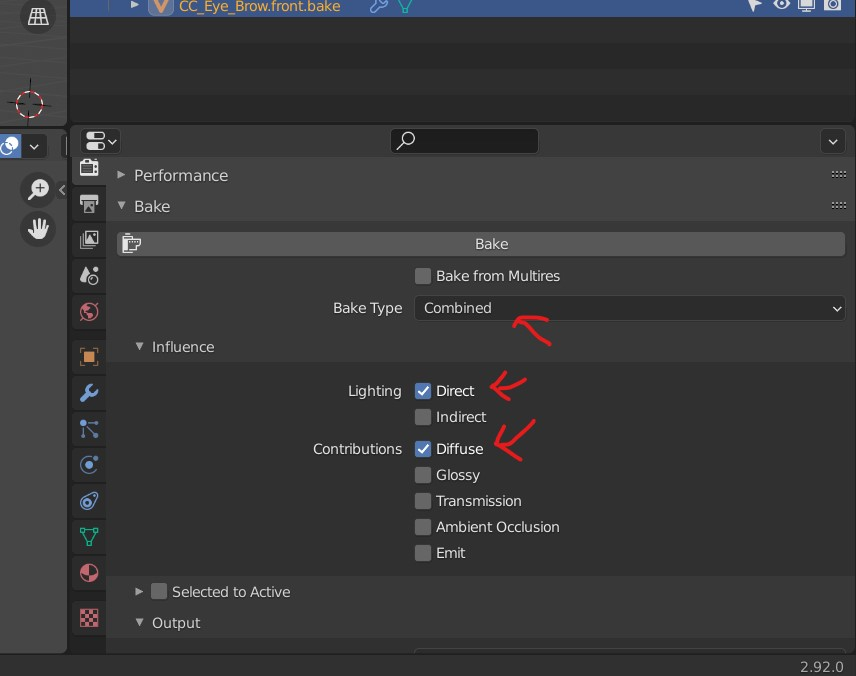
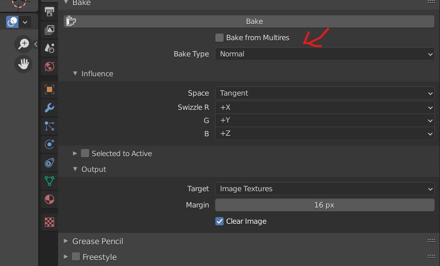
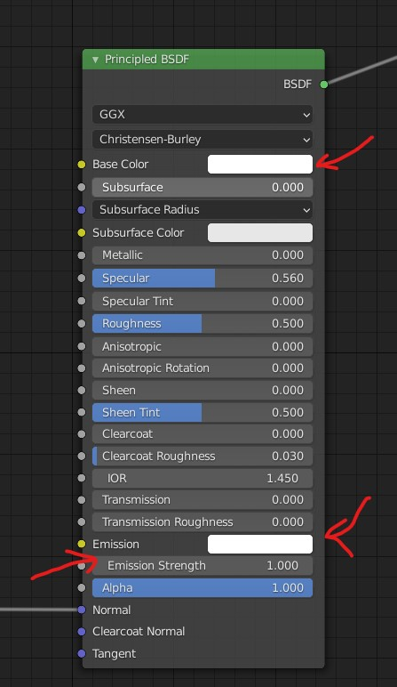
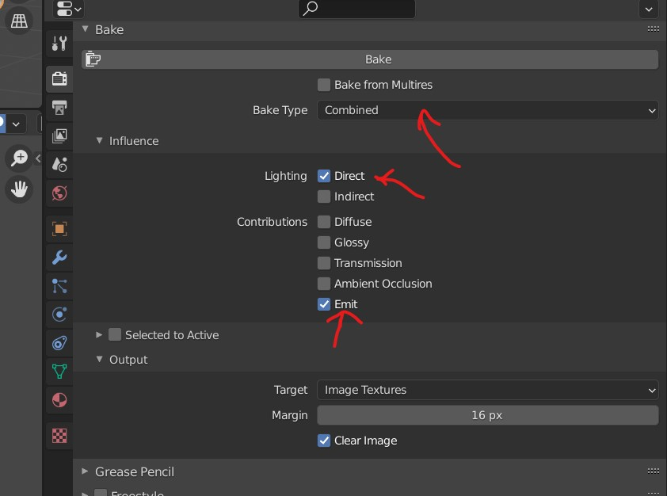

# Baking

## select node and UV
- in the `Shader Editor`, select image texture node
- in the `UV Editor` select the image from the above node 
- 

## sampling settings
- Render - 32
- Viewport - 32

## Albedo (all colors)
- setting for the Bake engine
- 

## Normals
- setting for the Bake engine
- 

## alpha
- detach the color and set it to white
- make `Emission Strength` to 1.0
- 
- setting for the Bake engine
- 