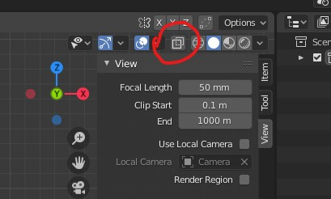
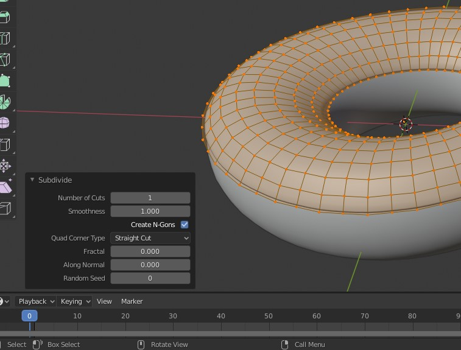
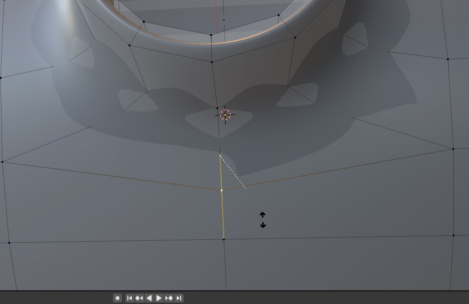
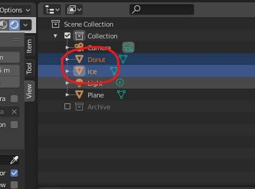
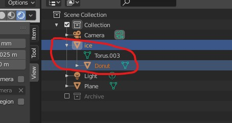
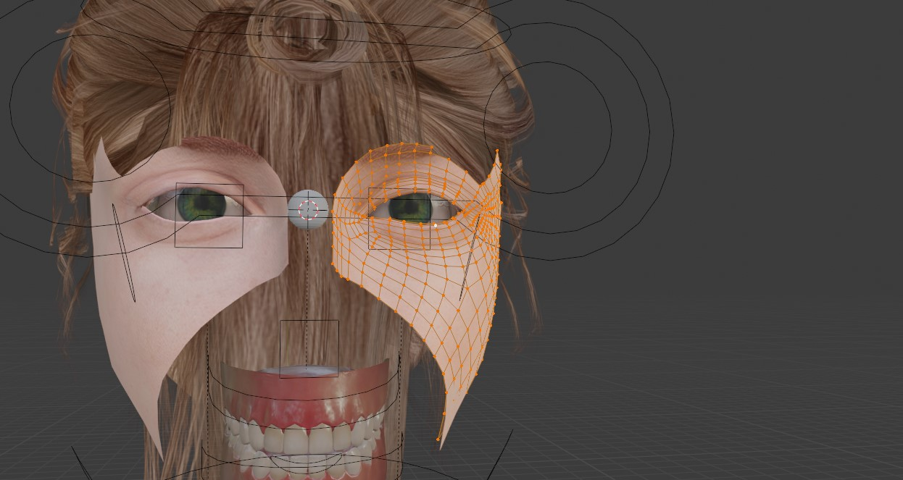
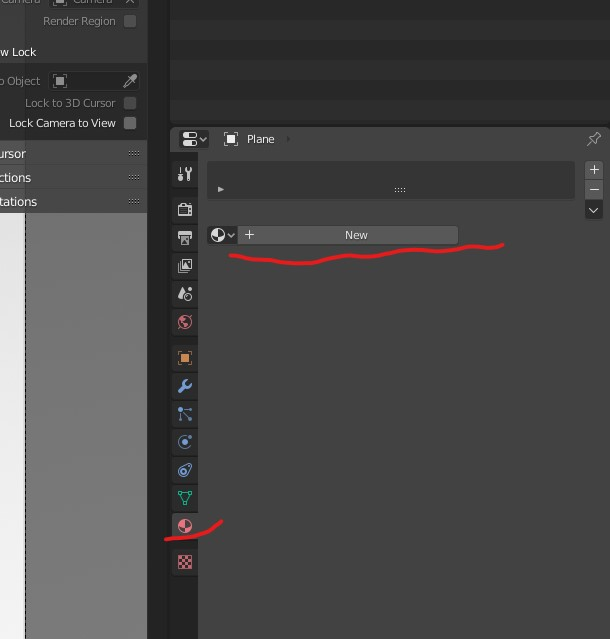
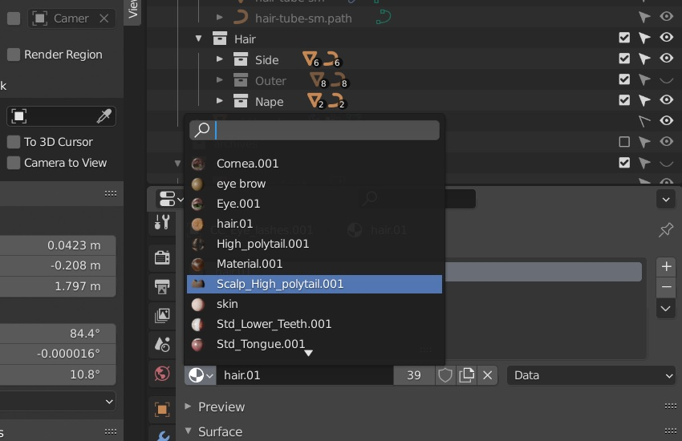

# **Blender**

# 3D cursor

Drops the new objects over the 3d cursor when they are added in the viewport

- 
- <kbd>SHIFT</kbd> + <kbd>Right Click</kbd> - to move it
- <kbd>SHIFT</kbd> + <kbd>C</kbd> - to centre the cursor

## menu

- shift + s
- 
    - move to world origin (snap to world origin)

# Origin

The origin is the point which will be attached to the surface of the object on which the particles are added

## menu

- shift + s
- 
    - move to world origin (snap to world origin)

## move origin manually

- can be done only in "object mode"
- 

## set origin to center of a mesh

- Select the object
- <kbd>Right Click</kbd> -> set origin -> origin to geometry
- or
- 

## transformed pivot point

- set object pivot point to a different reference point
- by default the pivot point is origin (individual origin)

### default

- 

### set to 3d cursor

- 

# Viewport

## vertices count

- 
- or
- right click on the bottom menu (status bar) -> select "scene statistics"
- 

## panel

- 
- <kbd>Right Click</kbd> on the `Object Mode` and `flip to bottom`

## zoom swiftly

- <kbd>CTRL</kbd> + <kbd>Middle</kbd>

## Toggle visibility

- if while importing some mesh from old version are looking as if they are disabled
- 
- also enable the selection and viewport option in filter menu

## Menu

- Press <kbd>N</kbd>

## Change the axis

- <kbd>`</kbd> to open the menu
- Numpad keys
- <kbd>ALT</kbd> + <kbd>Middle Mouse</kbd> + move mouse

## Split the viewport

- <kbd>Right Click</kbd> on the red marking
- 

## Quad view

- divide the view port in top, front, side and movable viewports
- <kbd>CTRL</kbd> + <kbd>ALT</kbd> + <kbd>Q</kbd>

## Rendered

To see the light on the object

- 
- or Press <kbd>Z</kbd> and select `Rendered`

## Light

- 

### Light settings

- 

## Change View for the mode (Layout, sculpting, etc)

- Press <kbd>N</kbd>
- 

## Render Engine

- 
- can change the render engine to Eveee (For Low graphics ex. games)
- can change the render engine to Cycles (For High graphics)

## Create a image

- Render -> Render Image
- Or Press <kbd>F12</kbd>

## View through the camera

- 

## Face orientation

See which face is viewable

- 

## Start Search

- <kbd>F3</kbd>

## Toggle X Ray

- 

## object view (on individual mesh item)

- set a wire view on individual object
- 

## draw marking (annotations)

- press <kbd>D</kbd> and <kbd>Left Click</kbd> and draw with pencil
- to clear the marking open up the menu <kbd>N</kbd> and go to annotation and click on `Subtract` button
- 

## Images

### Opacity

- 

## view region or portion of 3d viewport

- <kbd>CTRL</kbd> + <kbd>B</kbd>
- mark a portion

### exit region view

- <kbd>CTRL</kbd> + <kbd>ALT</kbd> + <kbd>B</kbd>

# Tools

## Object Properties

### render object only for shadows

- so that the blender rendered image will NOT include the additional objects and will only render the main objects shadow
- 

## Tranformation

- 
- <kbd>Left Click</kbd> on the object and tranform it
- <kbd>Right Click</kbd> to reset the tranform

<b>Note: </b> we can switch between the axis while transforming (<kbd>X</kbd>, <kbd>Y</kbd>, <kbd>Z</kbd>)  
<b>Note: </b> Press <kbd>T</kbd> for show/hide the toolbar

### Menu

<kbd>SHIFT</kbd> + <kbd>Space</kbd>

### Select inverse degrees

- hit <kbd>SHIFT</kbd> + axis key (<kbd>X</kbd>, <kbd>Y</kbd>, <kbd>Z</kbd>)

### Rotate

- <kbd>R</kbd>
- type the degrees
- or press <kbd>CTRL</kbd> while moving to have 5 degree change

### Move

- <kbd>G</kbd>

#### Moving 2 items without changing the origin

- this helps when using modifiers such as Curve etc
- say suppose we want to move an item which is repositioned in `X` direction
- copy its moved location (<kbd>CTRL</kbd> + <kbd>C</kbd>)
- 
- select both objects
- press <kbd>G</kbd> and press <kbd>X</kbd> for direction
- paste <kbd>CTRL</kbd> + <kbd>V</kbd>

# Object Mode

## Zoom

### zoom to a selection (focus)

- select any point(s)
- press <kbd>NumPad . (dot or numpad delete key)</kbd>

## Add

- <kbd>SHIFT</kbd> + <kbd>A</kbd> to add mesh

## duplicate objects

### different mesh data

- shift + d
  - create seperate vertex group

### sharing mesh data

- 
- alt + d
  - two mesh will share the same vertext group
  - useful for sculpting same on both the object

#### seperate the mesh data

- to seperate the mesh data apply the scale
- warning shows up, say "Apply"

## Smooth the object

- select the object by clicking on the object
- 

### control the shade auto smooth by angle

- right click and select shade auto smooth
  - adds a modifier automatically
    
- control the smoothness with angle

### Flatten the edges

To smooth everything based on a certain angle

- select auto smooth
- smooth everthing above the angle
- 

## Snap or reset the objects at the center

- press <kbd>ALT</kbd> + <kbd>G</kbd>

## Merge or join object

- select the 2 objects
- <kbd>CTRL</kbd> + <kbd>J</kbd>

<b>Note: </b>

- The last mesh origin will be applied to both
- also the one selected first will be one all other that will be merged into
  - i.e name of the first element will be taken like its a parent

### trim off merged parts of the mesh

- go into sculpt mode
- press <kbd>r</kbd> to get the remesh grid
  - make it finer
- enter to set
- ctrl + r to set it

## convert curve to mesh

- 

## convert mesh to curve

- 

## Apply transform (set transform)

- <kbd>CTRL</kbd> + <kbd>A</kbd>
- 

NOTE: to make all the transformations as 0, or reset the transformations

# Edit Mode

## change the mouse cursor

## zoom

### zoom to a selection (focus)

- select any point(s)
- press <kbd>NumPad . (dot or delete key)</kbd>

## Symmetry

- to edit the object so that the vertices on the other axis also are modified
- 

## Subdivide

<b>Note:</b> Edit mode should be on

- <kbd>Right Click</kbd> on the object
- Select `Subdivide`

### Increase the smoothness

- 

## movement

Switch between transformation orientations of the mesh

- suppose we have a mesh rotated, so while moving the vertices we can avoid global axis and use local
- 

<b>Note:</b> while transforming press the axis being locked, press the `axis key` again to switch between global and local.

## Edges

- 
- To open up the Edge menu
- <kbd>CTRL</kbd> + <kbd>E</kbd>

### Edge Filling (join 2 vertices)

- select the edge and press <kbd>F</kbd> to add a face to part shown in image
- 

### Expand edge

- <kbd>CTRL</kbd> + <kbd>B</kbd>

### draw edge

- 
- press <kbd>J</kbd> to create a staright line between them

#### Delete edge loops (without deleting faces)

- 
- Press <kbd>X</kbd> and select `Edges Loops`

### subdivide the edge

to make a perpedicular out of them

- select the 2 vertices
- <kbd>Right click</kbd> and subdivide

## Vertices

- select 2 points and press <kbd>F</kbd> to make vertex

### Merge

- to get the merge menu
- <kbd>ALT</kbd> + <kbd>M</kbd> or just <kbd>M</kbd>

#### auto merge vertices

- 

### Merge overlapping vertices

- select the entire mesh or press <kbd>A</kbd> in edit mode
- <kbd>Right Click</kbd> and `merge vertices -> by distance`

### snapping the vertices

To stick the dragging object on the surface, instead of going inside the surface of other selections

- 

#### to closest vertex

- 
- and then press <kbd>CTRL</kbd> while moving them to snap to closest vertex

#### to face of other object

- settings below
- 
- press <kbd>CTRL</kbd> move the object to have the closest rotation of the target mesh face
- 

### move vertex along the edge (also edges)

- Select the vertex and double press <kbd>G</kbd>
- 

#### move beyound the original limit

- after double taping <kbd>G</kbd>, hold <kbd>ALT</kbd> or press <kbd>C</kbd> to clamp
- 

##### move vertex along the rotated angle

- after clamping (refer above point), move `mouse` left to right
- 

### align the misaligned vertices

- double tap <kbd>G</kbd> and then press <kbd>E</kbd>
- 

### moving the vertex in a straight line (along its normal)

- select the vertex
- <kbd>ALT</kbd> + <kbd>S</kbd>
- 

#### show normal direction

- 

### align along the (X, Y, Z) axis (flatten the vertices)

- 
- select the vertices
- press <kbd>S</kbd> + (<kbd>Z</kbd>, <kbd>Y</kbd>, <kbd>X</kbd>) + 0

### align along the active element

- select the vertices
- make sure the active elements is selected
- 
- select the vertex which will act like a reference point at which all the previously selected vertices will align to
- press <kbd>S</kbd> + (<kbd>Z</kbd>, <kbd>Y</kbd>, <kbd>X</kbd>) + 0
- press <kbd>ENTER</kbd>

## faces

### make face

- 
- select the vertices
- Press <kbd>F</kbd>

### delete face

- select the face
- press <kbd>X</kbd>
- 

### Select faces

- 
- then click on the middle of the faces

<b>Note: </b> with face selection pressing <kbd>L</kbd> select one side of mesh easily

## Normals

### flip

- will inverse the normals
- to flip, in edit mode menu -> mesh -> normals -> flip

### recalculate normals to the outside

- 
- Select all vertices
- <kbd>SHIFT</kbd> + <kbd>N</kbd>
- or search for normal recalculations
- or from edit mode menu -> mesh -> normals -> recalculate outside

## Triangles to polygons conversion

- select the faces and go to face
- 
- select the tris to quads

## Extrude

- select vertices
- Press <kbd>E</kbd>

### extrude to cursor

- select the vertex
- move the cursor to a place where you want the extrued to extend to
- press <kbd>CTRL</kbd> + <kbd>Right Click</kbd

## Inset

- select vertices and press <kbd>I</kbd>

### Boundary

- press <kbd>B</kbd>
- 
- so that the edge near the `mirror side` will dissolve

<b>Note: </b> Make sure there are no faces between the mirror or else the boundary wont work,   Below image - 0 is no faces where the `boundary` will work perfectly, 1 is where it wont

- 

## Creating a bridge between cut faces

- 
- Select cut faces
- press <kbd>F3</kbd> and search for Bridge

## Proportional editing

For editing the vertices near by

- 
- Enable it
- select any vertice or vertices
- Press <kbd>G</kbd> and move the object
- 
- Scroll mouse up or down to get the lumpiness

<b>Note: </b> Hide the vertices to avoid proportional editing on non required vertices

### Follow another object

- Atfore joining
- 
- Select the parent object
- Then select the child object
- <kbd>CTRL</kbd> + <kbd>P</kbd> and select the `Object (Keep Transform)`
- After Joining
- 

## scaling

### from the center of 3d cursor

- 

## Hide

### hide rest

- <kbd>SHIFT</kbd> + <kbd>H</kbd>

## Selection

<b>Note:</b> Edit mode should be on

### enable brush selection

- Press <kbd>C</kbd> and
- Scroll for scaling
- <kbd>Middle Mouse</kbd> to Undo
- <kbd>Right Click</kbd> to disable

### Select the duplicates on the object

- <kbd>SHIFT</kbd> + <kbd>D</kbd> to duplicate the selection
- Select any vertice of the duplicate
- <kbd>CTRL</kbd> + <kbd>L</kbd>

### Seperate the selection

- <kbd>SHIFT</kbd> + <kbd>D</kbd> to duplicate the selection
- Press <kbd>P</kbd> and select the `Selection` option

### All

- <kbd>Left Click</kbd> on the object
- Press <kbd>A</kbd>

### loops

- <kbd>ALT</kbd> + <kbd>Left Click</kbd> the vertex for vertical or horizontal selection of the lines running through the vertex
- 
- <kbd>CTRL</kbd> + <kbd>I</kbd> to invert the selection

<b>Note:</b> <kbd>ALT</kbd> + <kbd>Left Click</kbd> on the line for vertical selection as shown below

- 

<b>Note:</b> add loop cut to make the edges sharp

- 
- from above to below
- 

### Elven - Show the edge

To show the edge its moving along press <kbd>E</kbd>

- 

#### Flip

- Press <kbd>F</kbd> if the shape is weird

### Hide the selection

- Press <kbd>H</kbd>
- To unhide <kbd>ALT</kbd> + <kbd>H</kbd>

### Extrude the selection

- Select the vertices
- Press <kbd>E</kbd>

### Create a loop on the mesh

- 
- Select the model
- <kbd>CTRL</kbd> + <kbd>R</kbd>
- scroll up and down to add more loops or reduce

### Create loop inside a circle

- Select a circle
- Press <kbd>I</kbd> and Drag

### Select only next loop (isolate)

- 
- select a point
- <kbd>CTRL</kbd> + <kbd>NUM +</kbd>
- <kbd>SHIFT</kbd> + <kbd>H</kbd>

### select all by trait

#### non manifold

- 
- like eyelashes in metahuman
- go into x ray mode and unselect rest
- press h to hide
- press alt + h to unhide

## Bevel

- 
- to create a loop cut only with marked vertices
- <kbd>CTRL</kbd> + <kbd>B</kbd>
- scroll up or down to increase or decrese the loops

<b>Note: </b> Make sure the scale applied and its value is 1

### Add bevel to the vertices

- select the vertex
- <kbd>SHIFT</kbd> + <kbd>CTRL</kbd> + <kbd>B</kbd>
- drag the mouse to see the `bevel`
- scroll up or down to increase or decrese the loops
- 

### add bevel to edges

- select the edge (press 2)
- ctrl + b and move the mouse

## Shear

when rotating the vertices the height can be affected, use shear instead

- select vertices
- open up search (<kbd>Space</kbd>) and search shear and then select the option
- 

## Knife tool

- Press <kbd>K</kbd>
- select any vertex
- Press <kbd>C</kbd> to snap the axis along 45o
- 

## vertex groups

### Assign

- in edit mode, select vertices
- assign
- 

### create group from subtraction

- select the group which contain all vertices
- create a new group and assign all vertices from the selected group
- select the group which you want to subtract from the selection
- 
- select the new group
- click on `REMOVE`
- deselect everthing and select the new group only

### shape keys

- make sure the shape keys basis is selected and the 'Apply Shape keys in edit mode' is off
- 

# World environment

- [Download Environment](http://www.hdrlabs.com/sibl/archive.html)
- nodes for the world
- 
- add the Texture -> Enviornment Texture

<b>Note: </b>

- The environment file is .exr extention
- to see the new environment , switch to Render mode

# Adding Material

- 
- 

## Material Properties

- Color
- Roughness (glossy to rough)
- Subsurface
  - Radius - R, G, B
  - Color
    - give similar to object color
    - this is when the light goes into the object
    - like the thin layer of skin becomes red as we see it on the bright light
- Transmission - make it 1 for glass
  - to remove the tint the base color should vue should be 1

## Copying material

- Select the object which you want to apply material to
- Select the object which you want to apply material from
- <kbd>CTRL</kbd> + <kbd>P</kbd> and select Materials

### Or select all the objects

- <kbd>CTRL</kbd> + <kbd>L</kbd> and select Materials

### or select from the existing

- 
- then create a new material
- selec the old material
- copy using the down arrow
- 
- select the new material
- paste the material

### duplcate material

- add the existing material
- select it and click on button marked 2
- rename it to new name
- 

## water like depth and color

- 

## Adding another material

- select the parts or faces of the object
- 

# Modifiers

## vertex group

- select the `mesh` on whose the modifiers will be added
- create a vertex group and assign to the mesh
- 
- select the vertex group in the modifier
- draw the paint on the `mesh`

## Solidyfy

- 
- adds thickness to the mesh
- 
- change the `thickness` and the `offset`

## Subdivision Surface

We can smooth the surfaces with these

- 

<b>Note: </b> The faces should have 4 vertices to have loops otherwise the subsurface modifier wont work correctly

### Pull the surrounding of face (Crease)

- select vertices
- Press <kbd>SHIFT</kbd> + <kbd>E</kbd>
- 

### Simple mode

Preserves the corners

- 

### Bulid up

- 
- 
- 

### make flat edges

To create a flat end with subsurface modifier

- press <kbd>SHIFT</kbd> + <kbd>E</kbd>
- 

## Mirror

- mirror the mesh arround the origin (of its own or global)
- 

### Mirror object

- or simply we can use nothing i.e. meshes own origin
- we can select some other mesh whose origin point acts like a mirror
- or we can use `empty object`

## Shrinkwrap

- to flatten a surface of some mesh or stick the mesh to other mesh

- add the target object, select project mode if required
- 

## simple deform

bend any surface around the pivot point

## displace

Create uneven paterns on the mesh

- 
- 
- add the texture and go into texture tools
- 
- select the clouds

## bevel

- to add smooth edges to the mesh
- 
- control the thickness
- modify the segments to control the sharpness or smoothness of the edge

### for flat lines

- 
- when bevel is applied the lines edge loops are flattened out
- 
- apply the above settings
- anything above 60o to be beveled (flattened)

## Boolean - for slicing mesh on mesh

- set to `Union`
- 
- set wire view on the slicing reference object
- 

## Multiresolution

- add this for better sculpting
- 
- click on subdivide to add more resolution

## curve

- have a path whose origin and mesh origin at the same point
- add curve modifier
- 
- both path and mesh should have origin at same location (ideally at the world origin)
- 

## remesh - [refer in sculpting](../sculpting/modifiers.md#remesh)

- used in sculpting or fusing joint mesh (that are joined by ctrl + j)

## decimate - [refer in sculpting](../sculpting/modifiers.md#decimate)

- to lower the poly count
- set the ratio to low value to make a low poly

### edit the path

- select the path
- go into `EDIT` mode
- select the last vertex -> press <kbd>E</kbd> to extrude

### rotate

- select the curve path
- edit mode
- 
- select the second vertice
- press <kbd>G</kbd> and rotate

### create curves with proportional editing

- 
- select the bound path
- go into edit mode
- enable proportional editing
- select the tip vertex (last vertex or any other)
- drag it in a direction
