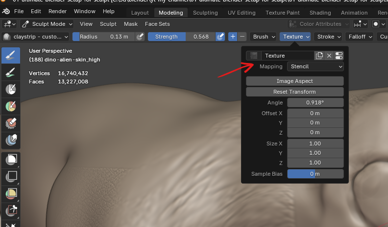

# brush texture

## stencil

- 

### controls

- 

- <kbd>RIGHT CLICK</kbd> - to move
- <kbd>SHIFT</kbd> + <kbd>RIGHT CLICK</kbd> - zoom in or out
  - plus Press <kbd>X</kbd> or <kbd>Y</kbd> - to adjust the size in that coordinate
- <kbd>CTRL</kbd> to rotate
- <kbd>Left CLICK</kbd> - to paint
