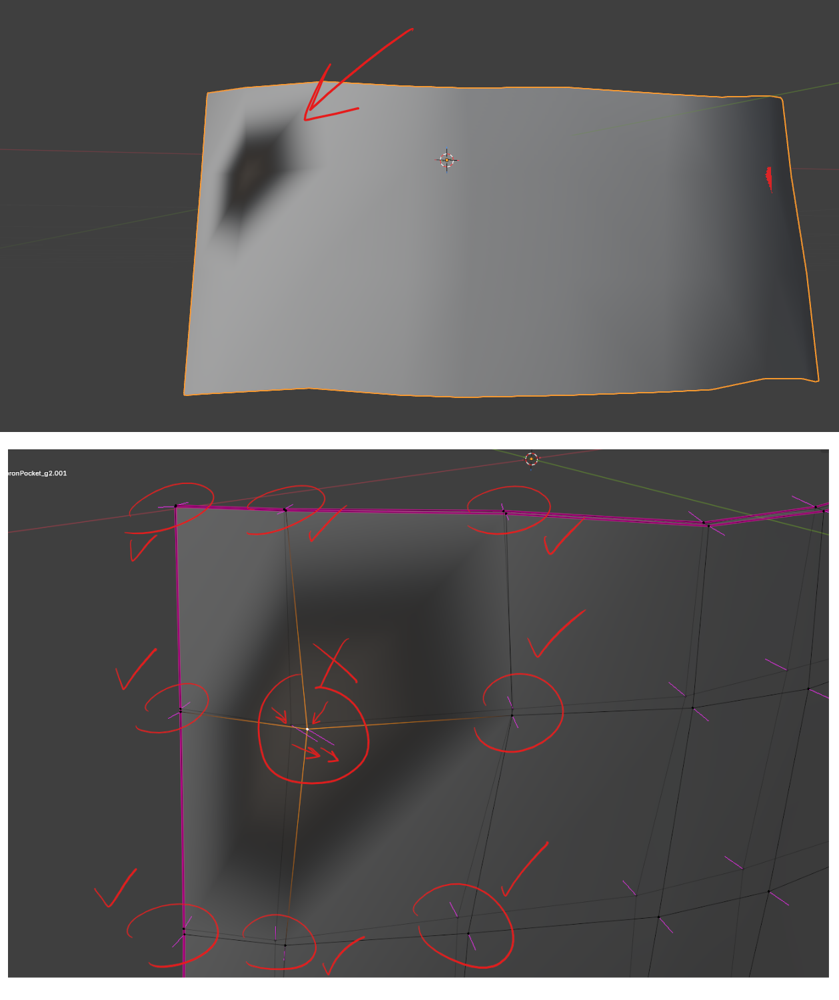

# Blender Issues

# black hole or anomaly near a vertex or vertices

- 

## fix

- go to edit mode
- enable normal overlay from "mesh edit mode overlay"
- see the normal direction, if the normals are in a wrong direction
- alt + n -> reset vectors
