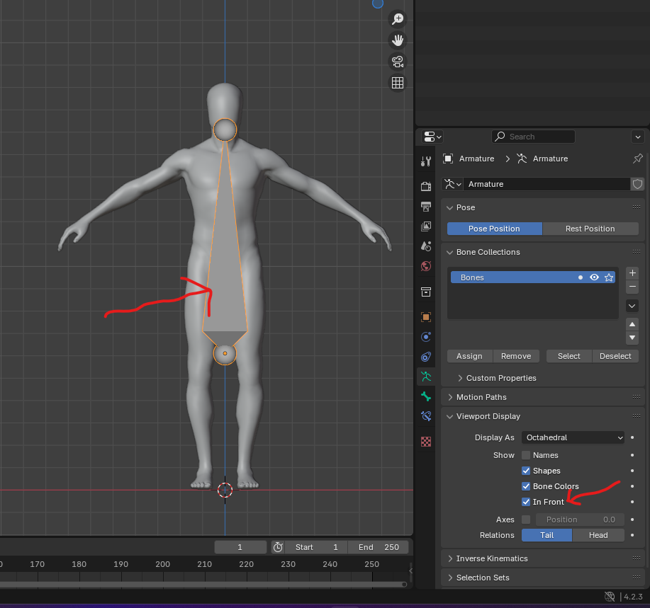
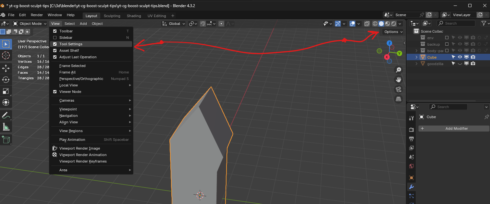
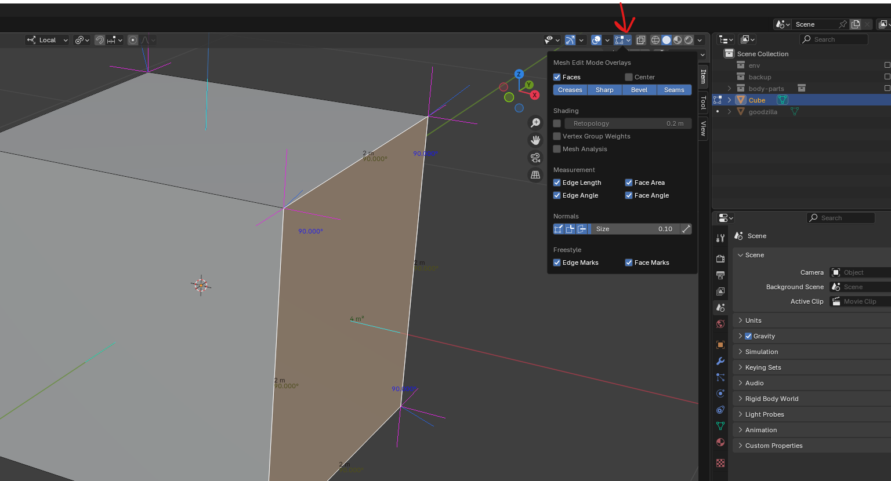
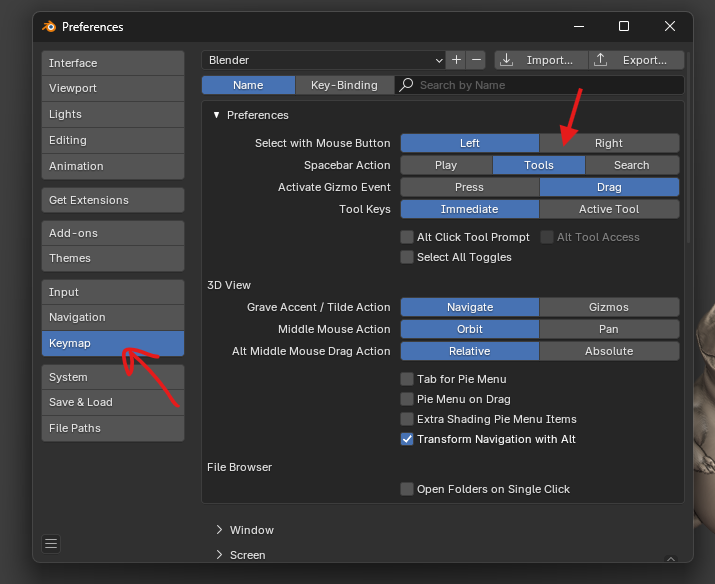
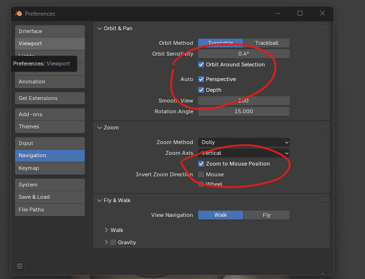

# select

## select child objects

- select any mesh or object
- shift + ] to select next child element

# View (blender UI)

## bone infront of mesh

- go to armature property
  

## move or place the 3D cursor

- shift + right click

## view options

  

## edit mode stats (vertices, edges, faces details)

- <b style="color: red;">Note</b> affects performance of the PC
- 

# settings

ctrl + ,

## set action on key `space` press

- 

## basic navigation settings for scuplting

- 

## tab for menu

- preferences -> keymap -> Tab for pie menu

# errors

## Object has non uniform scale

We get the error because the scales are different  

### solution

- Select the Object
- Go to object mode
- Apply transformation
  - <kbd>CTRL</kbd> + <kbd>A</kbd>
- Scale
