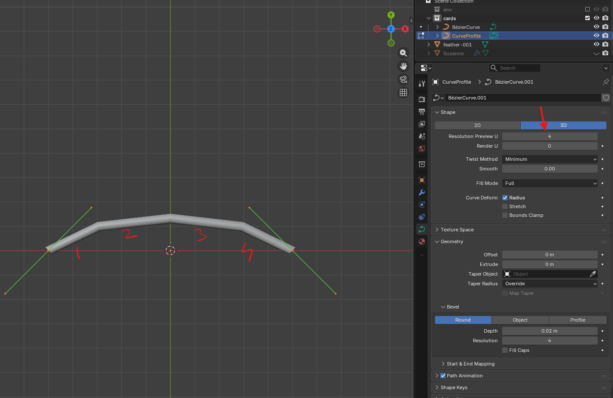
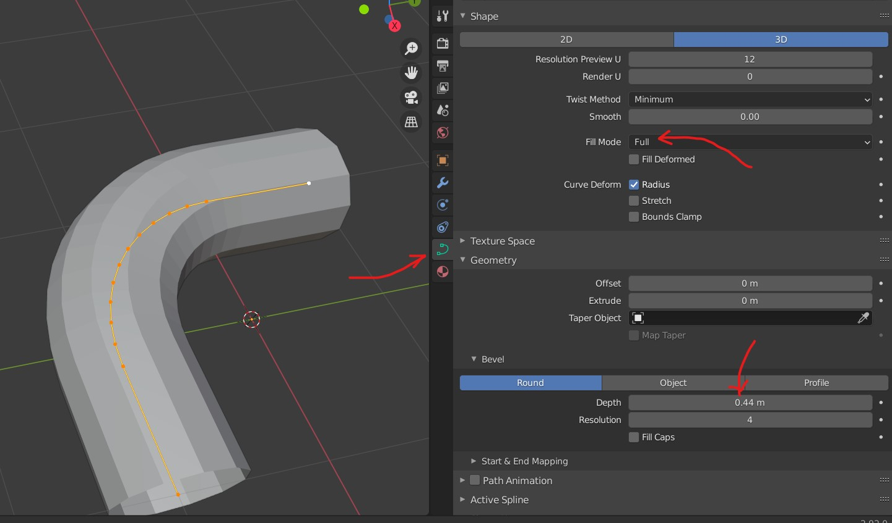

# **Curve**

**Note:**

- No merge menu? press `m` wont work?
  - duplicate is like adding more vertices thats why it wont give the option to merge vertices i.e. pressing m doesnt do anything

## curves to curve or bending points or vertices

- 

**Note**

- these are just resolution, not vertices
- but we get the edges after the curve is converted to a mesh

## add thickness to curve

- Go to curve tool
- select `Fill Mode` as full
- increase the `Depth` under Geometry -> Bevel
- 

### thicken the joints

- select any vertex
- alt + s

## handle type (joint movement)

- press v and select

## extrude

- select any vertex -> e

## seperate

- select any vertex -> p
