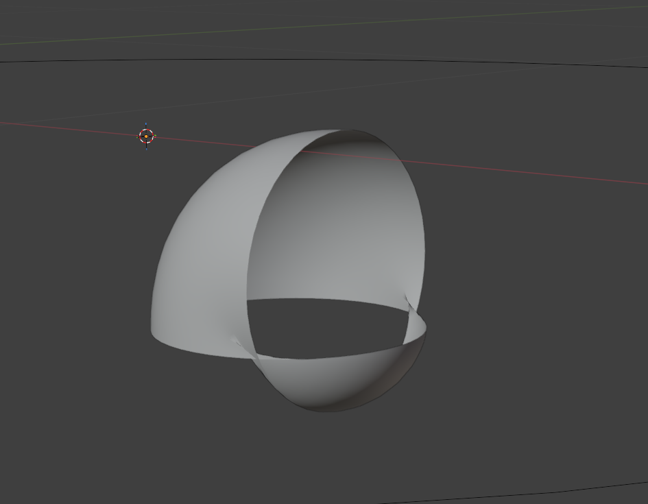

# bezier curve - rotation is unpredictable in edit mode

- usually happens if the curve is moved with snapping ON
- but disable snap
- reset transforms (ctrl + a) -> scale and rotation
- try edit rotate again

# using geometry bevel object (circle) creates weird shape

- 
- issue is - the bevel object (circle) is too big
- in the object mode (NOT EDIT MODE), scale down the circle
- do not apply transform
