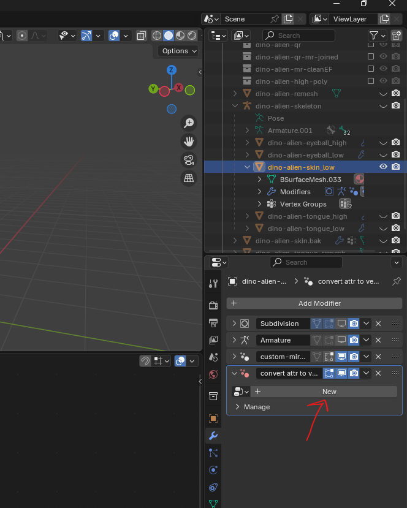

# **Geometry Nodes**

**Note:** geometry nodes creates kind of like a fresh object, so the vertex groups and other attributes get converted to a simple attributes

# Viewport (aka node tree)

- 

## create new or select existing geometry node board

- select new
- 
- select existing
- 

## show hide node tree

- 

## view current node (same as shading nodes)

- ctrl + shift + click on node

## snapping

- while moving the node press
  - do not press ctrl and try to move the node, it wont't work

## disable node

- select node and press m

# apply nodes

- once the geometry node modifier is applied and the new vertices are joined using merge, recalculate the normals
  - to recalculate the normals
    - go to edit mode
    - alt + n -> recalculate outside
- clean up the attributes if any
  - 

# errors or issues

## the output of geometry node is not visible

- debug by enabling the face orientation
- if using the "join geometry" node, then unplug the main geometry and keep only the transformed geometry

## all the vertex group are lost

- they are not lost but they are converted to a attribute
- workaround
  - create a duplicate of the mesh
  - add the vertex group
  - add geometry node and transform it
  - apply the modifier, now join this with the main one and merge by distance
