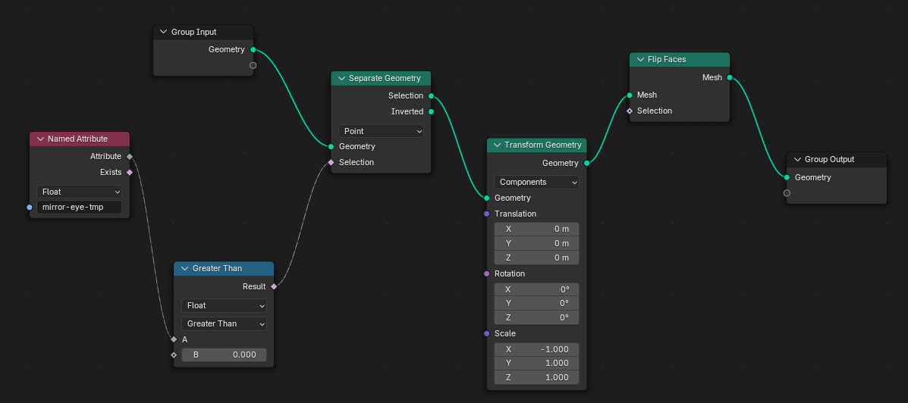

# **Techniques**

# Mirror only selected vertices

- duplicate the mesh
- remove all the vertex group
- select the vertices in a vertex group
- add named attribute and select the vertex group name
- use the compare node to select weight greater than 0
- use seperate geometry to select vertices coming from compare node
- use transform scale -1 on x axis
- flip normals if needed (optional)
- output the transformed mesh
- 

# how to weight paint a grass

- `TODO` - https://www.youtube.com/watch?v=JvbppmT0ILY&t=138s&ab_channel=JoeyCarlino

# geometry node to create VDM brush patterns from black & white image

- `TODO`
