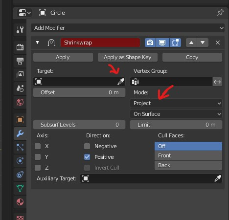
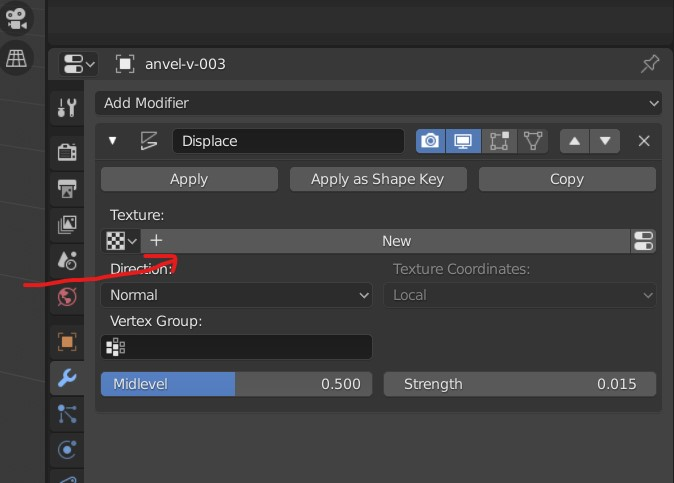
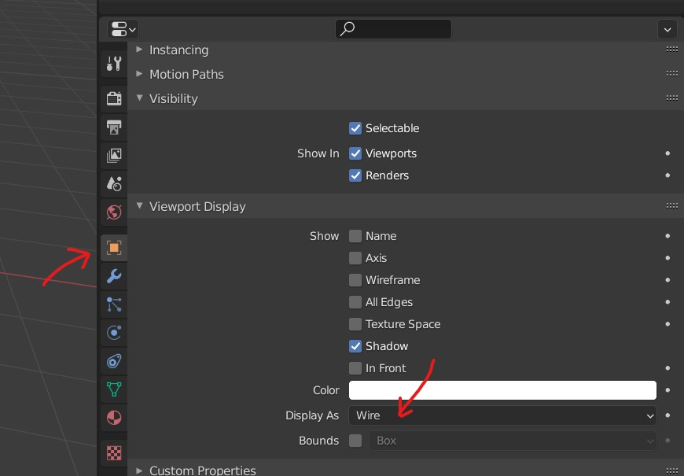

# **Modifiers**

## order of modifer

the bottom most modifier will have all the effect of modifiers above ones

- mirror
- subdiv

## view final result preview

- enable the "on-cage" option
- 

## vertex group

- select the `mesh` on whose the modifiers will be added
- create a vertex group and assign to the mesh
- 
- select the vertex group in the modifier
- draw the paint on the `mesh`

## Solidyfy

- 
- adds thickness to the mesh
- 
- change the `thickness` and the `offset`

## Subdivision Surface

We can smooth the surfaces with these

- 

<b>Note: </b> The faces should have 4 vertices to have loops otherwise the subsurface modifier wont work correctly

### Pull the surrounding of face (Crease)

- select vertices
- Press <kbd>SHIFT</kbd> + <kbd>E</kbd>
- 

### Simple mode

Preserves the corners

- 

### Bulid up

- 
- 
- 

### make flat edges

To create a flat end with subsurface modifier

- press <kbd>SHIFT</kbd> + <kbd>E</kbd>
- 

## Mirror

- mirror the mesh arround the origin (of its own or global)
- 

### Mirror object

- or simply we can use nothing i.e. meshes own origin
- we can select some other mesh whose origin point acts like a mirror
- or we can use `empty object`

## Shrinkwrap

- to flatten a surface of some mesh or stick the mesh to other mesh

- add the target object, select project mode if required
- 

## simple deform

bend any surface around the pivot point

## displace

Create uneven paterns on the mesh

- 
- 
- add the texture and go into texture tools
- 
- select the clouds

### from image

- select the displace type as "Texture"
- head to the texture tab
- 
- select the pattern image
  - should be black and white
- go back to modifiers and adjust the settings
- 

## bevel

- to add smooth edges to the mesh
- 
- control the thickness
- modify the segments to control the sharpness or smoothness of the edge

### for flat lines

- 
- when bevel is applied the lines edge loops are flattened out
- 
- apply the above settings
- anything above 60o to be beveled (flattened)

## Boolean - for slicing mesh on mesh

- set to `Union`
- 
- set wire view on the slicing reference object
- 

## Multiresolution

- add this for better sculpting
- 
- click on subdivide to add more resolution

## curve

- have a path whose origin and mesh origin at the same point
- add curve modifier
- 
- both path and mesh should have origin at same location (ideally at the world origin)
- 

## remesh - [refer in sculpting](../sculpting/modifiers.md#remesh)

- used in sculpting or fusing joint mesh (that are joined by ctrl + j)

## decimate - [refer in sculpting](../sculpting/modifiers.md#decimate)

- to lower the poly count
- set the ratio to low value to make a low poly

### edit the path

- select the path
- go into `EDIT` mode
- select the last vertex -> press <kbd>E</kbd> to extrude

### rotate

- select the curve path
- edit mode
- 
- select the second vertice
- press <kbd>G</kbd> and rotate

### create curves with proportional editing

- 
- select the bound path
- go into edit mode
- enable proportional editing
- select the tip vertex (last vertex or any other)
- drag it in a direction
