# Particle system

## Add new particle

- add a mesh and select it
- 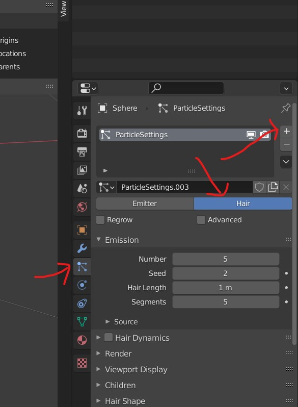

## viewport

### canvas movement

- dont click on particle and pan or rorate view
- instead click on parent mesh and move the viewport

## Viewing settings

### render mode divisions or segments

- 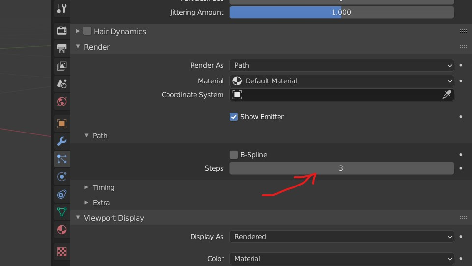

### viewing shading steps

- more steps meaning more sub surface division
- 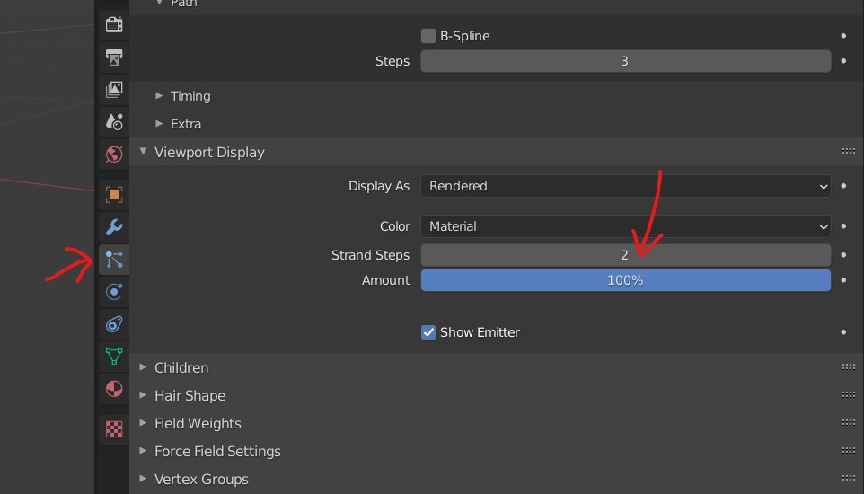

## Children particles

- 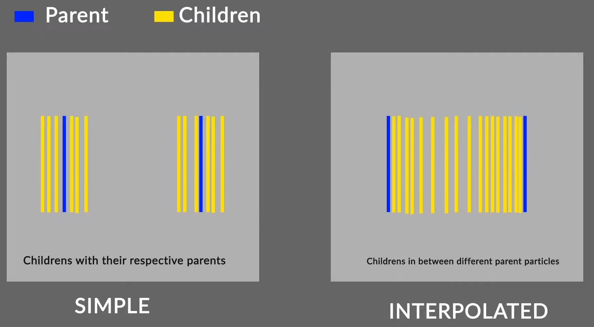

### Clumping

- settings under particle ->children -> clumping
- 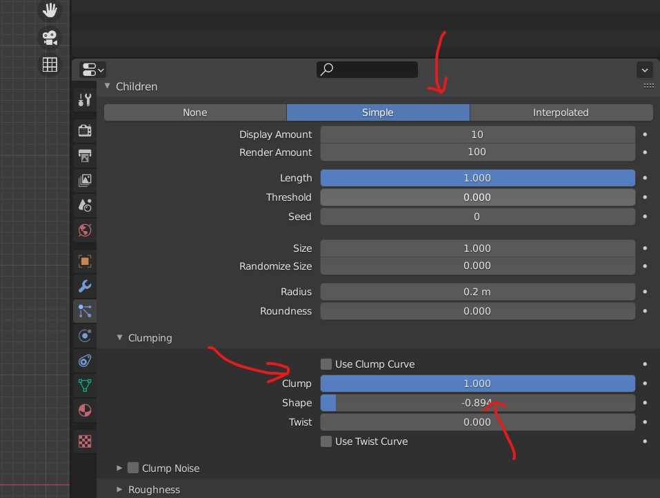
- 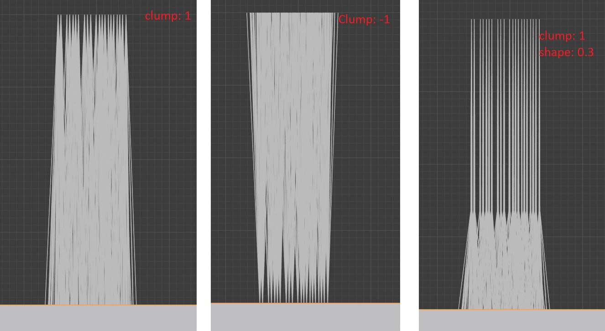

### Roughness

- adjust random and size
- threshold - to control how many strands will be affected by roughness setting
- 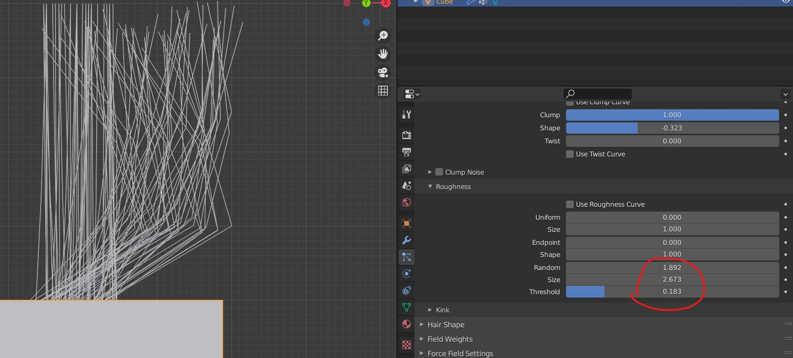

### kink

- have a sine wave in your hair
- 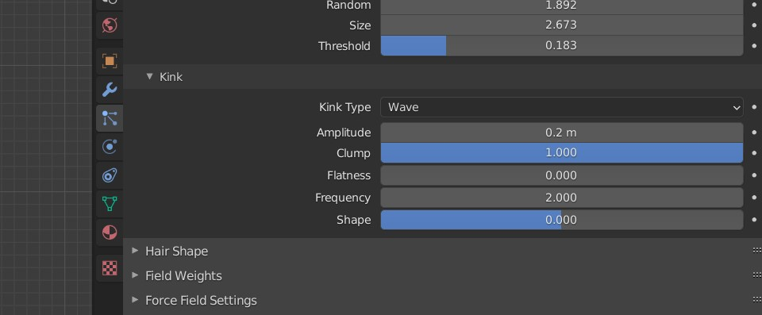

### Hair shape

- control size of each hair
- 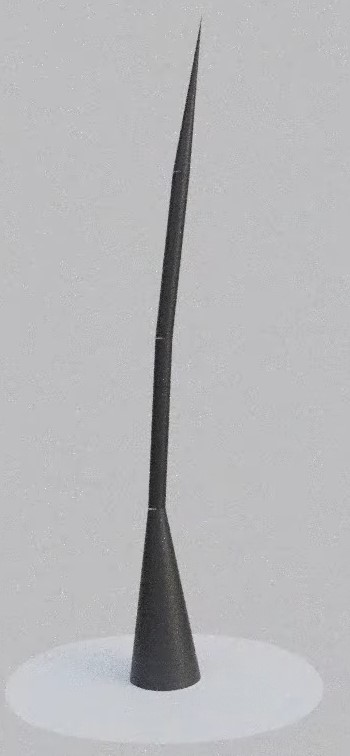
- 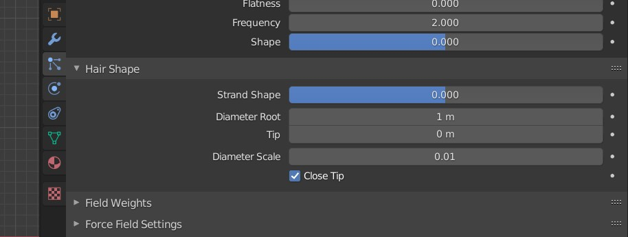

## Particle edit mode

- select the number of segments and number of hairs
- seed - random distribution and positioning of the strands

### move, rotate, scale

- <kbd>G</kbd> - Move
- <kbd>R</kbd> - Rotate
- <kbd>S</kbd> - Scale

### move many hairs/particle with root

- 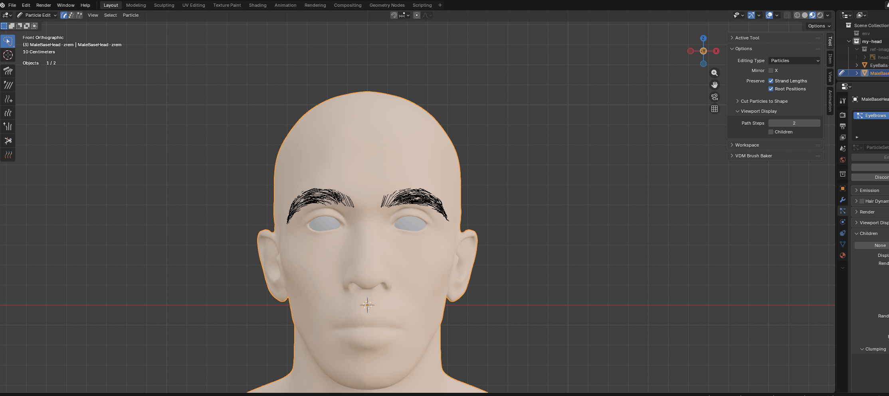
- enlarge the brush
- disable the preserve root positions

### snap the hair on surface

- 
- select -> roots
- disable preserve roots position
- enable snap
  - face project (or face)
  - align rotation to target, backface cuiling
  - move, rotate & scale
- press g and carefully move mouse with shift and click

### Increase hair length

- 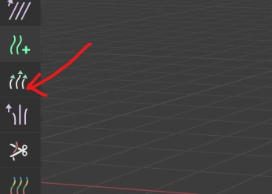

### Selection mode

- tip selection or mid point selection
- 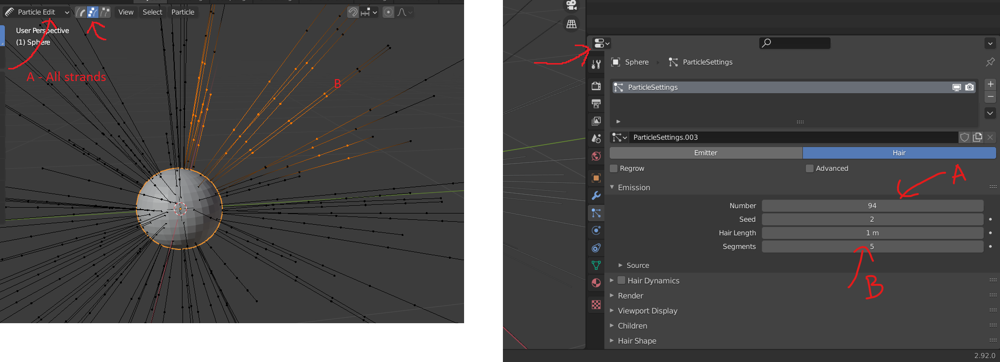

### Tools property

- preserve root
- extend the hair
- avoid clipping root
- 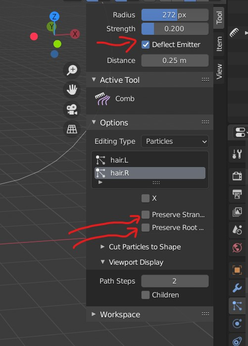

### have fine hair curves

- set Tool -> Options -> Viewport Display -> Path Steps -> 6
- 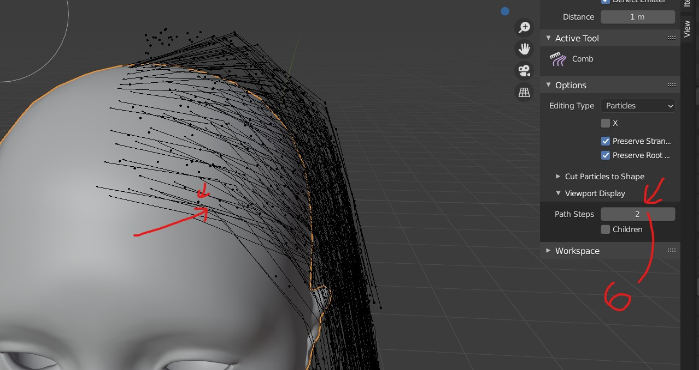

### show children hair in particle edit mode

- 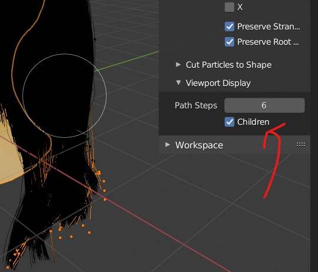

### Add

- 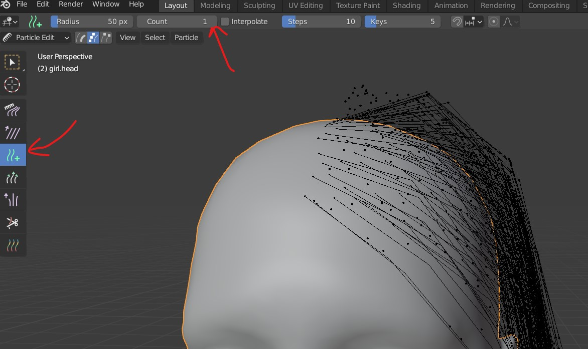

### select roots

- press <kbd>SPACE</kbd> for search in blender
- type select roots

### select next set of vertices

<kbd>CTRL</kbd> + <kbd>NUM +</kbd>

### subdivide vertices

- 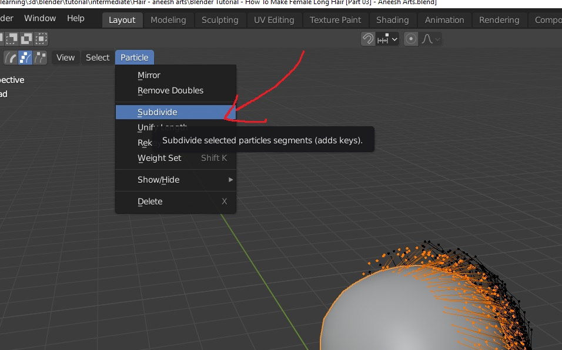
