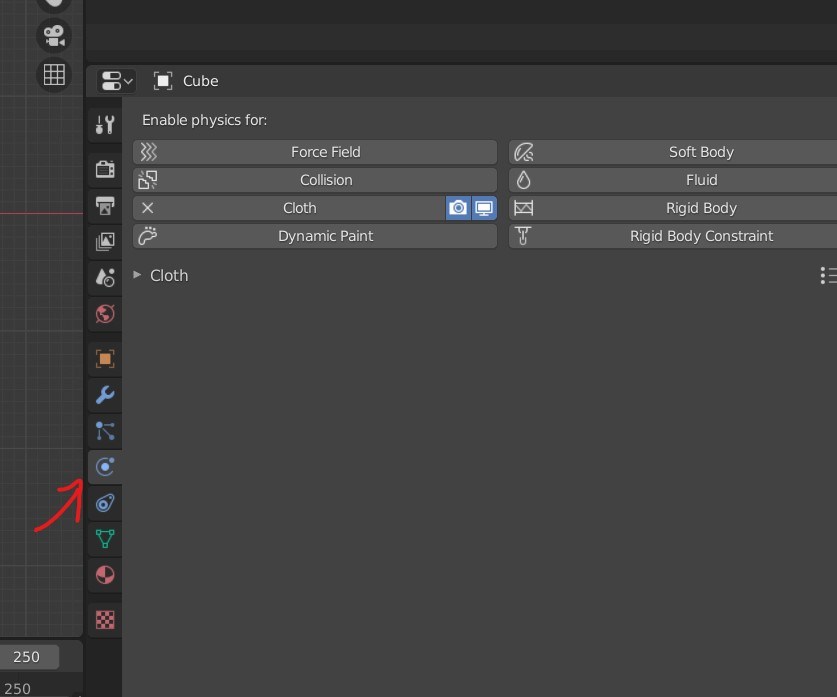
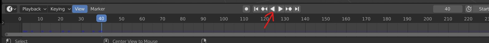
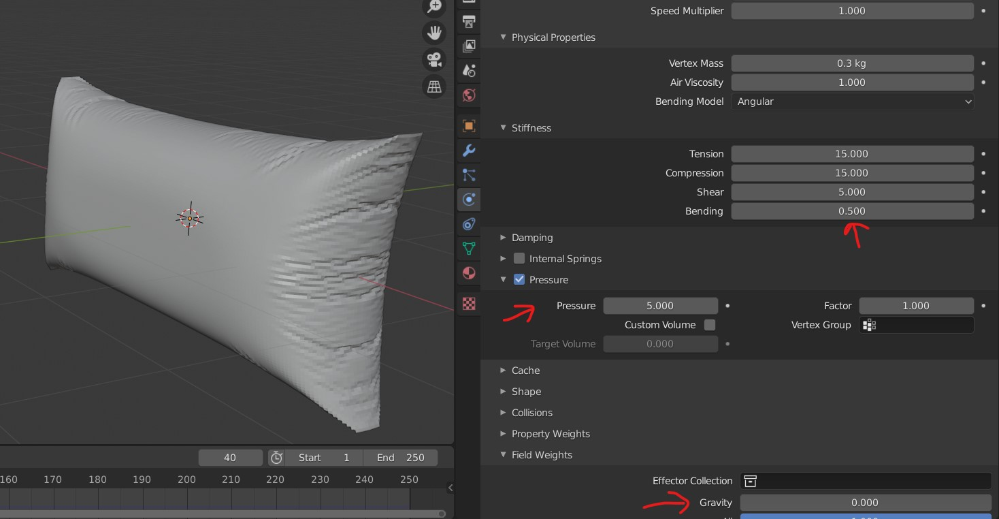
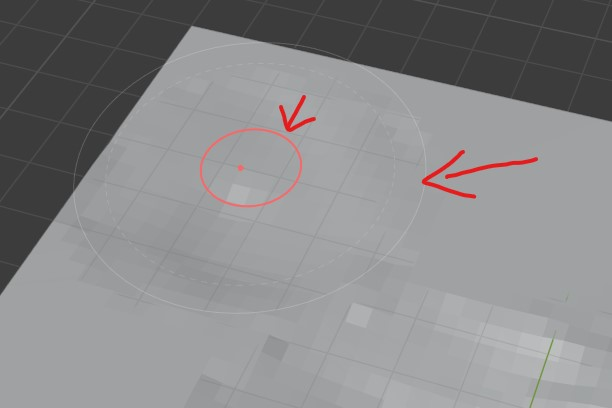
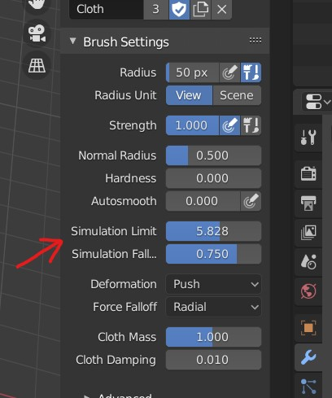

# physics

- 
- Physics tools
- its gets applied as a modifier (so need to apply the physics)

- 
- Animation have to be run to see the physics getting applied

## cloths

- 
- Pressure property is very important and controls the wrinkles
- Turn off gravity
- bending controls the size of the wrinkles

### simulation area

- we have to the middle circles as drag point and outer circles which define the simulation area
- 
- 
