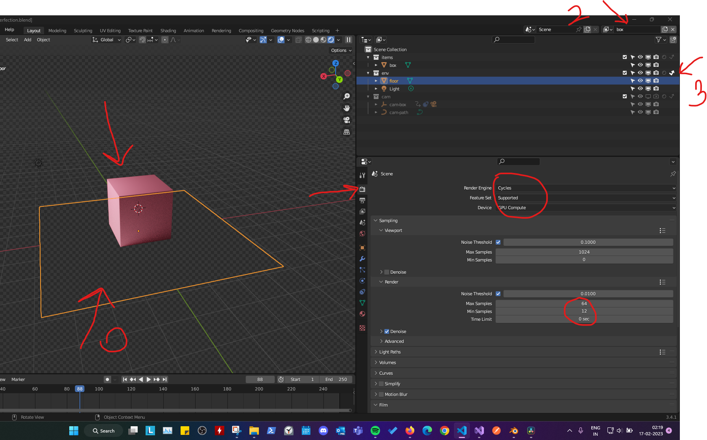

# Render - Create images of the 3d objects

## Transparent background
- under camera
    - render engine - select "Eevee" or if "Cycles" then GPU compute
    - Film - enable "Transparent"
- 

## Layers
- to control multiple type of views
- 
0. select render engine as "cycles" (or "Eevee")
1. add layer
2. add name
3. modify the view settings under "outliner"
    - Enable or disable `bounced arrow` to only render shadows (works only with "Cycles")
4. Select Film -> "transparent"
5. Get the desired result
    
## sharpen up the shadows in evee
- camera settings
- 
- light element settings
- 

## shadow catcher in cycles
- 
- select the object that you want to have shadows on
- under "object properties" -> Visibility -> Shadow Catcher
- under "Outliner" select indirect lighting (bounced arrow) to hide
    - the object whose only shadows we want in the layer

## Render image with layers

### Cycles and GPU Compute
- under "Render Properties" and "outilner"
- 
- create a layer with only object fully visible and shadows catching object with indirect lighting (hiding it😅) 
    - in the image its "box" layer
- create another layer with only shadows caught on the shadow catcher object
- 
    - the layer name is "box-shadows"

#### Render image or animation
- 
- go to render -> render image or render animation