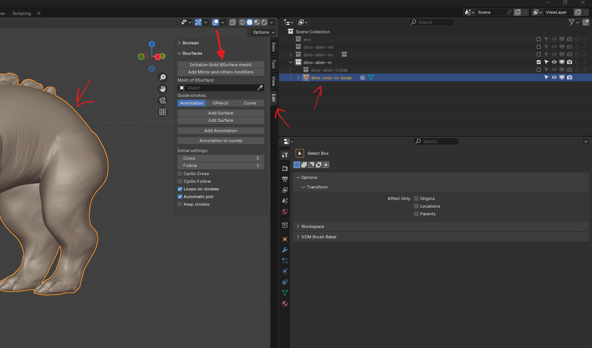

# **Retopology**

## enable Add on

- BSurfaces GPL Edition
- f2
- looptools

## Init B Surface mesh

- 
- click "initialize"
- 

### markings annotations

- 
    - marking direction is important
- click "Add Surface"
- this add a new mesh "BSurfaceMesh"
  - with shrinkwrap modifier with `target` set to mesh we are retopologising
  - with a subsurface and solidify modifier
    - disable them as needed
  - snapping is on
    - set snap mode to "face nearest" instead of "face project"
  - in the viewport shading popover color should be set to "Material"
- auto merge is on - [refer](../basics/blender-basics-notes.md#auto-merge-vertices-or-edges)
- 
    - enable mirror
    - cyclic cross
    - change faces count by changing "cross" and "follow"

**Note:** use annotation lines instead of pencil

#### make the back surface transparent

- 
    - goto viewport shading
    - enable backface cuilling

#### shrinkwrap enhancement

- 
    - wrap method -> "Nearest Surface Point" or "Target Normal Project"
    - snap mode - Above Surface
    - offset can be - 0.005 m - 0.05 m
      - adjust it so that retope mesh just hovers and is slightly inside
      - as we are going to bake the sculpt texture onto the low poly retopologized mesh

## resume retopology

- select the mesh "BSurfaceMesh" and go to edit mode
- select annotate tool
- draw lines
- in b surface menu -> "Add Surface"

## edit markings

- go to object mode
- select the surface markings
- edit mode

### Erase

- use annotation eraser

### Edit the direction of face

- use scale and flip it

### add more

- 
- select the edge where you want more "retopology"
- draw using annotations
- in b surface menu -> "Add Surface"

#### using f2 add on

- 
- select the vertice between 2 vertices
- press f and left click to set

### extrude

- in edit mode
- select the edge or vertice
  - press <kbd>e</kbd> + <kbd>left click</kbd> to set
  - or press <kbd>ctrl</kbd> + <kbd>right click</kbd>

### edge loop

- <kbd>ctrl</kbd> + <kbd>r</kbd>
- <kbd>left click</kbd> to set
- move the mouse to position or press <kbd>esc</kbd>

### dissolve edges

- select the edge
- <kbd>ctrl</kbd> + <kbd>x</kbd>

### slide the vertex or edge

- select the edge or vertex
- press double <kbd>g</kbd>

### control edge loop shape using loop tools add on

- select the vertices (usually the loop)
- 

## Smoothen the topology

- add smooth modifier
- use sculpt -> relax slide brush

### use looptools

- to relax the vertices
- ctrl + e -> loop tools -> relax

## final checks

- after the mirror modifier is applied make sure the joints are merged
- remove the material
