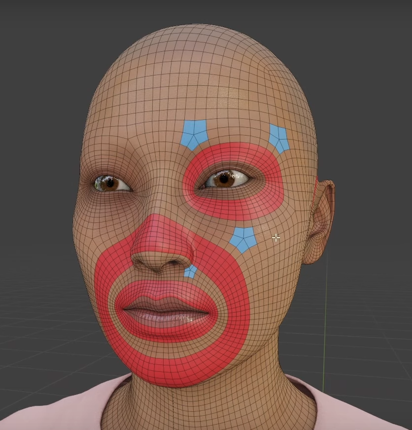
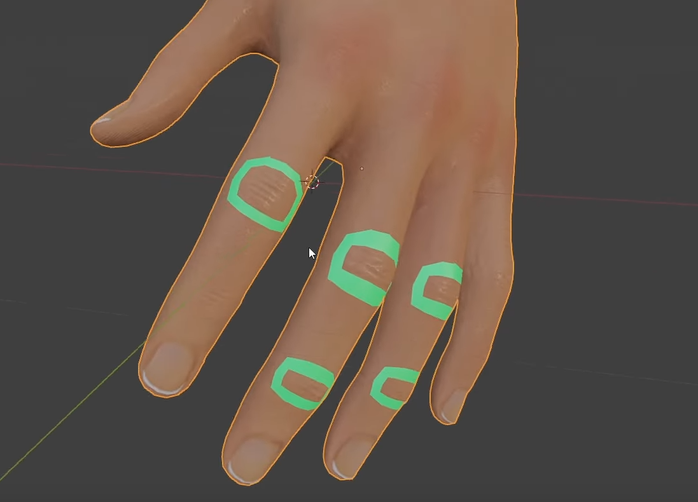
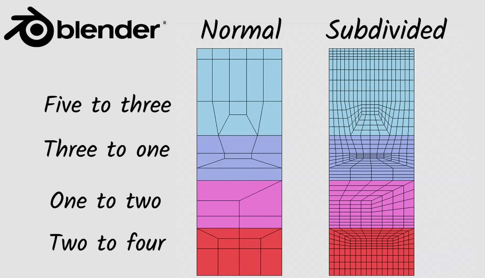

# **Retope Guide**

<table>
  <thead>
    <tr>
      <th>Pole Type</th>
      <th>Edge Count</th>
      <th>Common Use</th>
      <th>Behavior</th>
      <th>Risk</th>
    </tr>
  </thead>
  <tbody>
    <tr>
      <td><strong>N-Pole</strong></td>
      <td>3 edges</td>
      <td>Organic modeling (e.g. nose base, convex corners)</td>
      <td>Redirects edge flow sharply</td>
      <td>Can cause pinching or tight deformation</td>
    </tr>
    <tr>
      <td><strong>E-Pole</strong></td>
      <td>5 edges</td>
      <td>Extrusions (e.g. mouth, eyes, limbs)</td>
      <td>Spreads edge flow outward</td>
      <td>Can flatten or distort nearby loops</td>
    </tr>
  </tbody>
</table>

# How to create edge loops

- select the faces
- use inset (press <kbd>i</kbd>)
  - opposite of extrude

# where to form edge loops

## Face

- 
- 

## Fingers or Elbows

- 

# reduce count

- 
