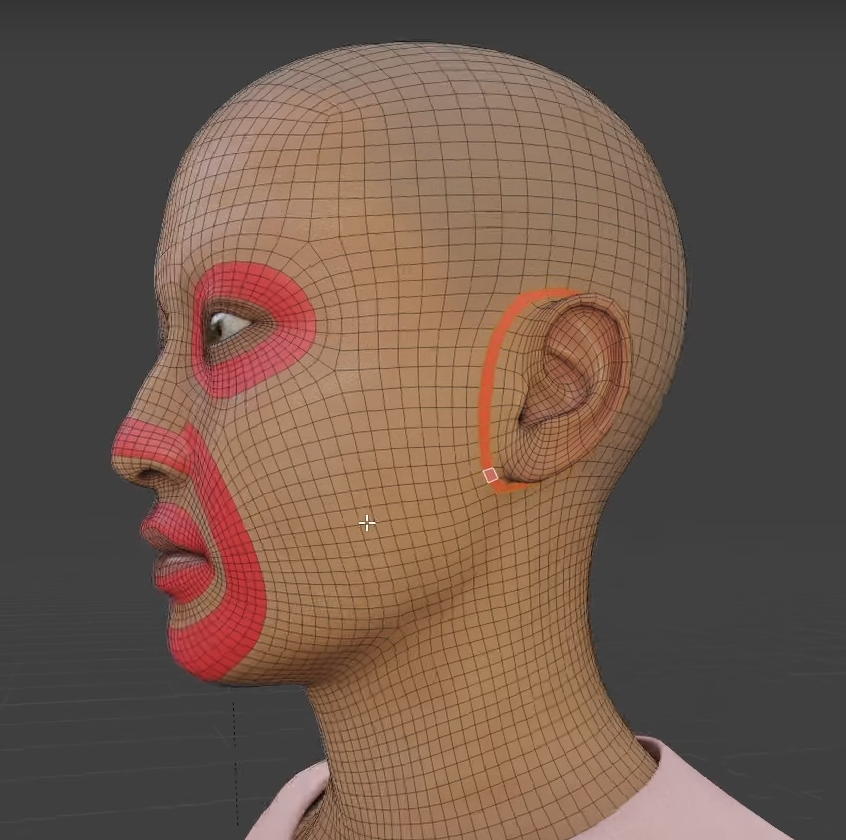

# **Retope Guide**

<table>
  <thead>
    <tr>
      <th>Pole Type</th>
      <th>Edge Count</th>
      <th>Common Use</th>
      <th>Behavior</th>
      <th>Risk</th>
    </tr>
  </thead>
  <tbody>
    <tr>
      <td><strong>N-Pole</strong></td>
      <td>3 edges</td>
      <td>Organic modeling (e.g. nose base, convex corners)</td>
      <td>Redirects edge flow sharply</td>
      <td>Can cause pinching or tight deformation</td>
    </tr>
    <tr>
      <td><strong>E-Pole</strong></td>
      <td>5 edges</td>
      <td>Extrusions (e.g. mouth, eyes, limbs)</td>
      <td>Spreads edge flow outward</td>
      <td>Can flatten or distort nearby loops</td>
    </tr>
  </tbody>
</table>

# How to create edge loops

- select the faces
- use inset (press <kbd>i</kbd>)
  - opposite of extrude

## Face

### markings

- 

### edge loops

- 
- 

## Fingers or Elbows

- 

# where to add more vertices

## sharp edges

- 

### avoid poles on edges

- 

## retope mesh is NOT wrapping on base mesh

- 
- delete and add more vertices and join them using 1 to many joint

## Ratio

| Type    | Edge loop vertices |
| ------- | ------------------ |
| Nails   | 6 - 8              |
| Teeth   | 6 - 8              |
| Fingers | 10 - 12            |

# reduce vertices count (creates redirection)

- 

# Retope in parts

but always keep one retope mesh only, otherwise join and editing vertices is a pain

## how or when to divide

- keep the scull or face with teeth together, dont have it seperately
  - because mirror is important
- hands and half torso
- legs and half torso

# how to space or add gap different object

## fingers

- make sure the gap between all the fingers is same so that retope is easy
- also align the fingers properly
- 

## armpit and chest

- there should be enough gap between chest and arms, i.e. the model should be in relaxed t pose
- 

# redirect topology or edge flow

- 
