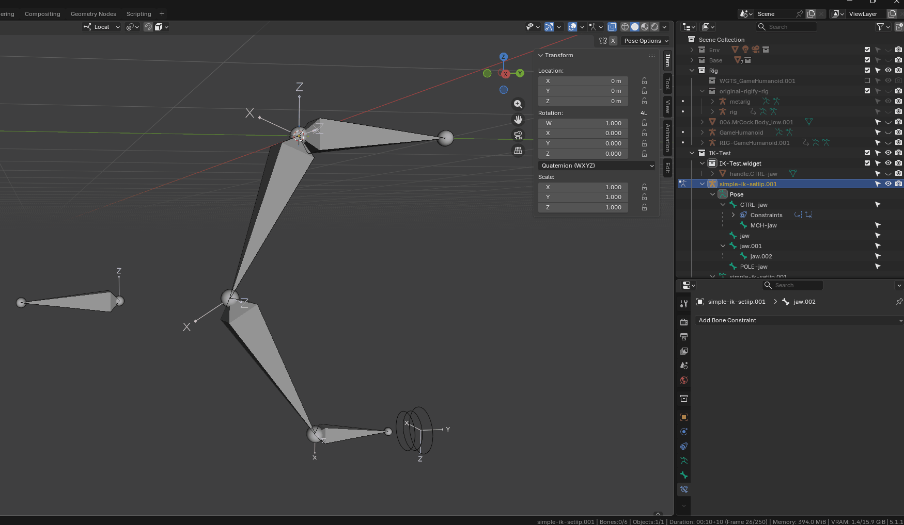
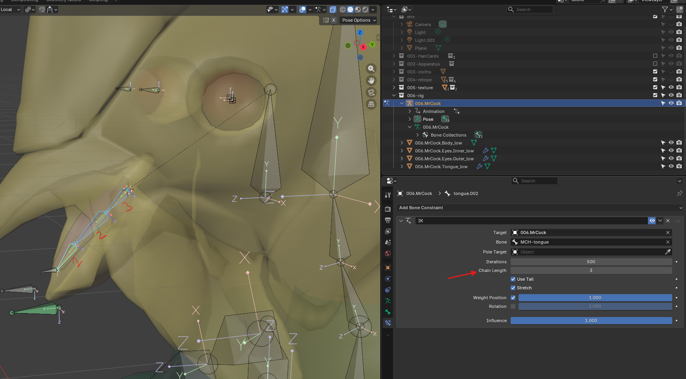
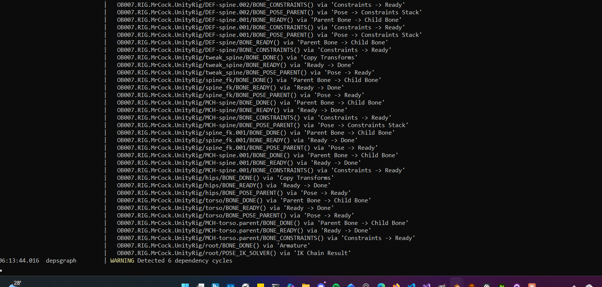

# Inverse Kinematics (IK)

- 
- select the MCH bone, then the target bone
- shift + i -> target selected bone
- adds the IK contraint

## create an offset distance between bone and control bone

- add a MCH bone anywhere, parent it to CTRL bone
- IK the target bone to MCH bone

## move only connected bones

- use chain setting
- 

# Issues

## Dependency Cycle

- 
- adding a new IK, makes the whole RIG move, or in console there is the warning
- solution - set the chain Length to more than 0, because 0 means all
