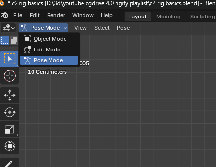
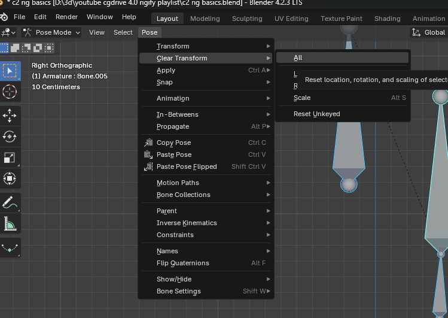
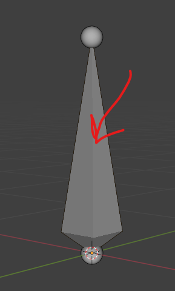
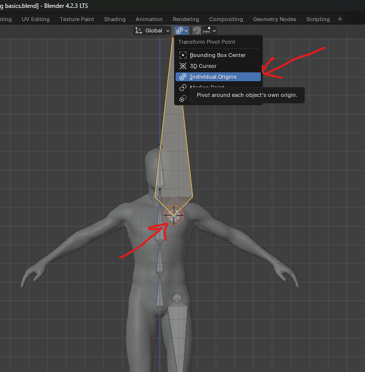
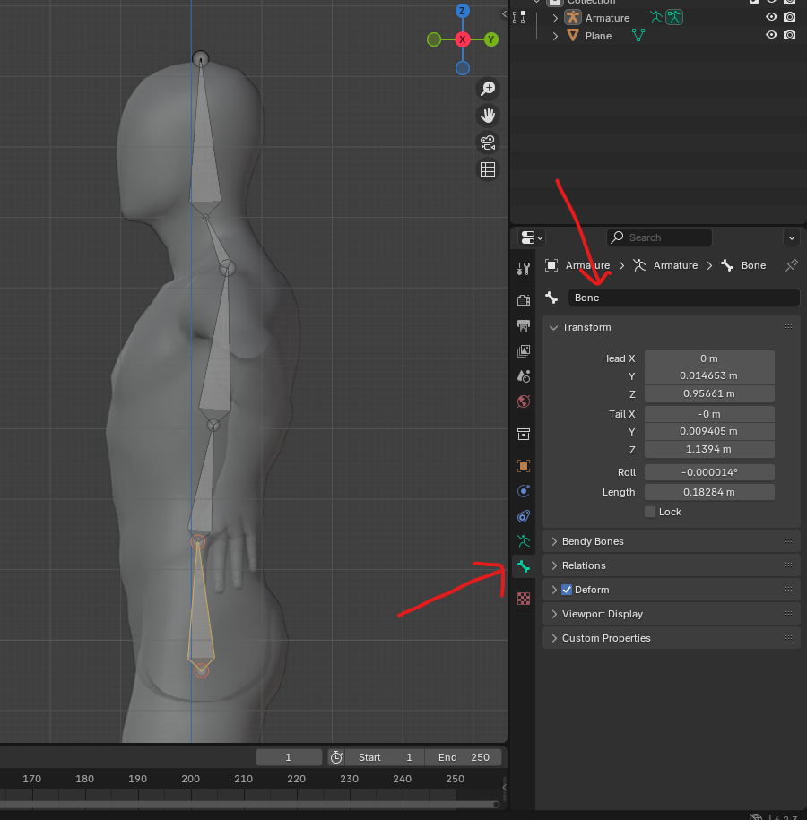
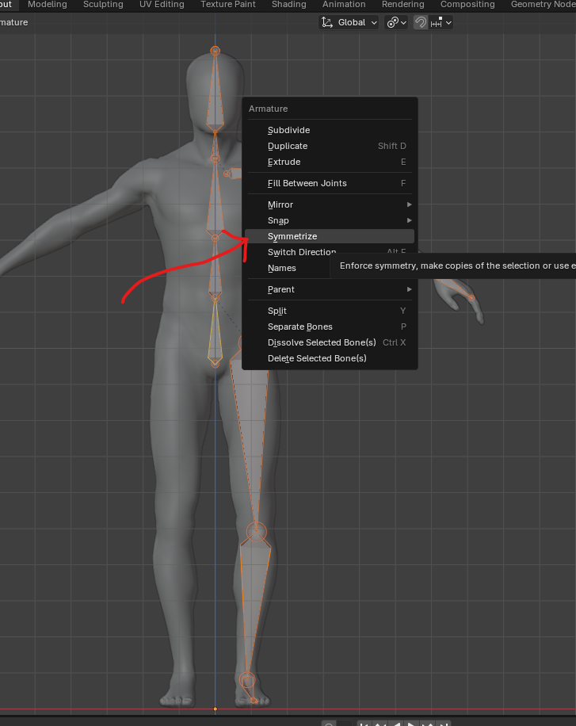
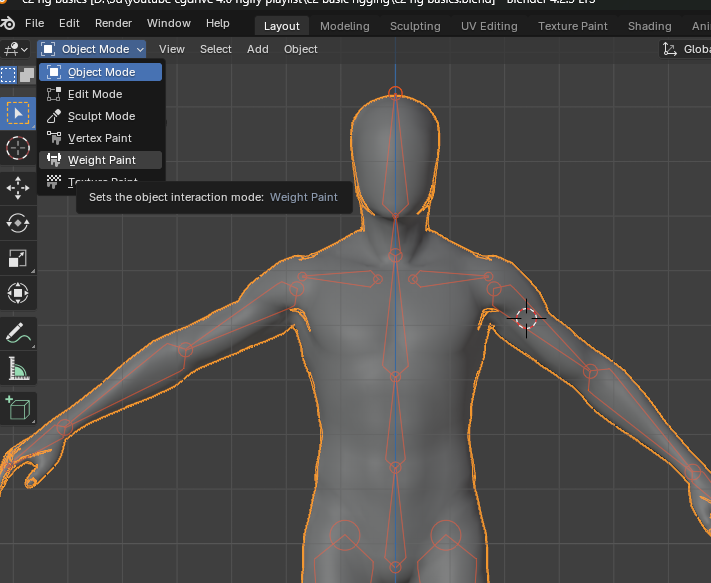
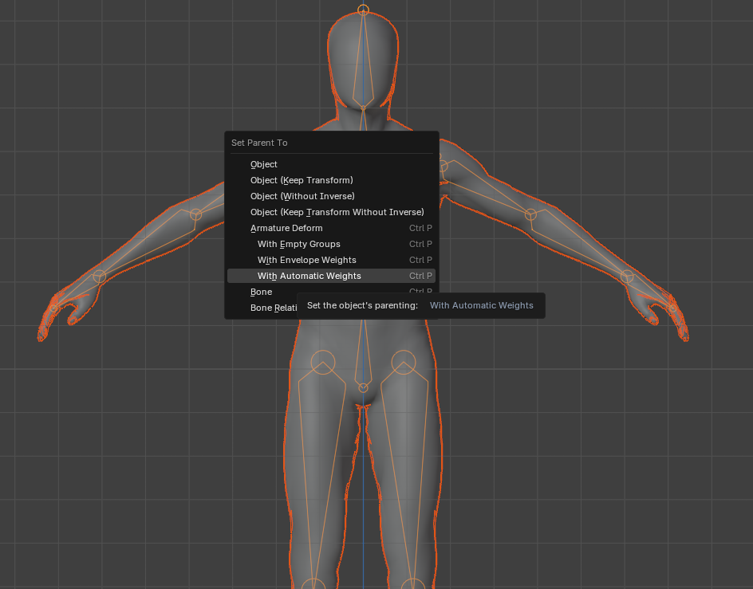
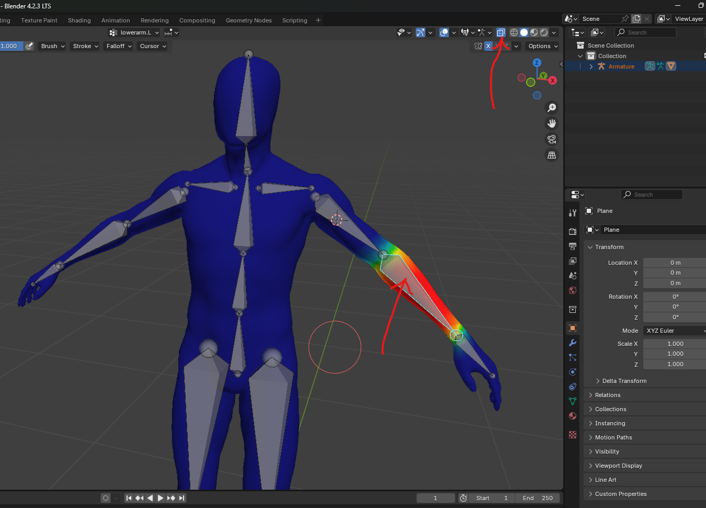

# pose mode

## reset bones to original pose
- select bone or bones and goto Pose - clear transform -> all or anything
- 

# Armature basic
- shift + a to add armature
- press TAB to switch to edit mode

## select
- click the following or press and drag the mouse onto this
- 

## new bone
- to be added in `Edit mode` only

### shift + a
- move the bone to new place
- press shift + a
    - this will automaticaly add another bone at the center

### extrude
- select tail and press `e` to extrude the bone

### subdivide
- select the bone, right click -> subdivide

### scale based on origin
- select bone -> change the mode as shown in the image
- 
- press `s`

## rename bones
- 
- or press `f2`

### naming convention to symmetrize
- thigh.L
- upperarm.L

## connect bones
- select 2 bones and press ctrl + p
    - keep offset will keep them seperate
    - connect will snap child bone onto the parent

## duplicate other side of bones or symmetrize
- select bones
- right click and select symmetrize
- 

# Weights
- weight paint becomes available when mesh is selected
- 

## automatic weights
- switch to object mode
- select the mesh
- press shift and select the armature
- press ctrl + p
- automatic weights
- 

## weight painter see bones
- select bones -> select mesh -> go to weight paint
- 
- or press alt + z