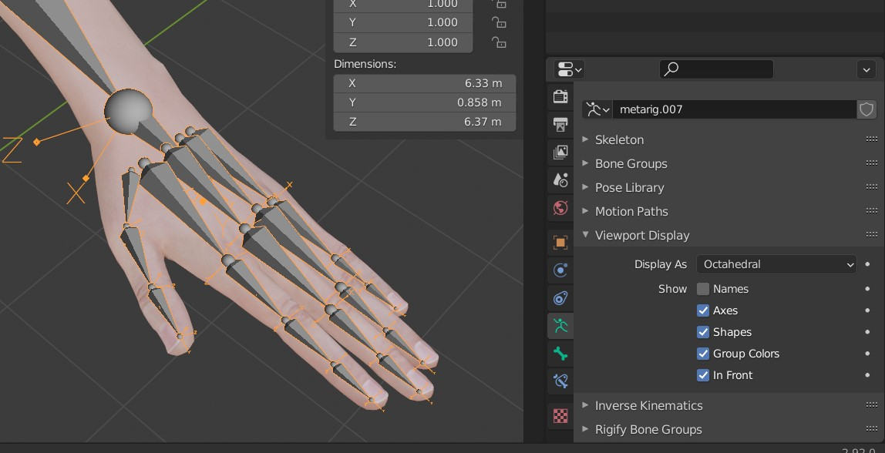
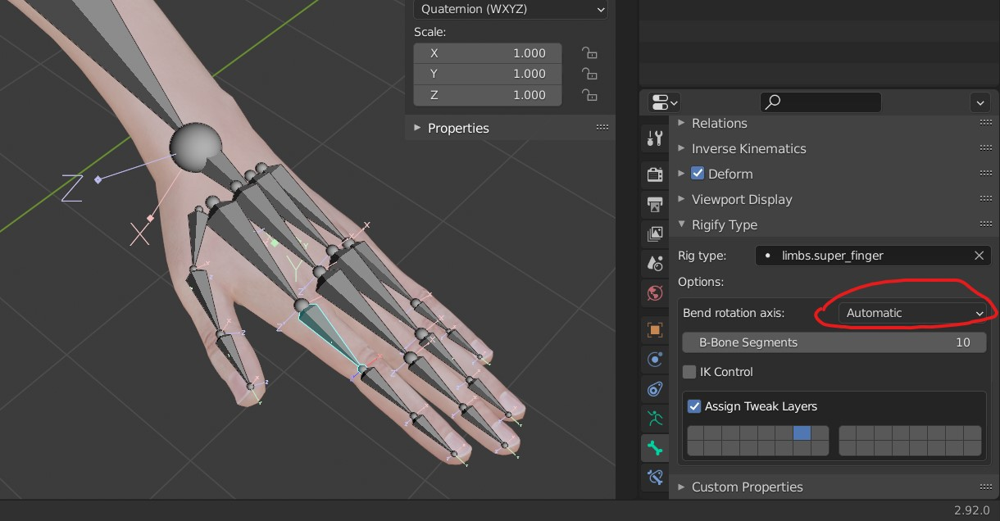
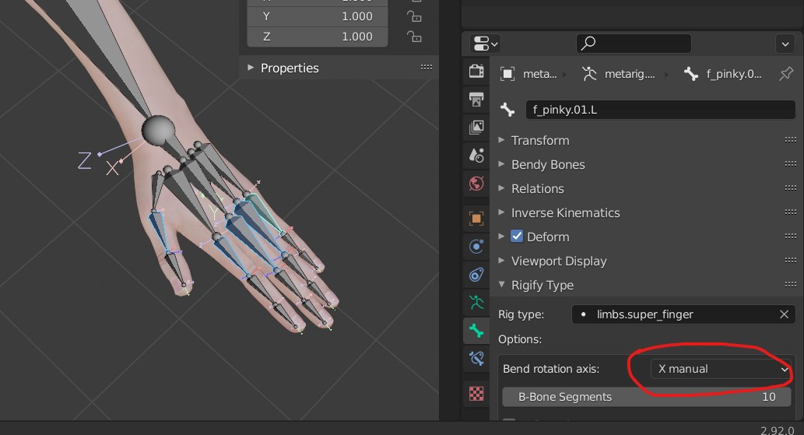

# Rigify

- Enable it in blender add-on settings

## Enable bone axis

- select metarig
- go to viewport display
- 

## Bend Bone Direction

- in the pose mode
- select the bone
- set the Bend rotaion axis to x manual
- 

## apply to all the selected bones

- select the bones
- change the `bone rotataion axis` as per the above step
- right click as shown in below images (the red marked)
- 
- select `Copy to selected`
- repeat the same on the other side (like the left or the right side)
