# Fingers

- use volume snapping
- 
- use persepective view

# face

- use pose mode to move connected bone
- later press ctrl + a -> apply pose as rest pose

## Alignment

### middle tip bones

- 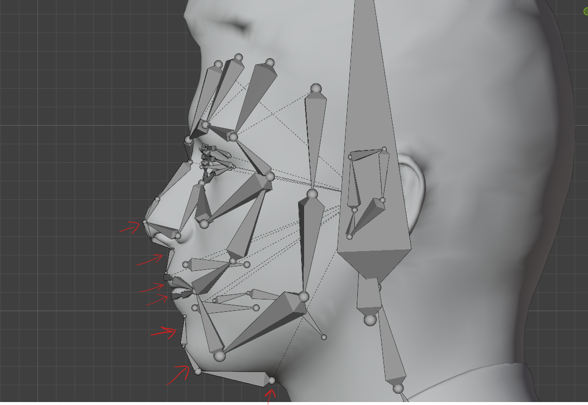
- align these bones on the tip of chin and nose area

### forehead bones

- use face snapping, so that they snap on the forehead
- 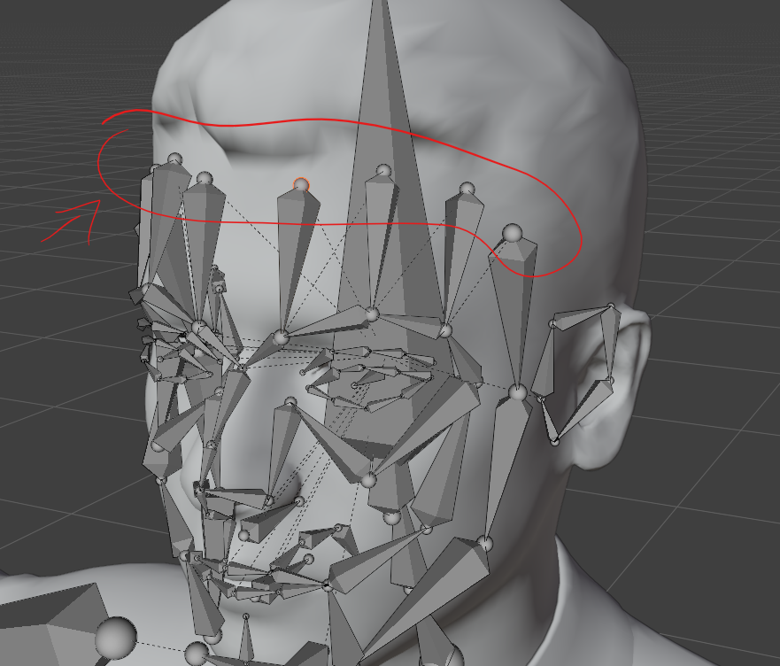

### eyebrows bones

#### eyebrows top bones

- switch to material preview and align the bones where the eye brow start and end
- 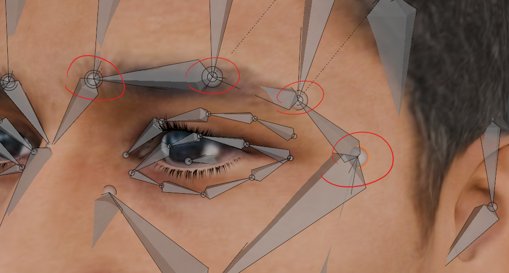

#### eyebrows bottom bones

- align between eyebrows top bones and eye lid top bones, use face snap
- 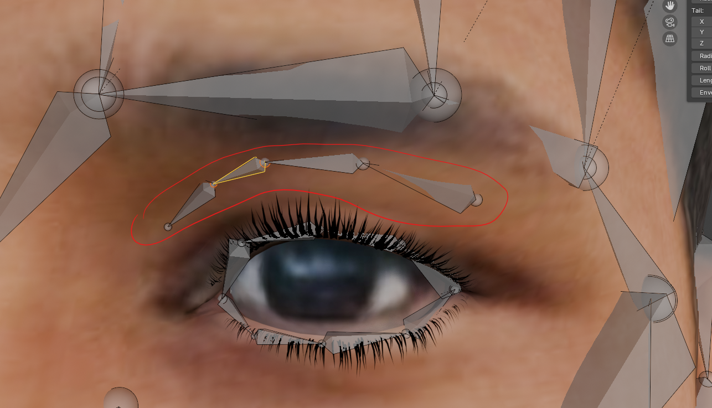

### eye lid bones

- 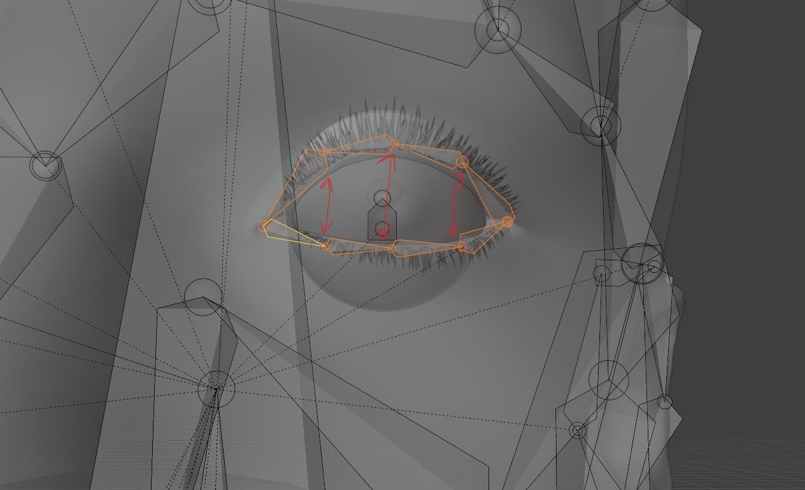
- the upper and lower bones should align
- 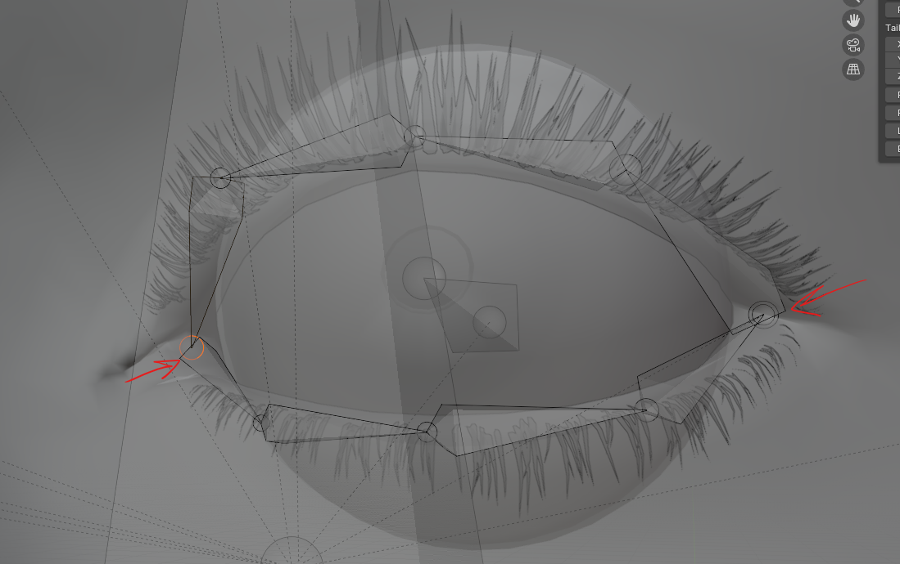
- align the start and end bones right on eye lid corners

### eye bone

- select the eye center edges, place the 3d cursor at its center (cursor to selection)
- 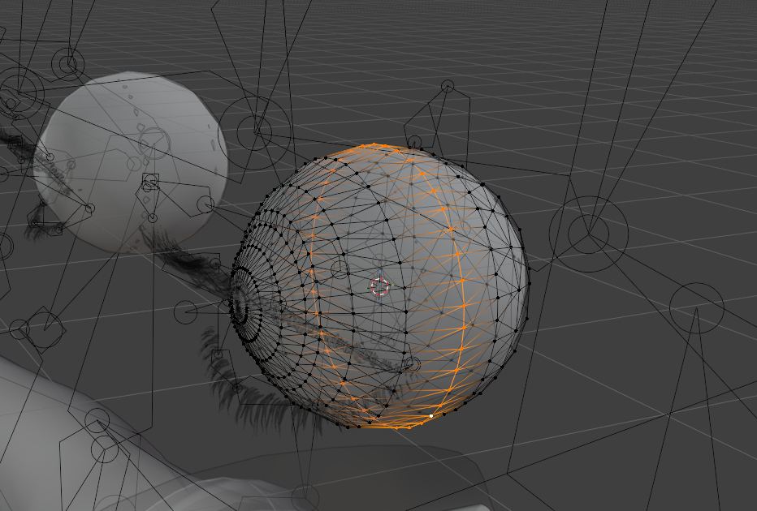
- in armature edit mode -> shift + s -> selection to cursor
- 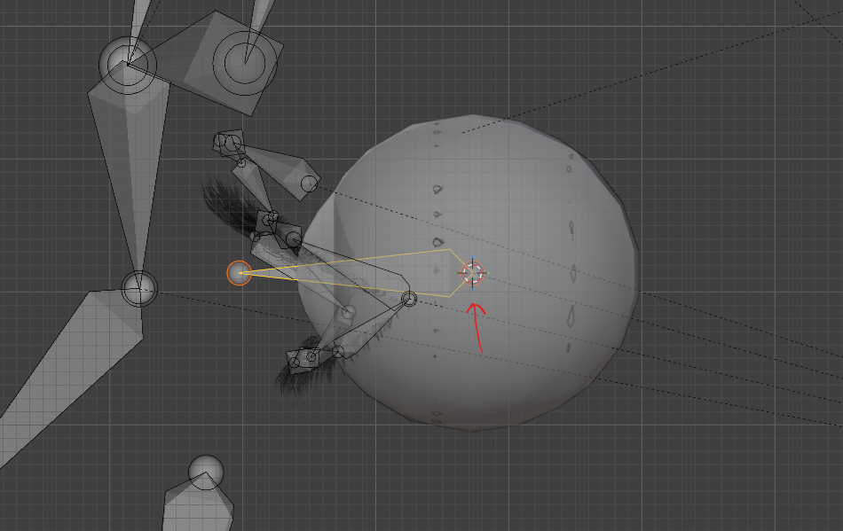
- adjust the eye bone size
- 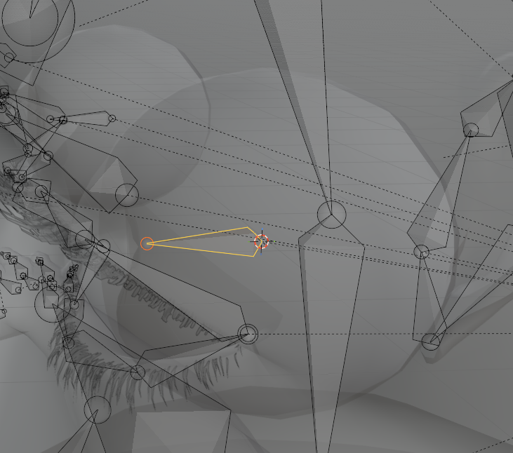

### nose and cheek

- 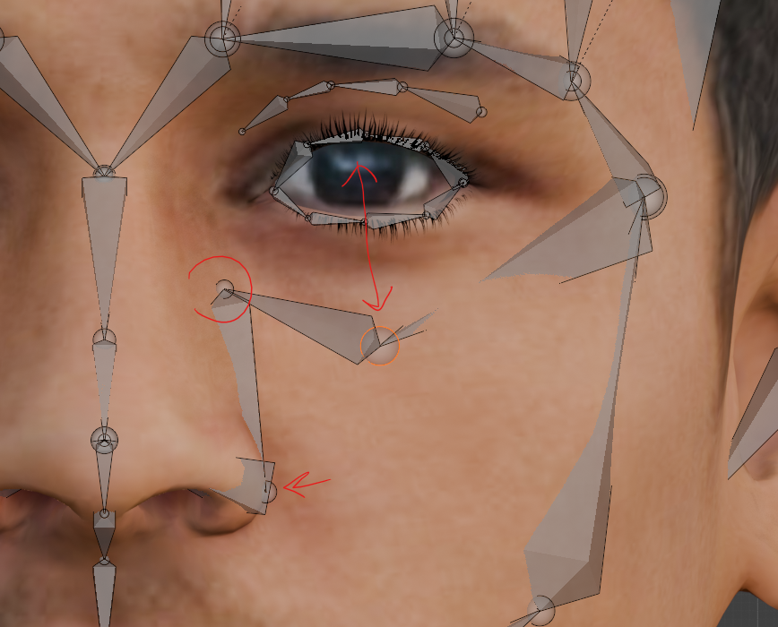
- align the nose bones over nose and cheek right below the eye

### lips and cheek

- 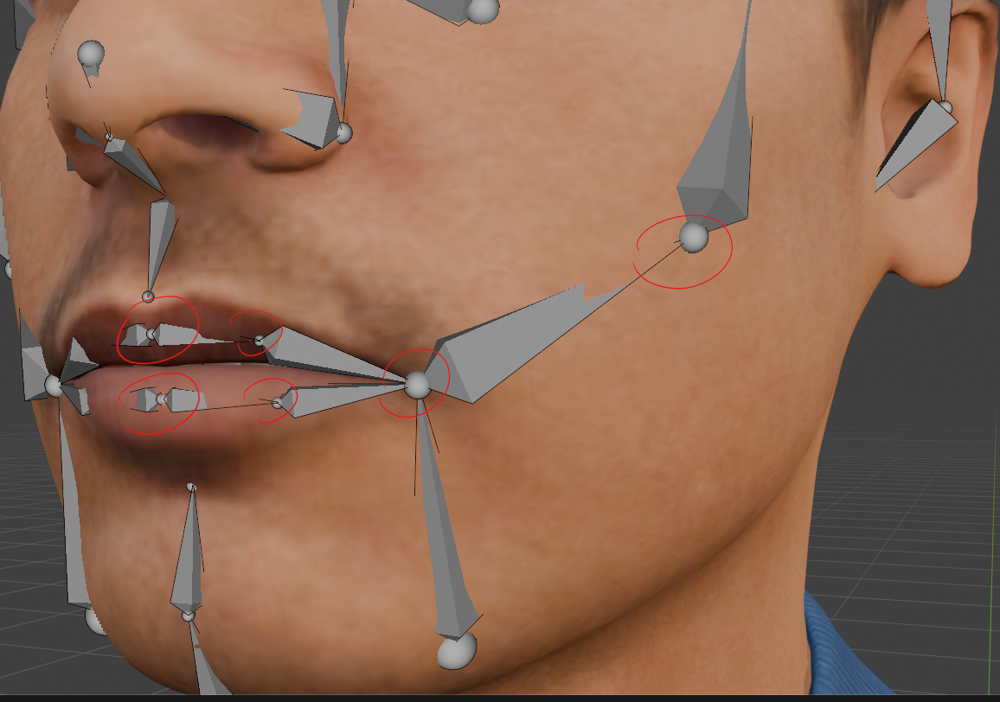
- align the lips bones over the lips
- cheek bone over cheek

### ear bones

- 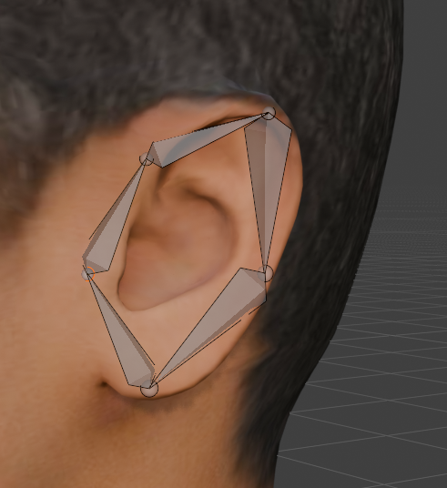

### jaw and temple bones

- 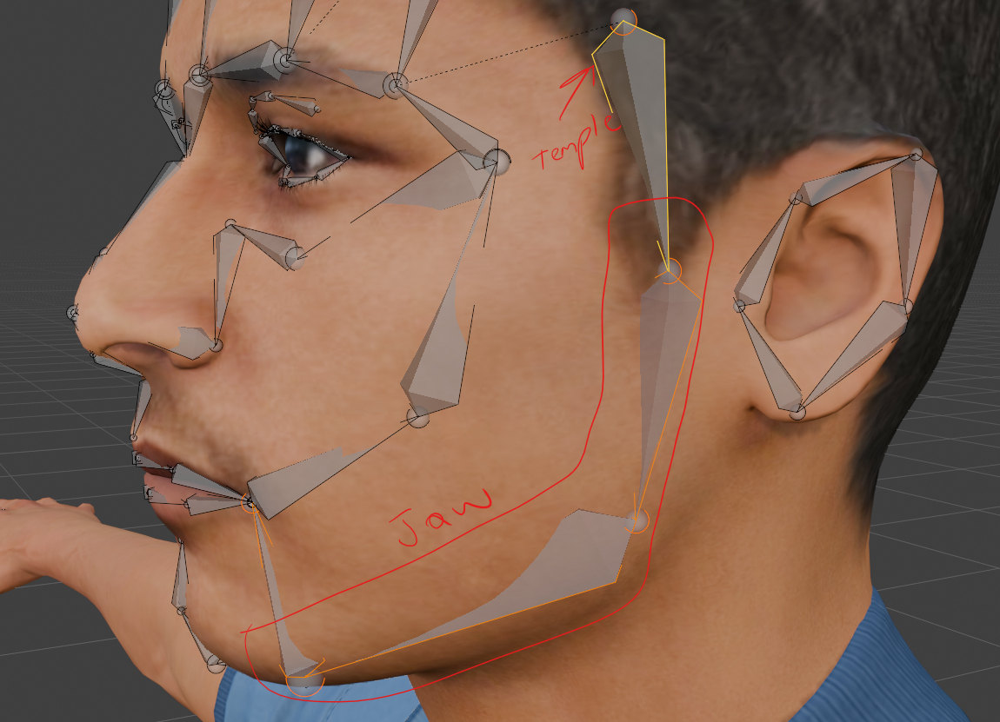
- align the jaw bones in the jaw volume and jaw line
- chin bone over the skin slightly over the skin
- temple bone over the skin

### teeth bones

- 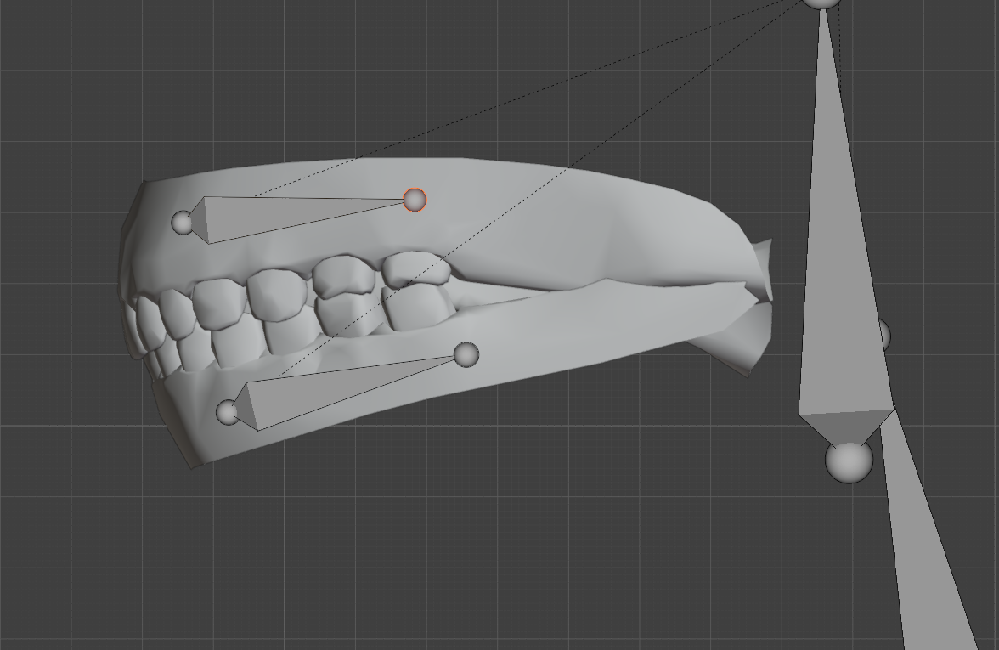

### tongue bones

- 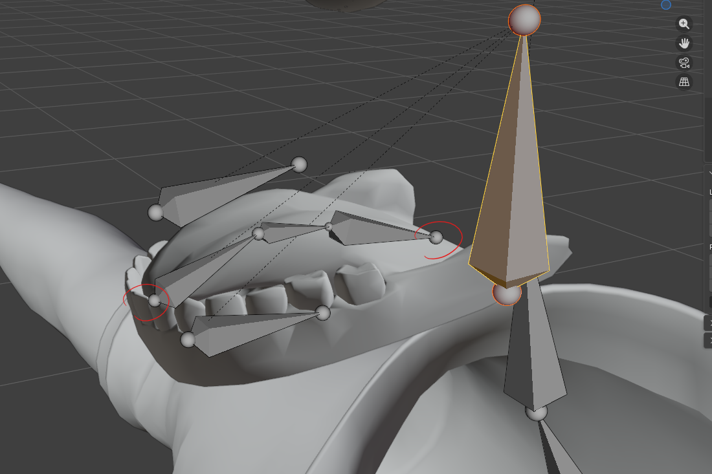

# Automatic weights

- do not use auto weights for tongue, eyes, teeth
  - i.e. any seperate meshes
