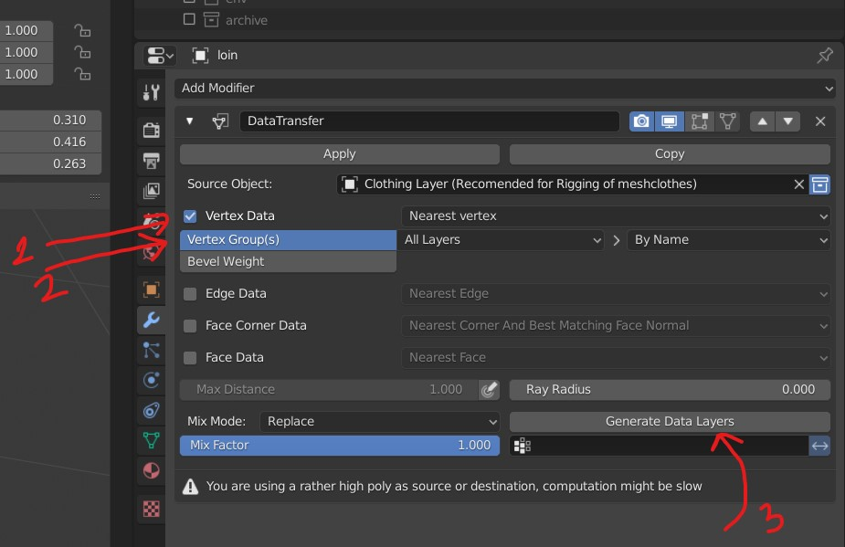

# Weight Paint

- 
- reduce weight to have blue
- more weight gives red

## x ray for bright mode

- select the mesh and press <kbd>ALT</kbd> + <kbd>Z</kbd>

## More weight paint layers on object

- 

## Show hide the bones above mesh or object

- select armature
- go to `Object Data Properties`
  - the dancing stick man
- Viewport Display
- Select `In Front`

## Select bones while painting

- Go to `object mode`
- Select the bones
- select the mesh
- Go to `weight paint mode`
- <kbd>SHIFT</kbd> + <kbd>CTRL</kbd> + <kbd>Left Click</kbd> on bone to select

**Note:** In case if selection doesnt work then remap the keymap -> 3d view -> weight painting -> select

## weird weight paint

- in the brush stroke - check if `Stabilize stroke` is ON

## Weight trasfer using data transfer modifier

- 

## weight transfer from selected bones (one or more)

- NO need to create a new vertex group, as a new vertex group will be created
  - if a vertex group is created, select it
- select the bone
- go to "Weight paint menu"
- select "assign automatic from bones"
- 
