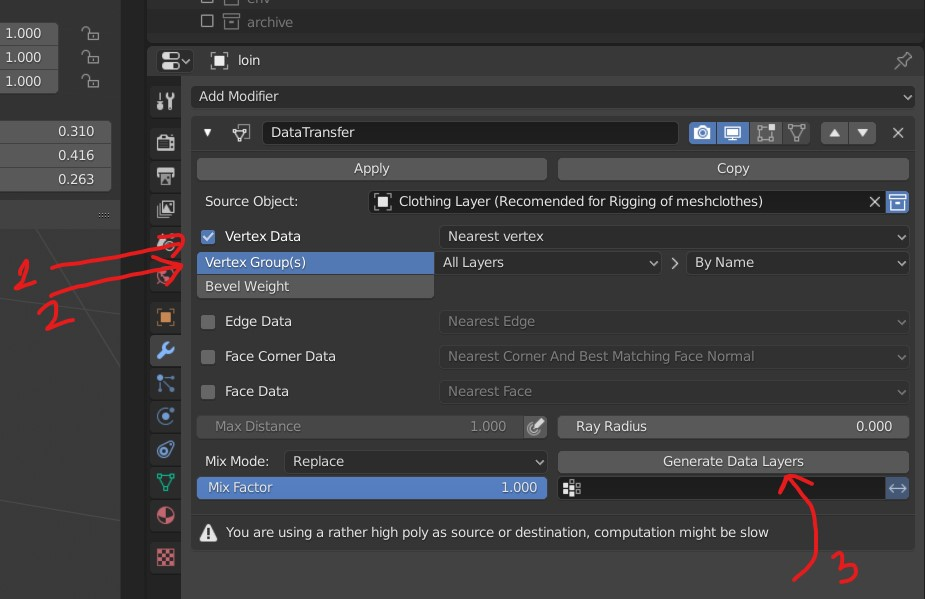

# Weight Paint

- 
- reduce weight to have blue
- more weight gives red

## x ray for bright mode

- select the mesh and press <kbd>ALT</kbd> + <kbd>Z</kbd>

## More weight paint layers on object

- 

## Show hide the bones above mesh or object

- select armature
- go to `Object Data Properties`
  - the dancing stick man
- Viewport Display
- Select `In Front`

## Select bones while painting

- Go to `object mode`
- Select the bones
- select the mesh
- Go to `weight paint mode`
- <kbd>SHIFT</kbd> + <kbd>Left Click</kbd> on bone to select
- <kbd>SHIFT</kbd> + <kbd>ALT</kbd> + <kbd>Left Click</kbd> on bone to unselect

## weird weight paint

- in the brush stroke - check if `Stabilize stroke` is ON

## Weight trasfer using data transfer modifier

- 

## Tranfer weight

- select the bones
- select the mesh
- go to weight paint
- select the envelop
- 
- vertex will be added for that bone

## Adding Particles

- Select the object on which you want to add particles
- 
- Option Emmission -> seed - emits a different pattern in the way partcles are added

## copy weightor invert weights

- use mirror to copy weight to other vertex
- 
- rename the vertext group to bone weight

### Select the object to duplicate on top of previously selected object

- 
- Select the object

### Rotate

- 

### selecting the vertex group (weight painter group)

- Particle property -> Vertex Group
- 

### deleting all the vertex group

- clicking on the button opens the menu
- 
- in the menu select delete all groups

### set priority

- 
