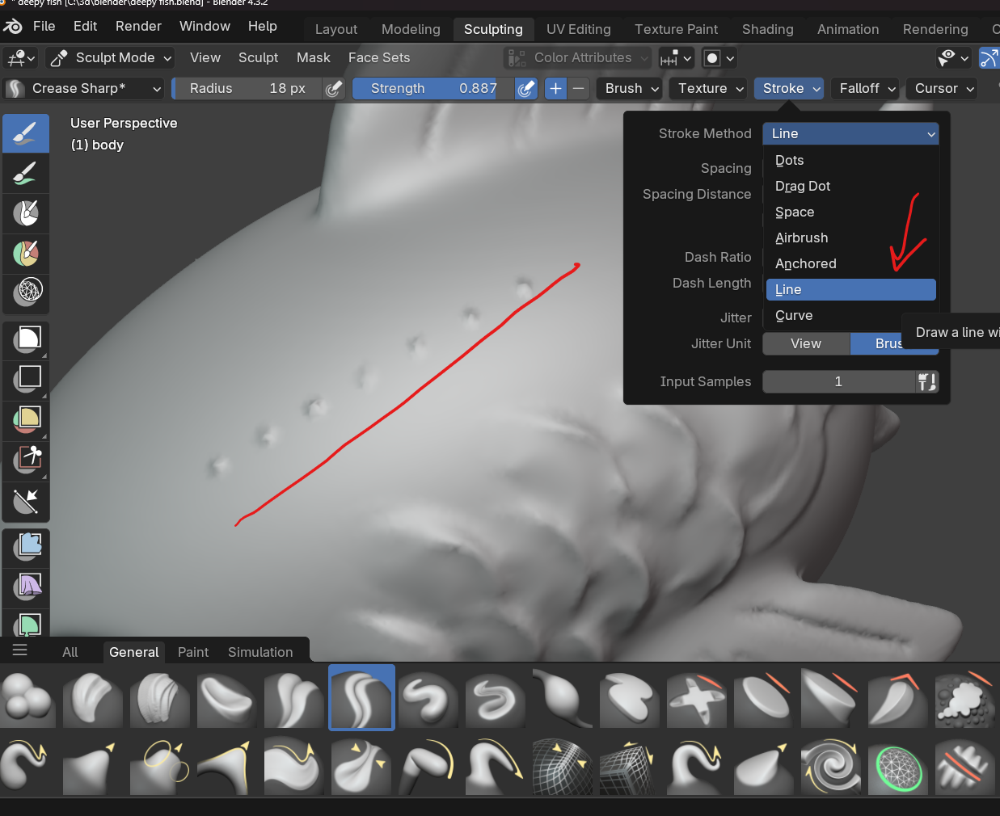
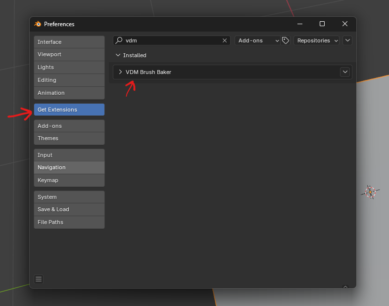

# Brush

## size

### brush size contant on zoom

keep the size of the brush constant on zoom

- 

## Stroke

- used to create pattern by pressing down and dragging the brush
  - automatically it sill add the spaces, and no need to tap again and again
- 

### method

- 
- switch from the above menu

#### line

- select stroke method as line
- 
- click and drag the line to draw the pattern

#### anchored

- 
- use the draw brush
- set stroke method as anchored
- set falloff as sharp
- falloff shape as - sphere
- while drawing press and drag along x, y or z axis

## add Texture to brush

- 
- add the new texture
- select mapping as `Random`

## falloff

make the brush either like a ball or like a pipe

- 

## types

### mask

- enable - m
- shift - smooth the mask
- invert - ctrl + i
- clear - Alt + M

#### mark vertices that should not be sculpted

- 

#### drag and select

- press b and drag to mark it mask

### Grab brush

- press G

#### to not touch or affect sculpt next to the grabbed shape

- 
- enable "grab silhouette"
- 

### smooth brush

- press s to switch to smooth brush
- while using other brush, press and hold shift to use smooth brush

#### invert the smooth brush

- press s to switch to smooth brush
- press ctrl + left click

### crease polish

- 
- set Pinch to 0

#### make it sharper

- 

#### sharper lines

to draw shapes like muscle strands

- 
  - set 5% spacing and disable `adjust strength`
  - make sure the pinch in the brush details panel (right panel) is 0

### draw sharp

- to draw creases without pinch and easier than crease smooth or sharp

### clay strips

usually to be used with higher res (remesh 0.008 or like so)

### flatten

use when want to preseve creases but smoothen overall

- 

#### settings

- 
  - more radius more smoothness

### scrape

use to scraps areas like sharp cheeks

- 

#### invert to fill

- 

### fill/deepen

- use with crease brush

#### invert to scrape

- 

### Density

- can be only used if dyntope is enabled

### pose brush

to move legs, arms like FK

- 

### cloth brush

- 
- in the tools, select the type of brush function

#### stroke cloth airbrush

- 

## download new brush

- download from - - [link](https://pixologic.com/zbrush/downloadcenter/alpha/)
- add new brush from texture
- 
- select image
- 
- add above highlighted settings

## VDM (Vector Displacement Map)

### enable

### Create

- 
- save
- 
- search
- 
- once save the vector image of the brush will be available in the saved project directory in `output_vdm`

### import

- duplicate asset - preffered is `draw` brush
- set the texture
- stroke method to anchored
- set the strength to 1
- 
