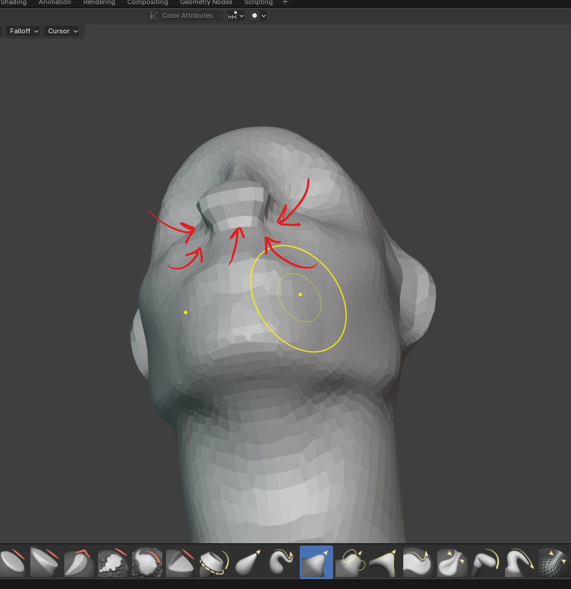
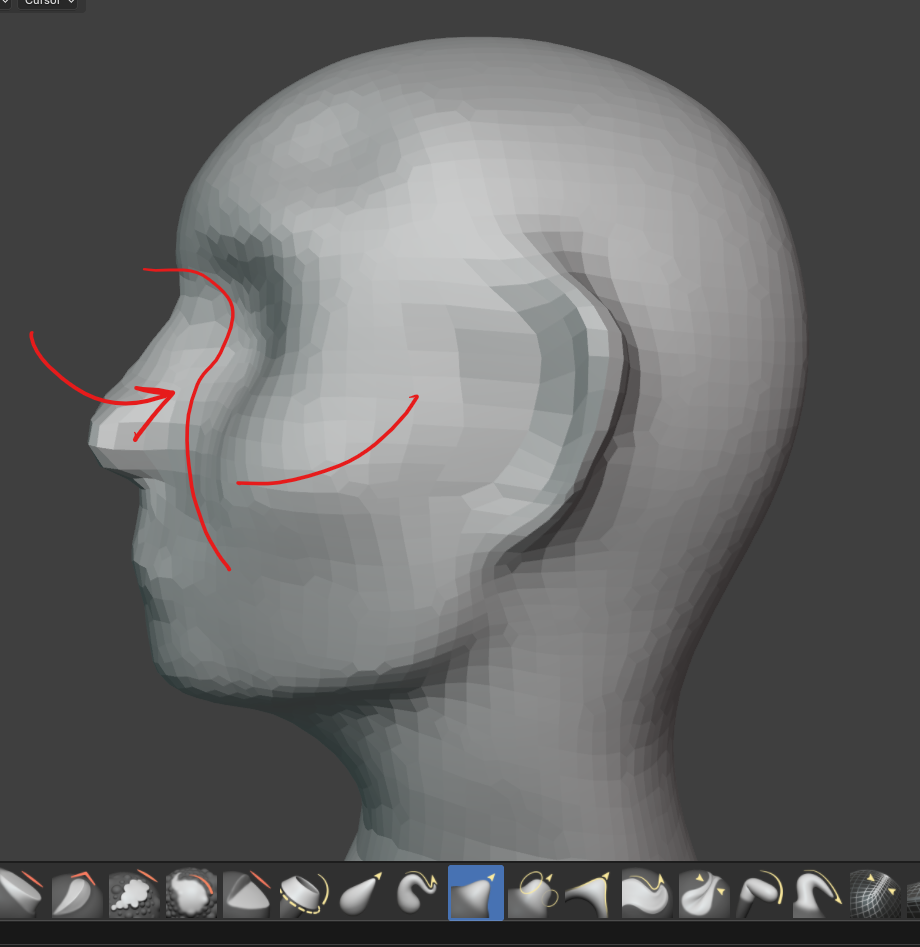
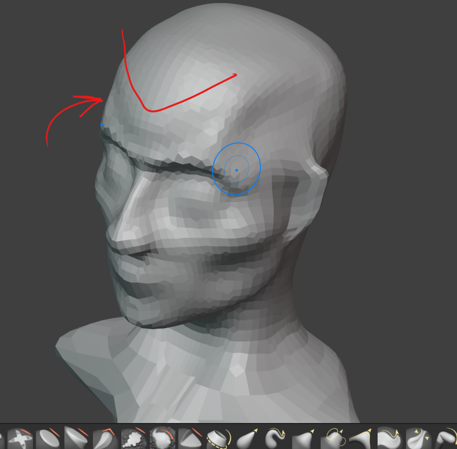
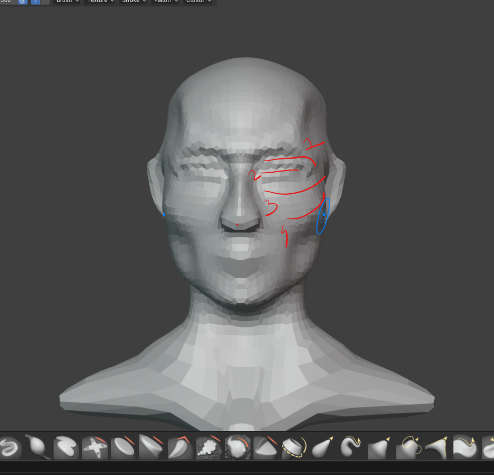
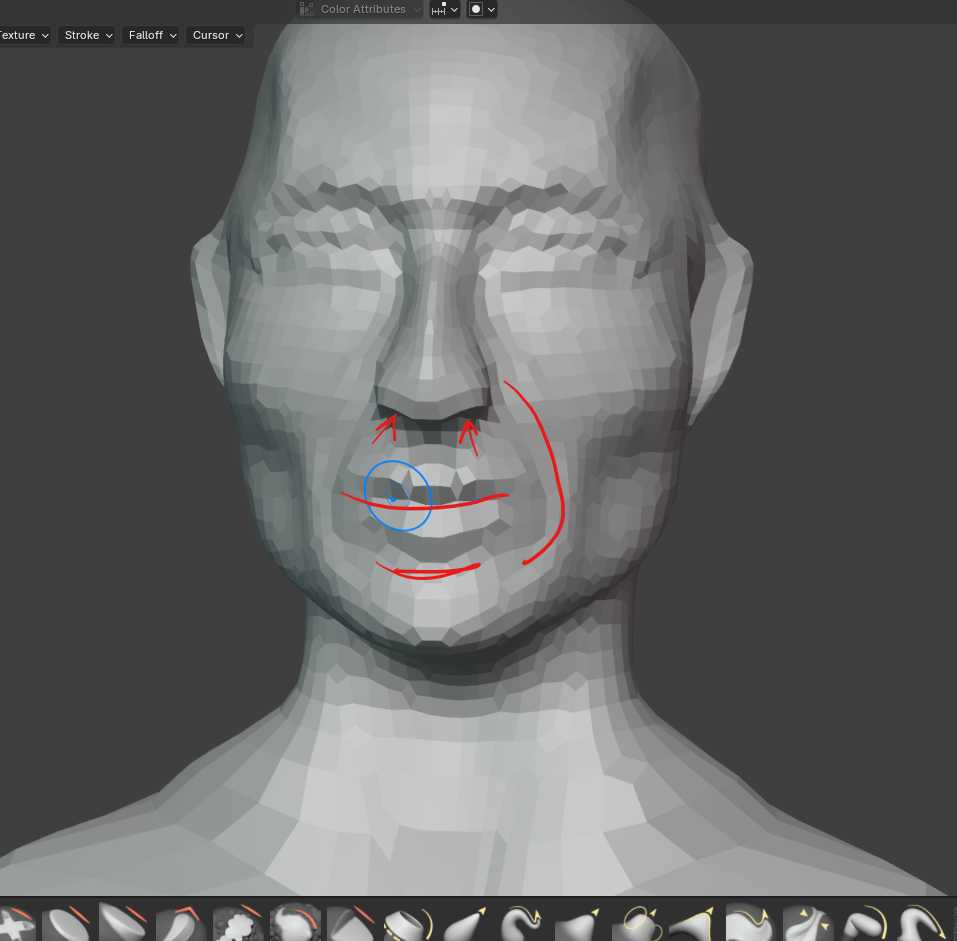
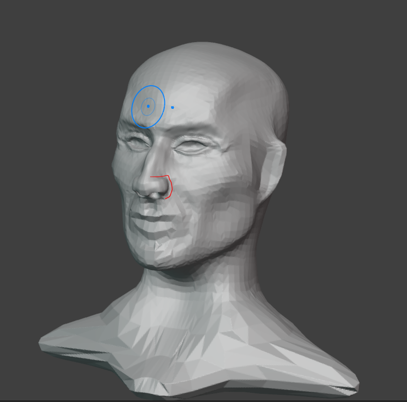
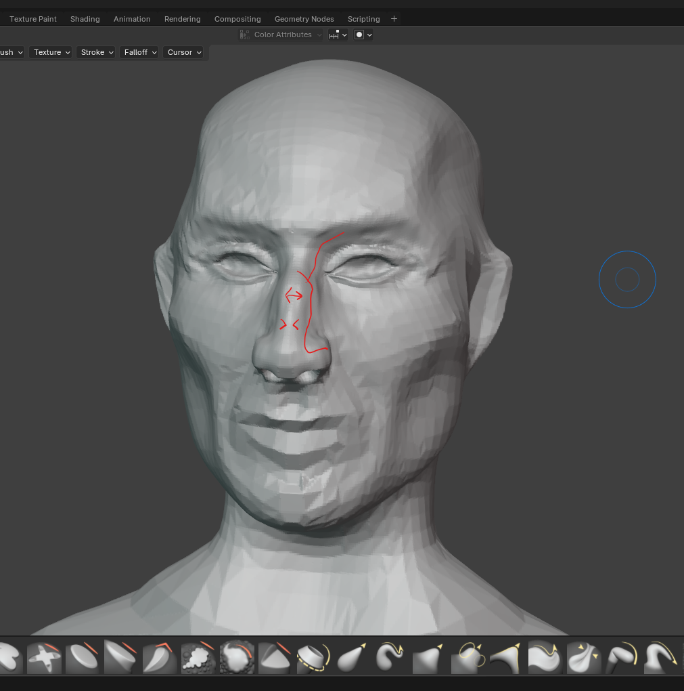

# level 1

## remesh

- apply 0.0500

## nose

- 
    - press these points inside

## cheeks

### cheek curves

#### step 1

- 
    - make curve following the line
        - to do that press from the front

#### step 2

- 
    - add the tissue near lips

## head

### frontal sharp shape

- 
    - with crease -ve indent the v curve

## eyes

- 
    - create the 1,2,3 landmarks with polish crease 
    - line 4 is just smoothing

## mouth

- 

# level 2

## remesh

- apply 0.00850

## nose

- 
    - add creases
- 
    - use clay
    - the nose is broad at the middle
    - and narrow near the nostrils
