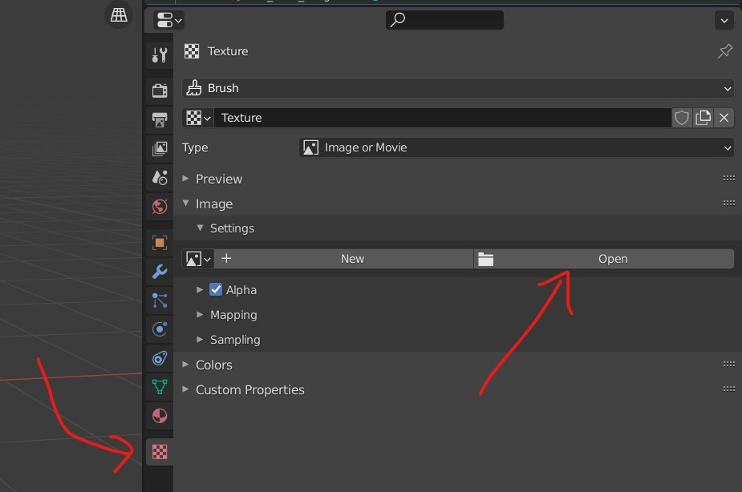
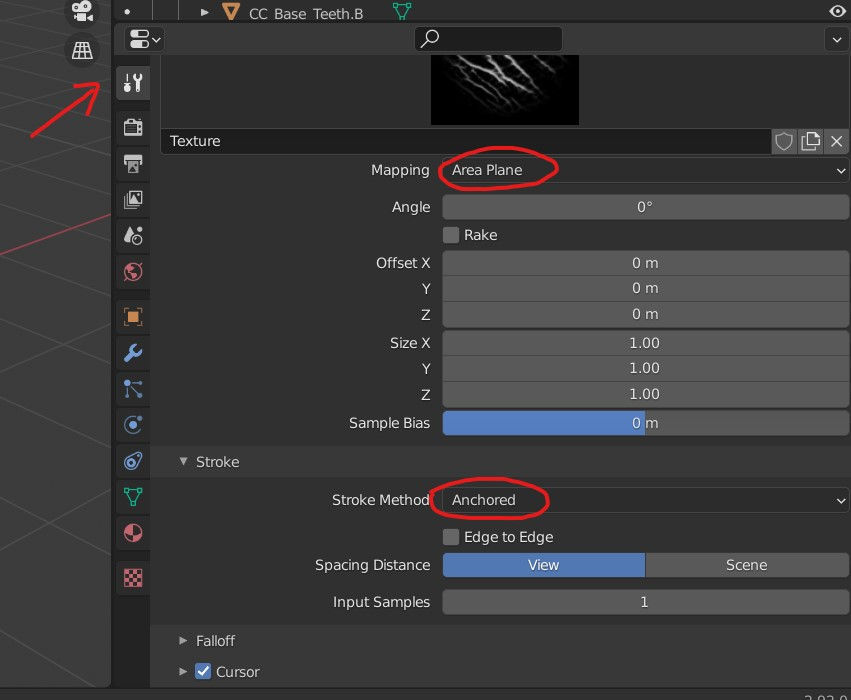
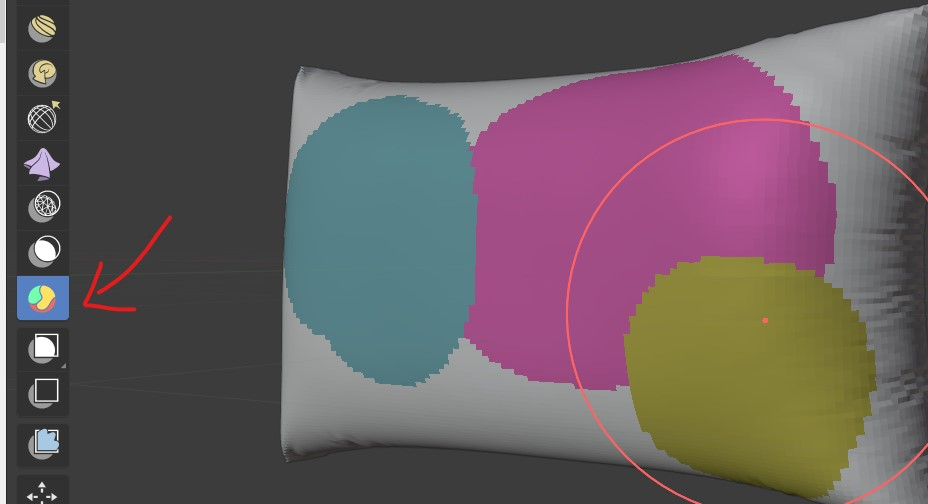
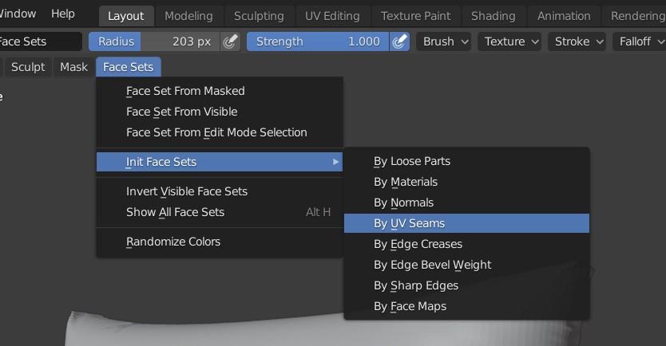

# Sculpting

<b>Note: </b> add Multiresolution modifier for better sculpting

## assign keyboard keys shortcuts

- right click on the brush tools
- 

## Brush

- To adjust the brush press <kbd>F</kbd>
- To adjust the brush strenth press <kbd>F</kbd> + <kbd>F</kbd>

### Smooth brush

- hold <kbd>SHIFT</kbd> and tap

### Subtract brush

- hold <kbd>CTRL</kbd> and tap

### Texture

- 
- add the new texture
- select mapping as `Random`

### new brush

- download from - - [link](https://pixologic.com/zbrush/downloadcenter/alpha/)
- add new brush from texture
- 
- select image
- 
- add above highlighted settings

## for better sculpting - add multiresolution modifier

- 

## cloth brush

- 
- in the tools, select the type of brush function

### stroke airbrush

- 

## draw straight line

- 

## Masks (Layers)

- 

<b>Note: </b> if u cant see the masks (face sets), disable the subsurface modifier

### masks by uv seems

- 
- now we need to use the face masks, we need to enable advanced setting (refer below options)

#### boundary

- preserving the boundary
- 

#### only one face

- 
