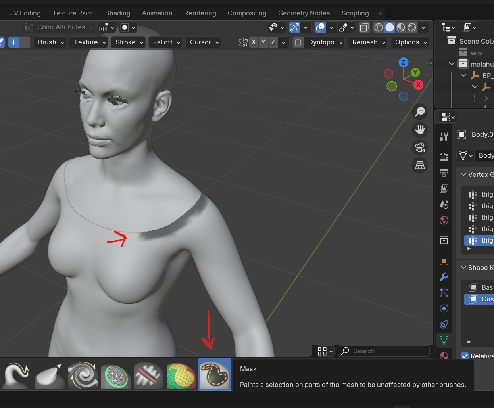
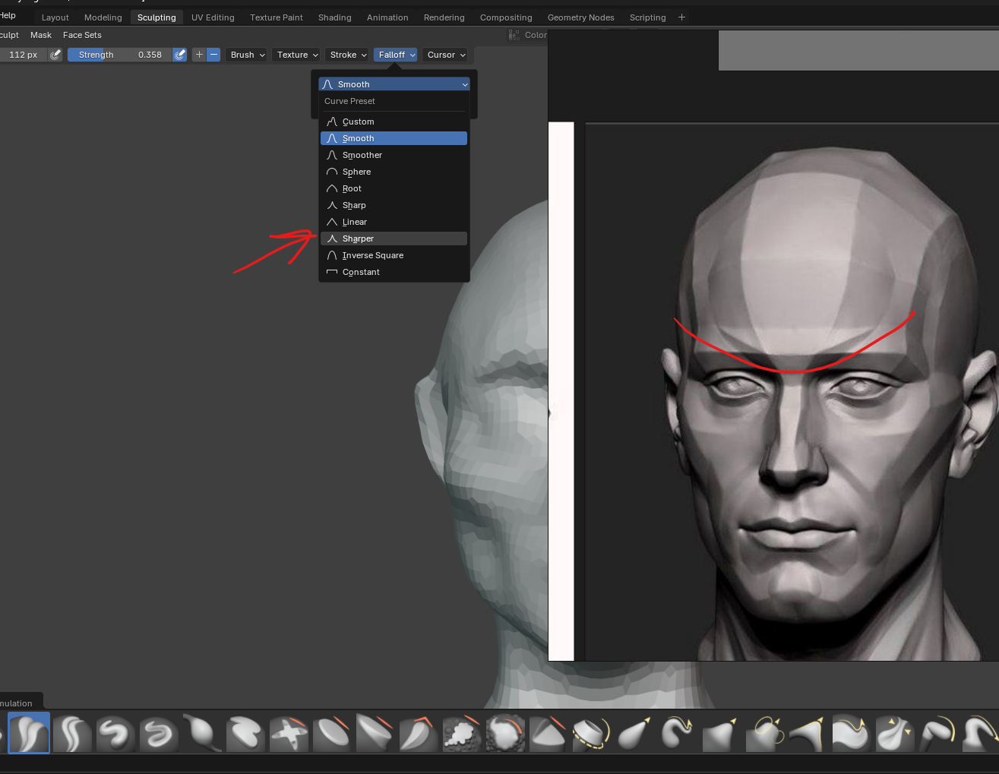
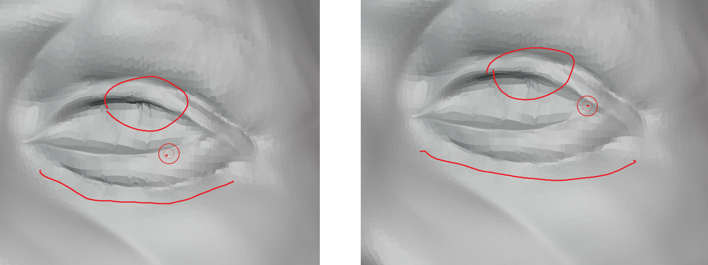
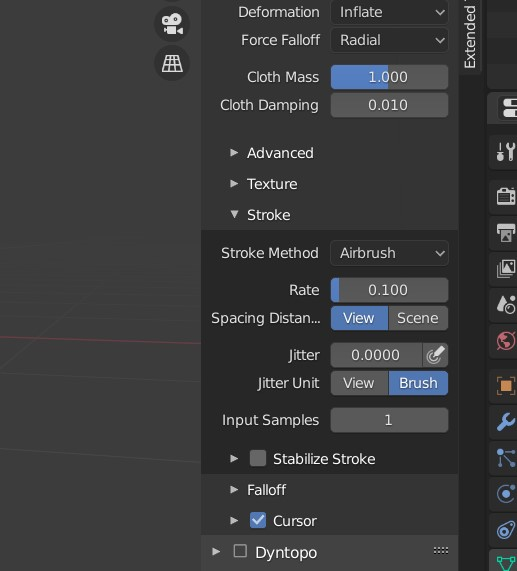

# **Sculpting**

# setup

- 
- open blender, on the landing pageclick on the sculpting, this gives a sphere

## Or manually

- always start with a UV Sphere
- 
- goto sculpt mode
- 
- drag out the brush panel
- 

## assign keyboard keys shortcuts

- right click on the brush tools
- 

## settings

### preferences (basic)

- [refer](../blender.md#settings)

### recommended

- 
  - front faces - so that to prevent accidental back of the mesh sculpting, which are very close
  - accumulate - each brush stroke will build upon the previous ones

### viewport

#### control opaqueness of inactive sculpt object

- 

### shading

- 

## view

- 

## scale

- if the brush shape is not round - apply all transforms or scale
- also at the bottom blender will show "object has non uniform scale, sculpting might me unpredictable"
- [solution](../blender.md#object-has-non-uniform-scale)

## for better sculpting - add multiresolution modifier

- 

## draw straight line

- 

# controls

## switch between object sculpts

- alt + q
- or press here
- 

## set space to toolbar or brushes

- open preferences
- 

## zooming & pan

- shift + middle mouse for pan
- ctrl + middle mouse for zoom

## Strength & radius

- press F for radius & move mouse up down
  - tap to exit
- press shift + F + move mouse up down for strength
  - tap to exit

## Smooth brush

- hold <kbd>SHIFT</kbd> and tap

## Subtract brush

- hold <kbd>CTRL</kbd> and tap

### avoid these

- pen pressure radius
  - 

# operations

## duplicates

- [refer](../basics/blender-basics-notes.md#duplicate-objects)

## move

### base pivot (still moves only the unmasked)

- 
  - or just the selected sculpt

### set pivot to unmasked

- move the pivot
- 
- then select the move
- 

## Selection

- 

# Symmetry

- 

## to enable the symmetry after the sculpting (or transfer the symmetry)

- 

# topology (for more vertices and reformating the vertices)

## Dynamic topology

- 

## Remesh - add more vertices (when running out of vertices while drag)

- r and drag the grid to make it finer and left click to set
- to apply this remesh press ctrl + r

**note:** never undo a remeshed object, because blender add more vertices once remeshed again

# Brush

## Stroke

- used to create pattern by pressing down and dragging the brush
  - automatically it sill add the spaces, and no need to tap again and again
- 

### method

- select stroke method as line
- 
- click and drag the line to draw the pattern

## add Texture to brush

- 
- add the new texture
- select mapping as `Random`

## types

### mask

- enable - m
- shift - smooth the mask
- invert - ctrl + i
- clear - Alt + M

#### mark vertices that should not be sculpted

- 

#### drag and select

- press b and drag to mark it mask

### crease polish

- 
- set Pinch to 0

#### make it sharper

- 

#### sharper lines

to draw shapes like muscle strands

- 
  - set 5% spacing and disable `adjust strength`
  - make sure the pinch in the brush details panel (right panel) is 0

### clay strips

usually to be used with higher res (remesh 0.008 or like so)

### flatten

use when want to preseve creases but smoothen overall

- 

#### settings

- 
  - more radius more smoothness

### scrapper

use to scraps areas like sharp cheeks

- 

### cloth brush

- 
- in the tools, select the type of brush function

#### stroke cloth airbrush

- 

## download new brush

- download from - - [link](https://pixologic.com/zbrush/downloadcenter/alpha/)
- add new brush from texture
- 
- select image
- 
- add above highlighted settings

# painting

## use in shading

- 

## Masks (Layers)

- 

<b>Note: </b> if u cant see the masks (face sets), disable the subsurface modifier

### masks by uv seems

- 
- now we need to use the face masks, we need to enable advanced setting (refer below options)

#### boundary

- preserving the boundary
- 

#### only one face

- 
