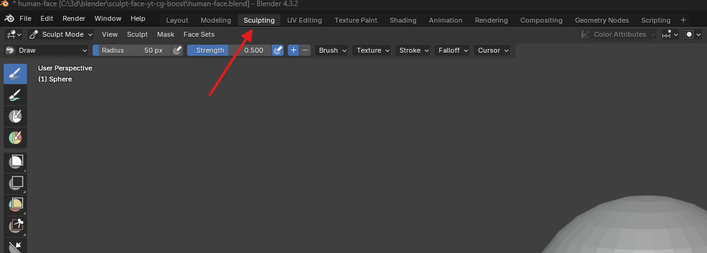
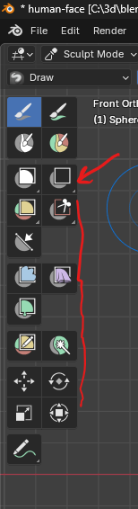
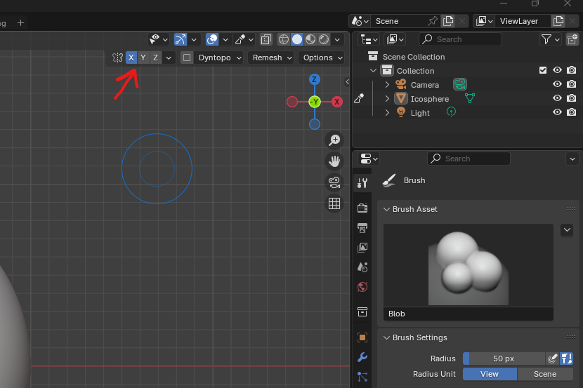
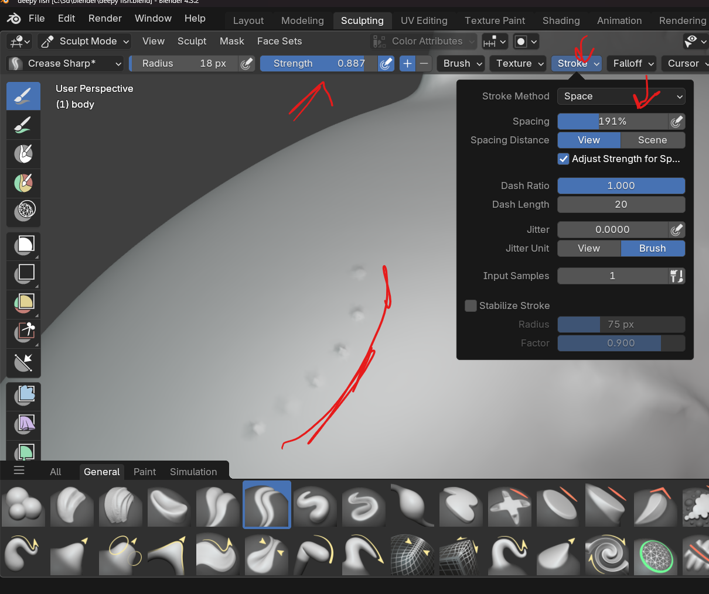
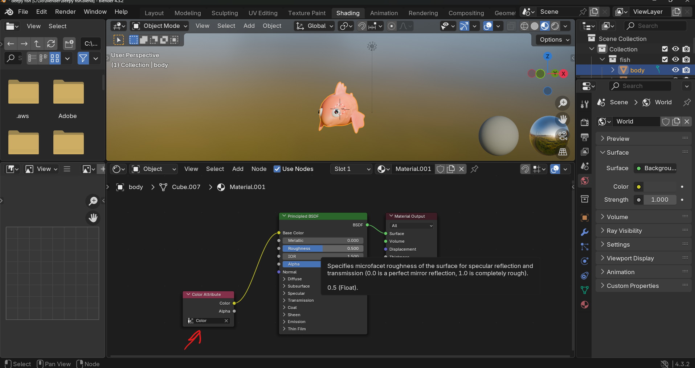

Sculpting

# setup

- always start with a UV Sphere
- 
- goto sculpt mode
- 
- drag out the brush panel
- 

## settings

- 
  - front faces - so that to prevent accidental back of the mesh sculpting, which are very close
  - accumulate - each brush stroke will build upon the previous ones

# mark vertices that should not be sculpted

- 

## Add

- start with mesh ico sphere, shift a
  - set property - subdivisions to 7

## zooming & pan

- shift + middle mouse for pan
- ctrl + middle mouse for zoom

## Strength & radius

- press F for radius & move mouse up down
  - tap to exit
- press shift + F + move mouse up down for strength
  - tap to exit

## Symmetry

- 

### to enable the symmetry after the sculpting (or transfer the symmetry)

- 

# more vertices

## Remesh - add more vertices (when running out of vertices while drag)

- r and drag the grid to make it finer and left click to set
- to apply this remesh press ctrl + r

# Brush

## Stroke

- used to create pattern by pressing down and dragging the brush
  - automatically it sill add the spaces, and no need to tap again and again
- 

### method

- select stroke method as line
- 
- click and drag the line to draw the pattern

## types

### mask

- enable - m
- invert - ctrl + i
- clear - Alt + M

# painting

## use in shading

- 
