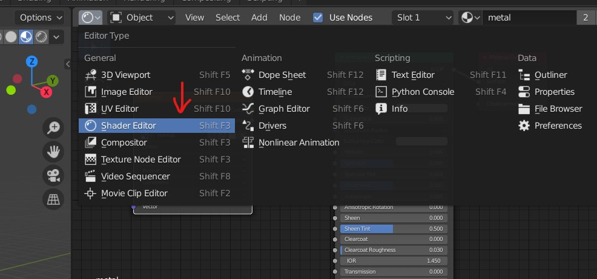
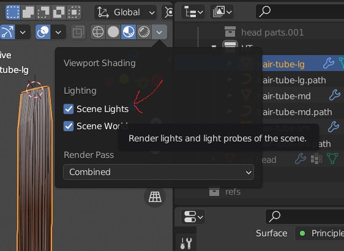
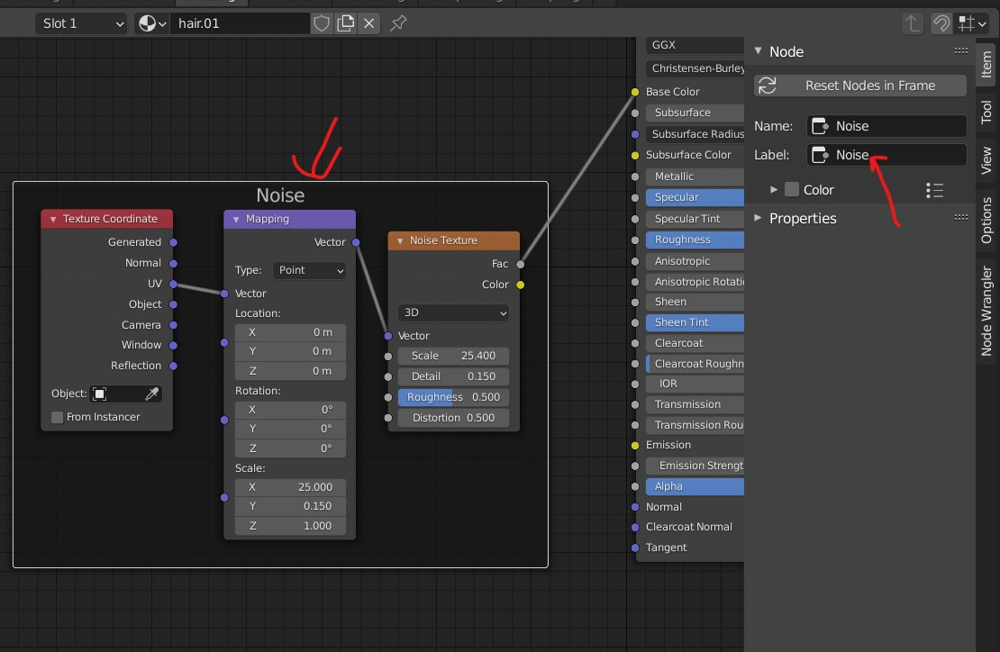
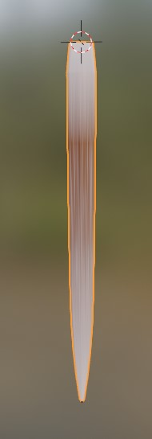
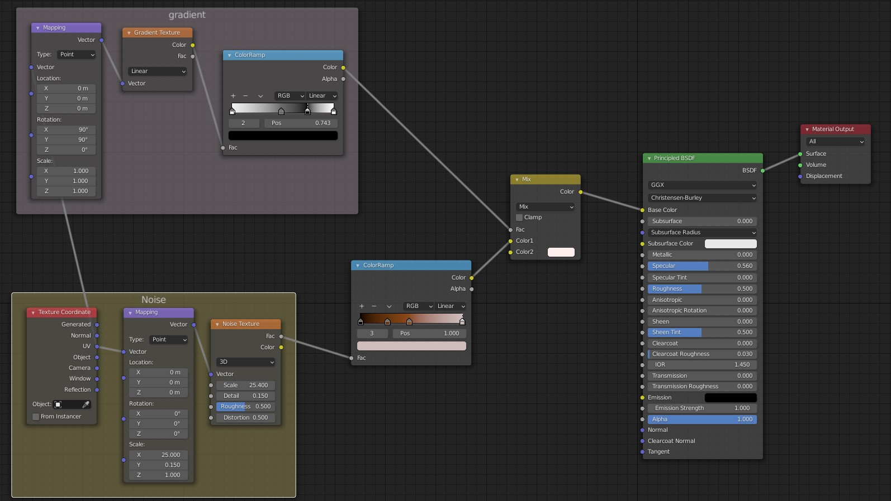
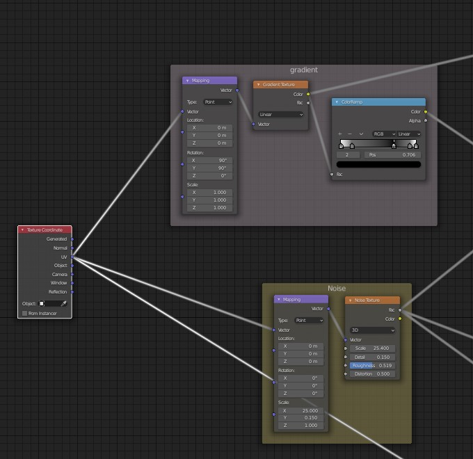
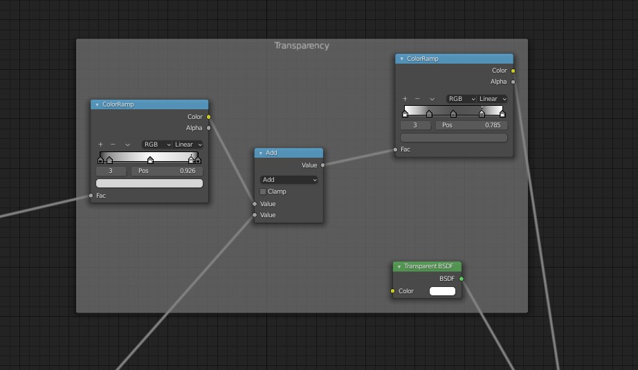
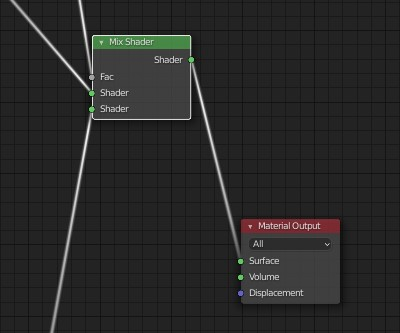

# Shading
- 

## minimize/expand node
- <kbd>CTRL</kbd> + <kbd>H</kbd>

## node wrangler 
node wrangler add on lets you see the rendering of the node
- in the preferences enable add on node wrangler 
- <kbd>CTRL</kbd> + <kbd>SHIFT</kbd> + <kbd>Left Click</kbd> on the node

### Shortcuts

#### Mapping
- select the image texture 
- <kbd>CTRL</kbd> + <kbd>T</kbd>

## enable lighting
- lighting helps in seeing the depth effect like the bump
- 

## add material
- Select new object
- Add material
- 

## Add new node
- <kbd>SHIFT</kbd> + <kbd>A</kbd>

## group the nodes
- select the nodes
- press <kbd>CTRL</kbd> + <kbd>J</kbd>
- rename in the tool bar
- 

## nodes

### input -> object info

### converter -> color ramp
- move the middle slider to the left side to shift the other(left most) color in the middle
- 

### texture -> image texture

### Anisotrapic BSDF
Need Cycles
- Shader -> Anisotrapic BSDF

## Combine lines
- <kbd>SHIFT</kbd> and <kbd>Left click</kbd> and drag the mouse over the lines to combine
- 

## Procedural Texturing
- Texture -> Noise texture
- add vecter -> displacement
- 
- <kbd>CTRL</kbd> + <kbd>SHIFT</kbd> + <kbd>Left Click</kbd> on the panel `principled BSDF` (main layer)
- View in the render mode

### 2 layers of Procedural Texturing
- add 2 noise texture
- pass one through colorRamp - to darken the 2nd noise
- Add them
- Overlay the texture with noise and set the displacement scale very low
- 

## Effects

### Gradient
- 
- 

### transparency
- 
- connect color to fac of tranparency color ramp 1 
- connect noise texture to Add value 2
- 
- connect transparency color ramp 2 color to fac of Mix shader
- 
- transparency BSDF to shader 1 of Mix shader