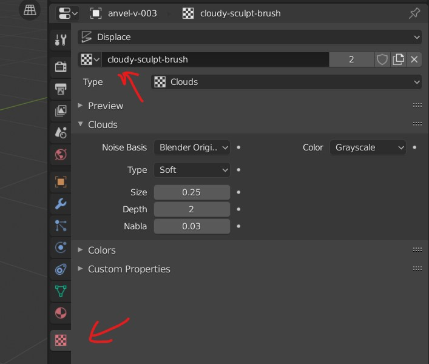
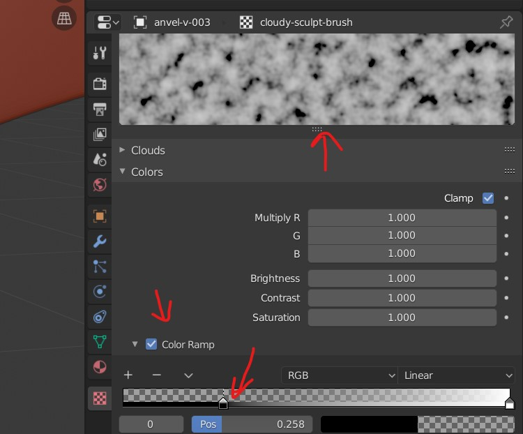
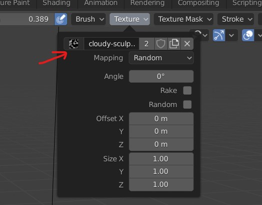
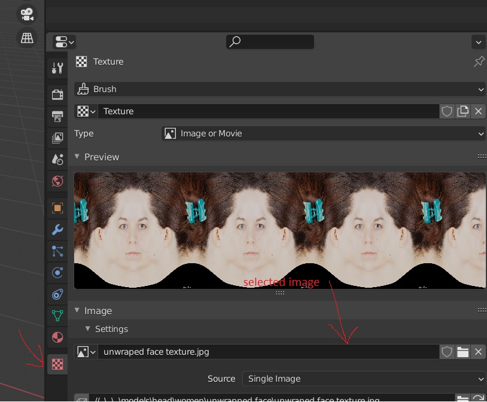
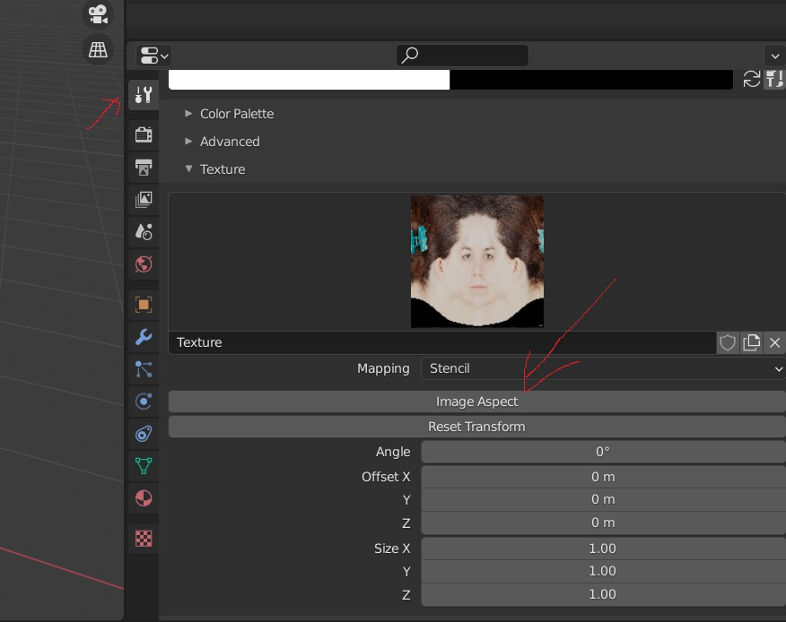

# Texturing

## Texture tool

Change its texture pattern

- rename the newly created brush
- 
- 
- change the color ramp slider (observe the bumpiness in the preview)

## brush texture

- 

# Texture Paint

- Add new texture
- save the new texture on the hard drive or <kbd>ALT</kbd> + <kbd>S</kbd> for quick save
- Go to shading and add `texture -> image texture`
- select the neew texture in the node

## issue of brush not working

- after creating the texture
- add a texture node and select the texture
- switch to edit mode and select all the vertices (press <kbd>A</kbd>)
- now the created UV map should be displayed over the newly created texture in the `UV editor`
- now the brush should work while painting on the mesh

## Choose Color

- Press <kbd>N</kbd>
- pick the new color
- Press <kbd>X</kbd> to select

## Texture Mask

- Go to texture mask
- New
- 

### Brush Overlay (darken with same color)

- 

## add drawing image overlay on 3d mesh

- After the texture is selected in texture for the mesh
  - open mesh texture
  - select `open`
  - select the `unwrapped face texture`
- 
- 
- select `stencil`

## controls for stencil

- <kbd>RIGHT CLICK</kbd> - to move
- <kbd>SHIFT</kbd> + <kbd>RIGHT CLICK</kbd> - zoom in or out
  - plus Press <kbd>X</kbd> or <kbd>Y</kbd> - to adjust the size in that coordinate
- <kbd>CTRL</kbd> to rotate
- <kbd>Left CLICK</kbd> - to paint
