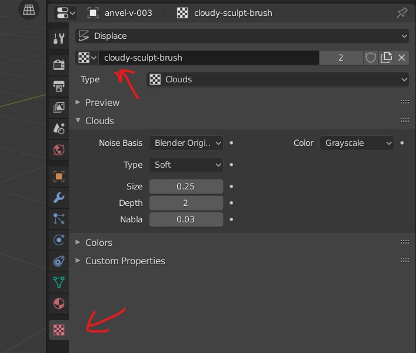
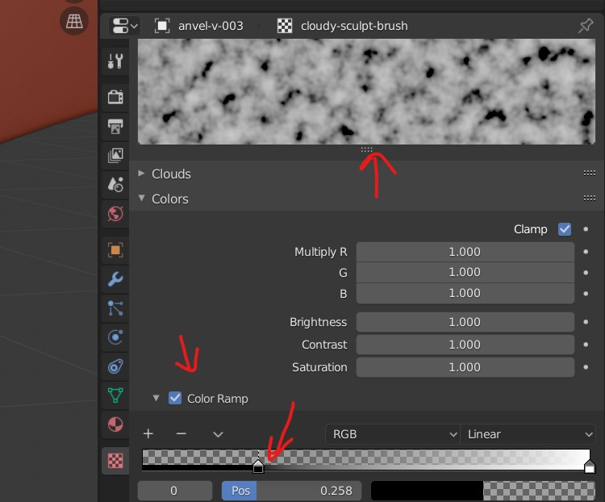
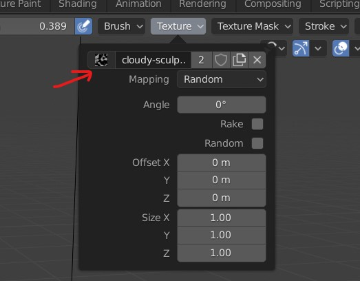
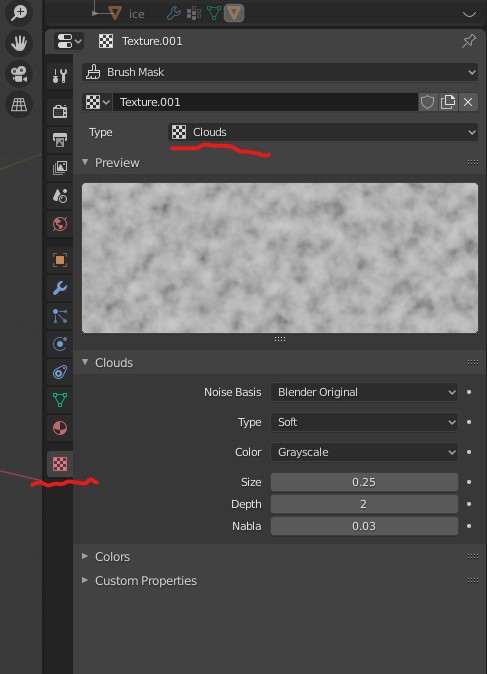
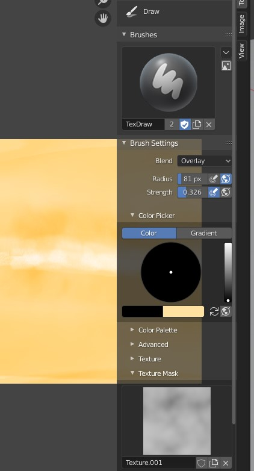
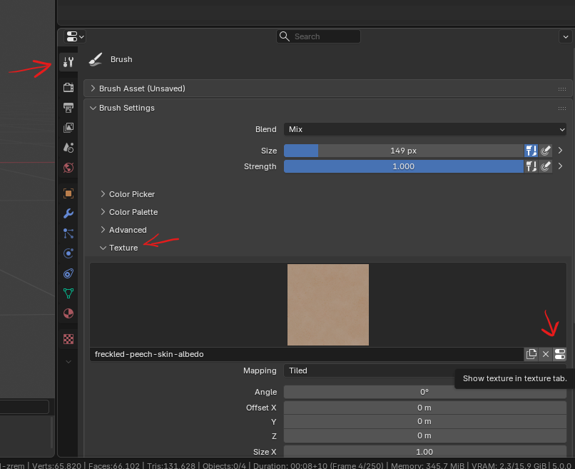
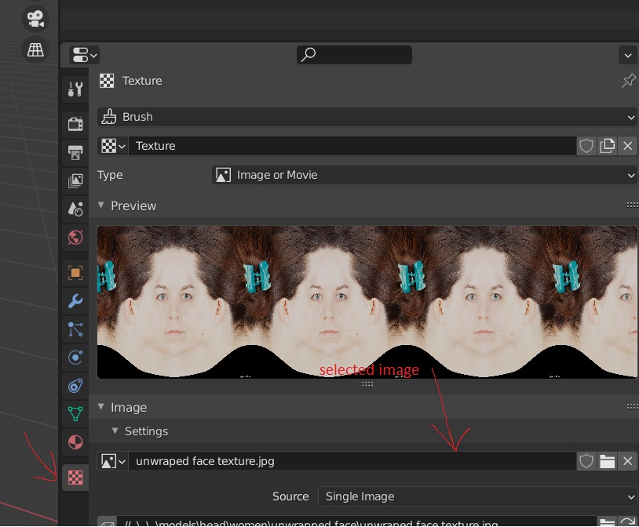
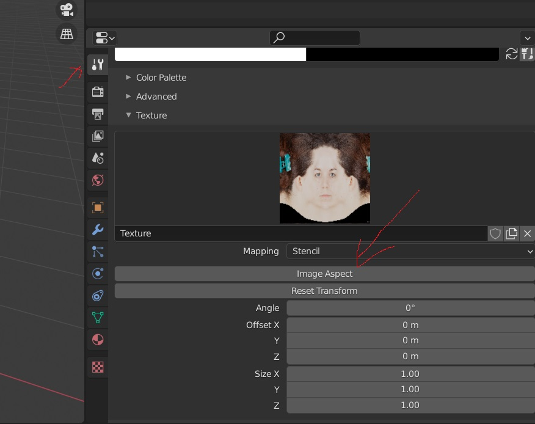
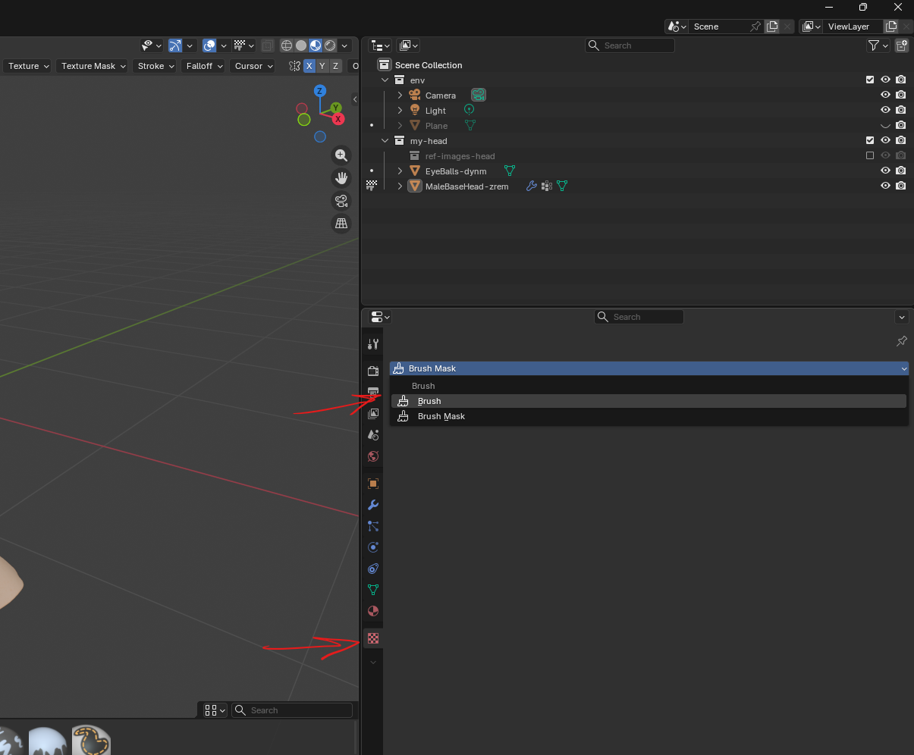
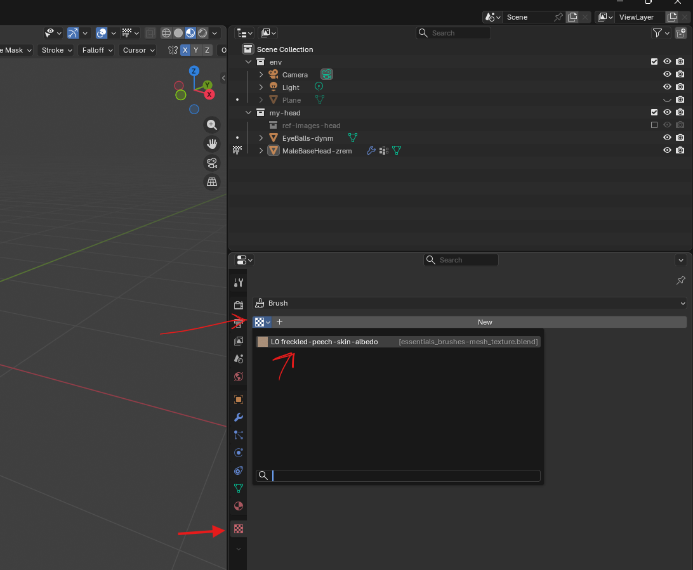

# Texturing

## Texture tool

Change its texture pattern

- rename the newly created brush
- 
- 
- change the color ramp slider (observe the bumpiness in the preview)

## brush texture

- 

# Texture Paint

- Add new texture
- save the new texture on the hard drive or <kbd>ALT</kbd> + <kbd>S</kbd> for quick save
- Go to shading and add `texture -> image texture`
- select the neew texture in the node

## issue of brush not working

- after creating the texture
- add a texture node and select the texture
- switch to edit mode and select all the vertices (press <kbd>A</kbd>)
- now the created UV map should be displayed over the newly created texture in the `UV editor`
- now the brush should work while painting on the mesh

## Choose Color

- Press <kbd>N</kbd>
- pick the new color
- Press <kbd>X</kbd> to select

## Texture Mask

- Go to texture mask
- New
- 

### Brush Overlay (darken with same color)

- 

## add stencil overlay for brush

- Go to brush -> brush settings -> texture -> `+ New`
- rename (optional)
- click on the `texture tab` button (which takes you to the texture tab)
- 
- select `open` -> select the image
- 
- 
- go back to brush settings -> mapping -> select `stencil`

### select existing

if the texture is already created for the brush (in brush settings -> textures), then no need to click on the `+ New` button under texture

- go to textures
- select Brush
- 
- select exiting texture
- 
- now you can go back to brush settings and change texture -> mapping -> stencil (if required)
