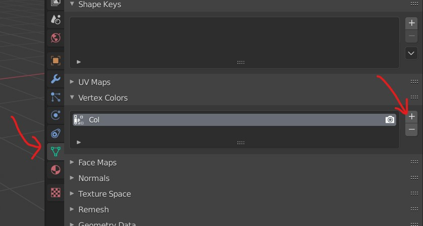
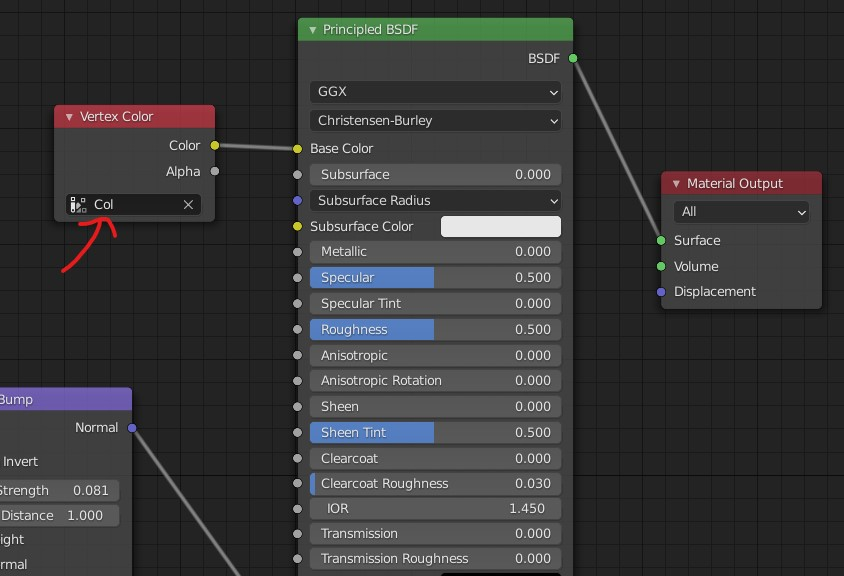
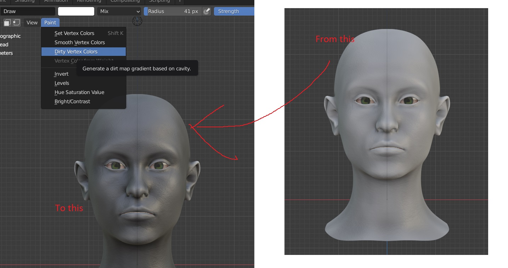
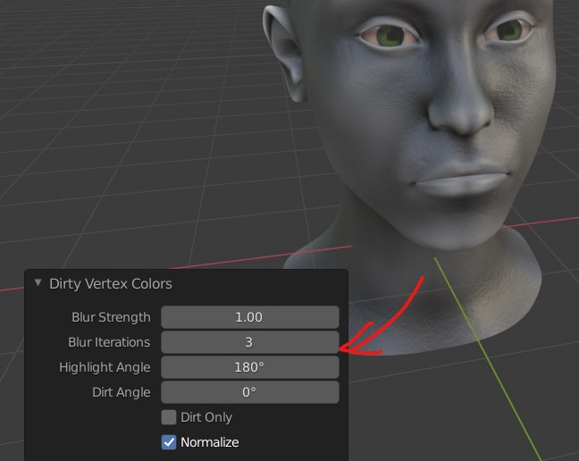

# Vertex Painting
- create a vertext color
- 
- to see the vertex colors add vertex color in shader (input -> vertext color)
- 

## Dirty vertext colors
In order to darken the dark areas of the mesh
- after adding the verter color shader
- switch to `texture mode` or `material preview viewport`
- 
- then u can select the blur to 3
- 