# animation

# menu

- 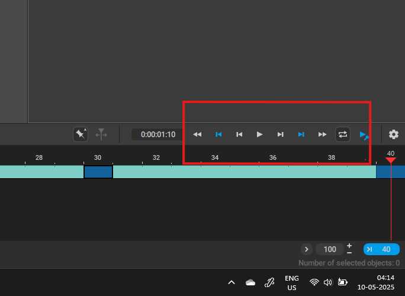

# frame

- 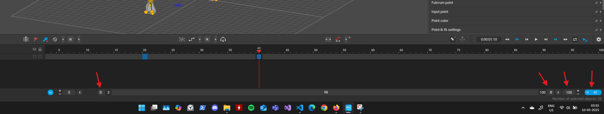

## select multiple frame

- 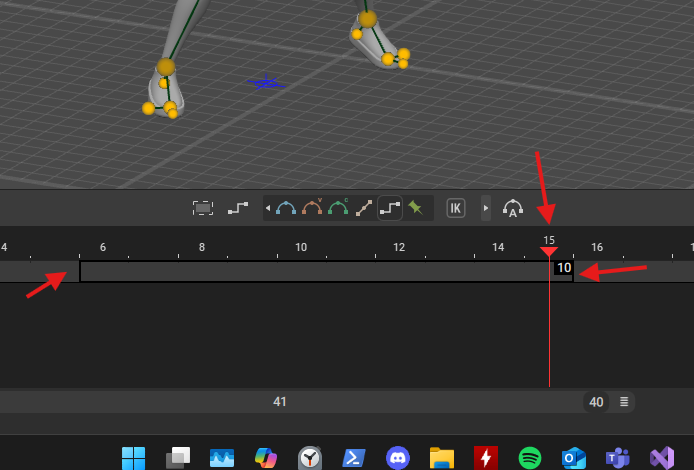
- left click any frame and drame to the next frame

# key

- move the frame to 20 or whatever
- 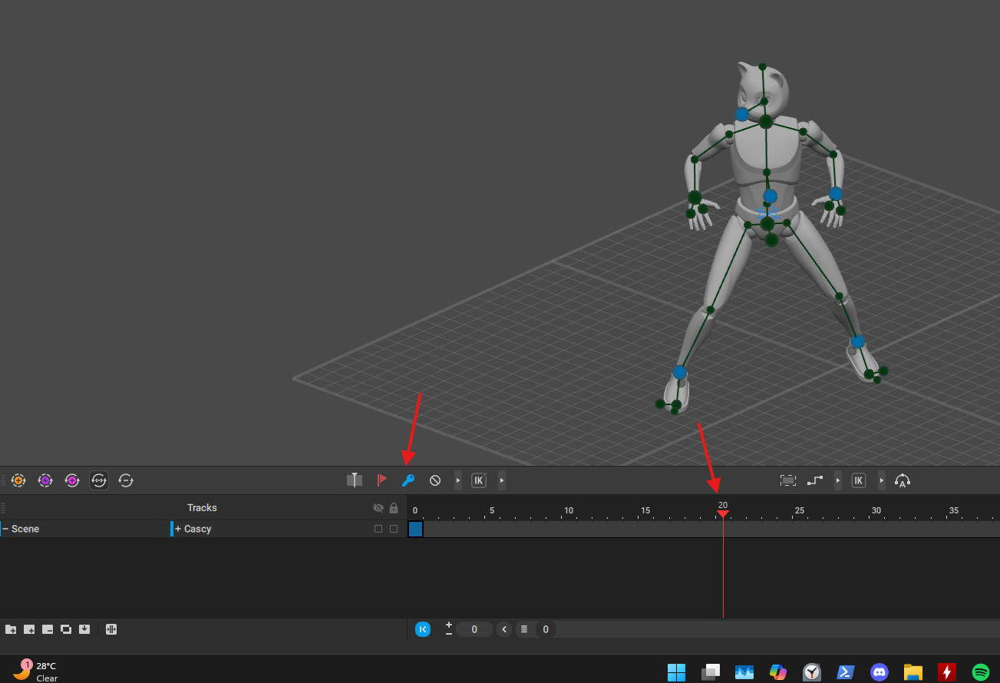
- press f or this button

## add more or remove more

- select the frame and press `+` or `-`

## move

- press middle mouse button and drag

## copy

- 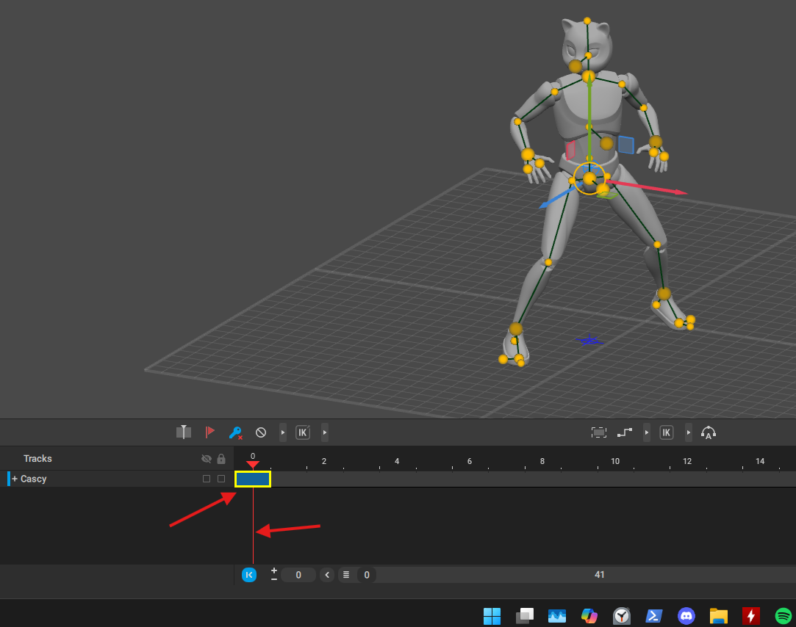
- move the slider to the key you want to copy
- hold shift + middle mouse and drag to a new frame time

# mirror frame

- 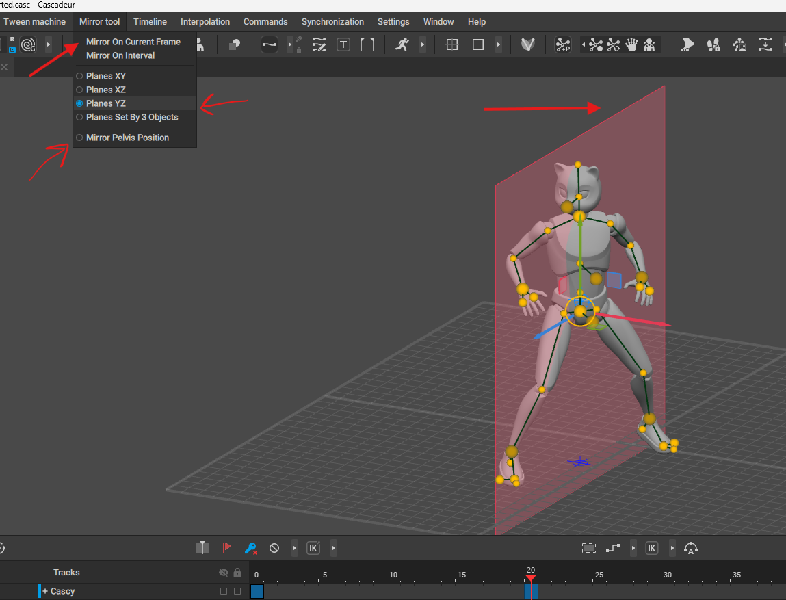
- disable mirror pelvis
- select the planes direction
- click on "Mirror on current frame"

# add frames in between

## static using bezier interpolation

- 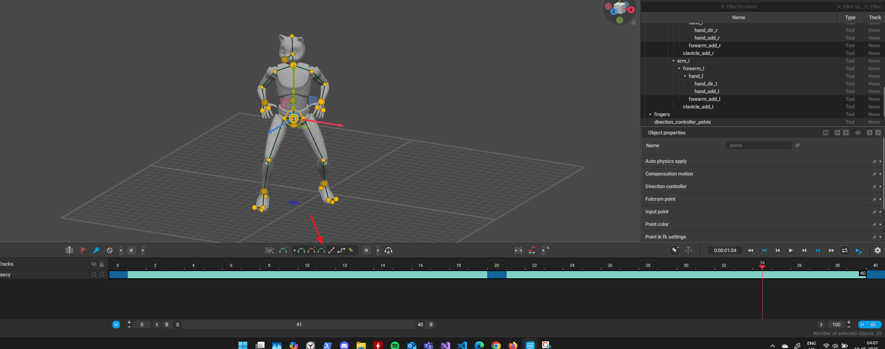
- select the frames [refer](./animation.md#select-multiple-frame)

# auto physics

- 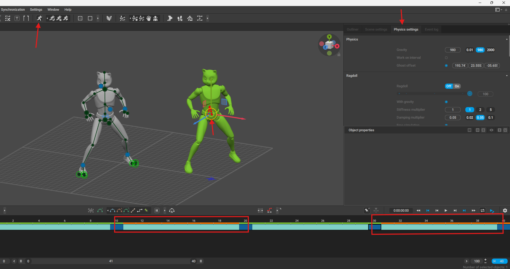
    - move the ghost which the manipulator

## when is auto physics added

- 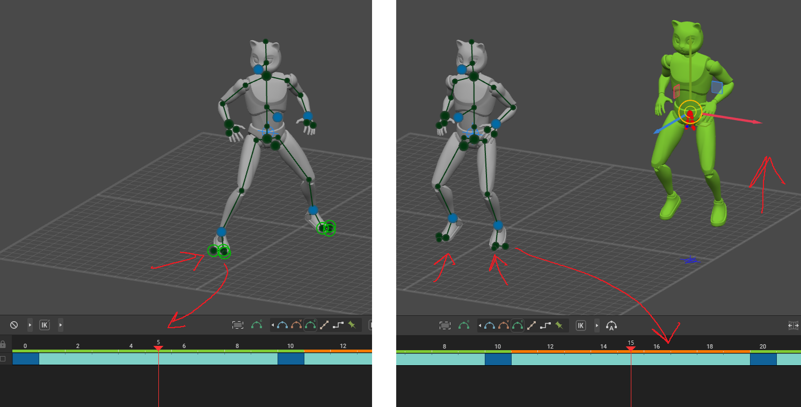
- when the green dots (fulcrum moves)
  - i.e. in the orange color frames the auto physics is added

## ghost mode

- 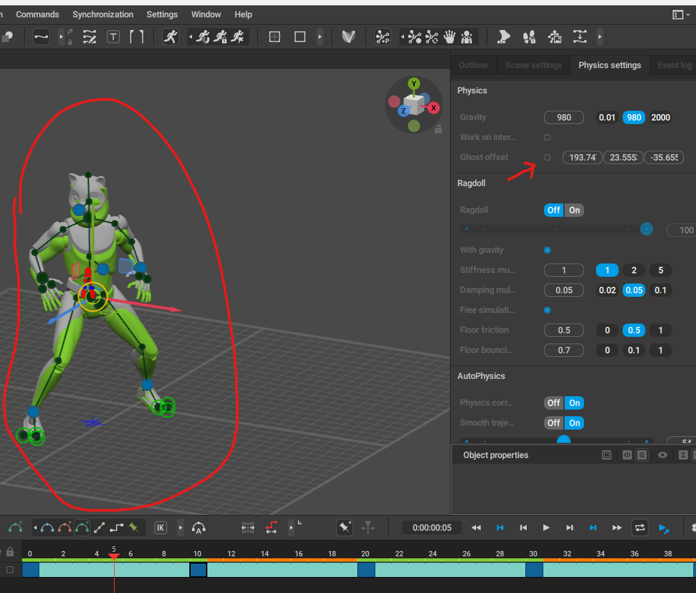

## smooth trajectory

for added bouncyness

- 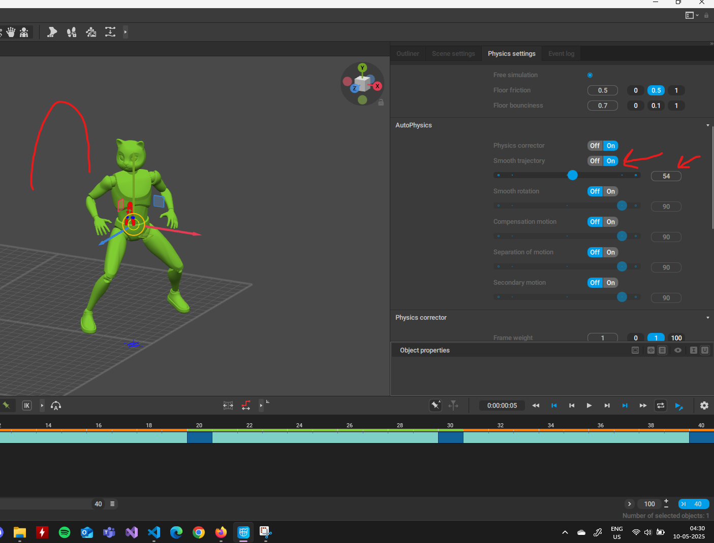

## bake physics

- 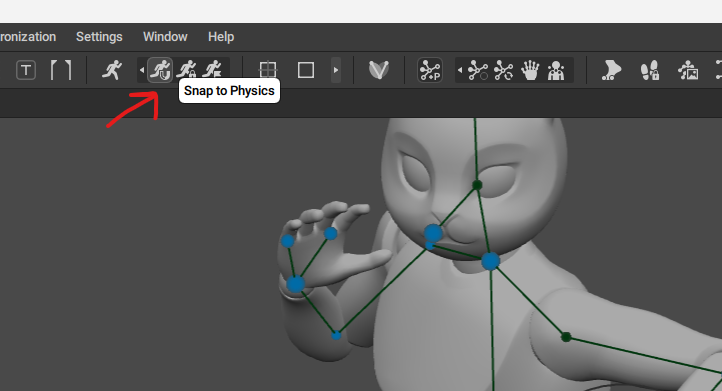

## unbake

to re enable the animation keys unbake it

- 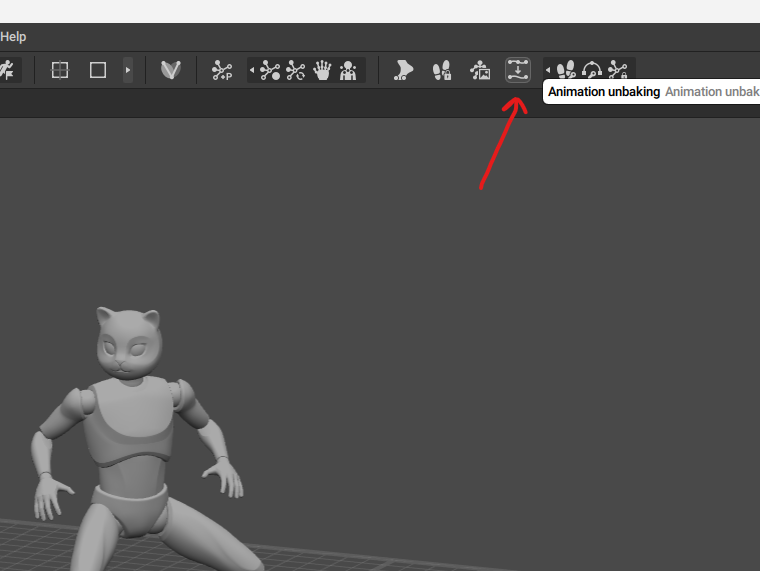
- 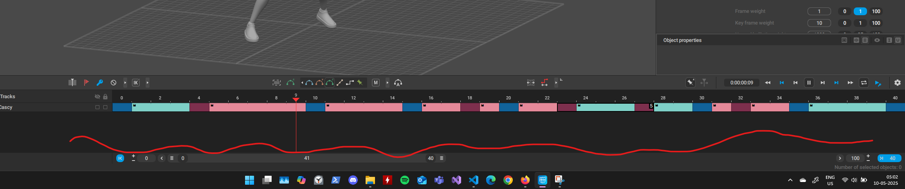
