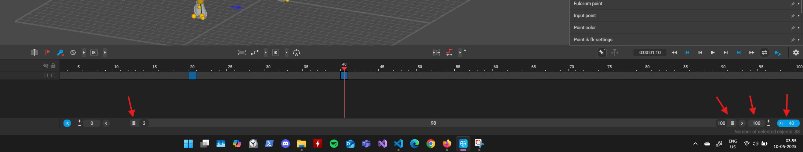
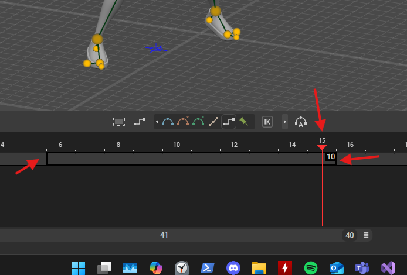
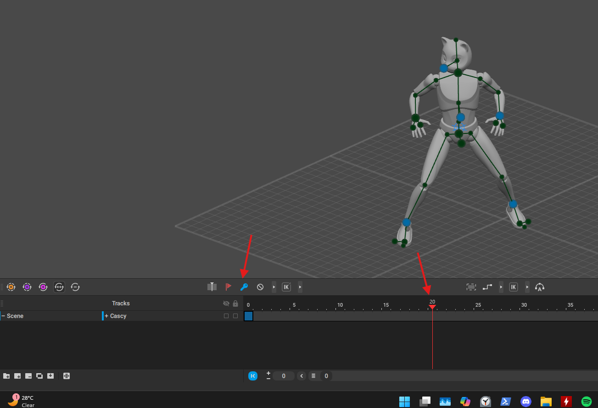
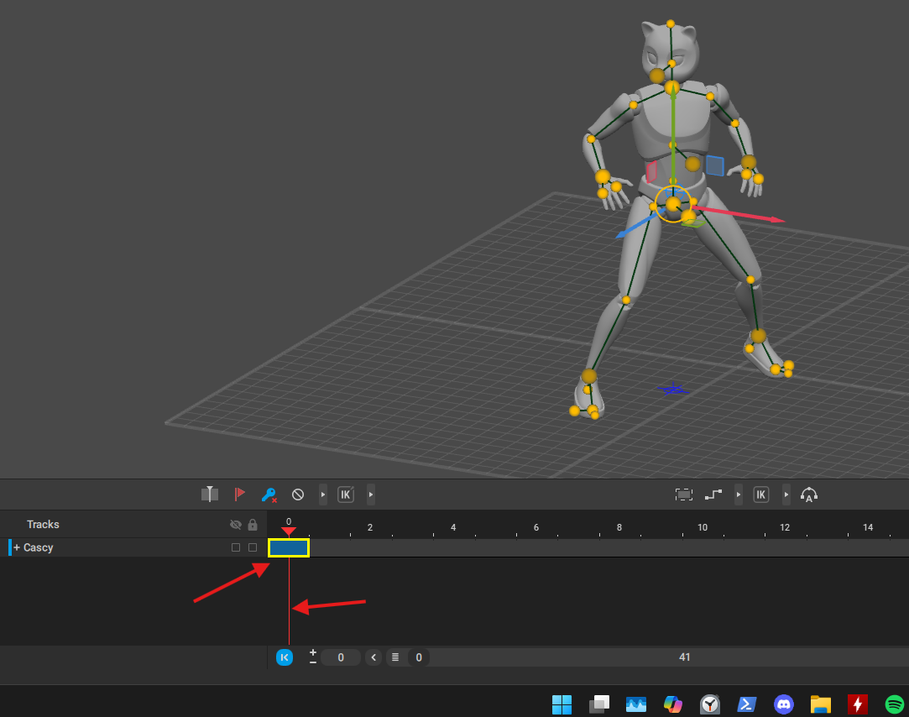
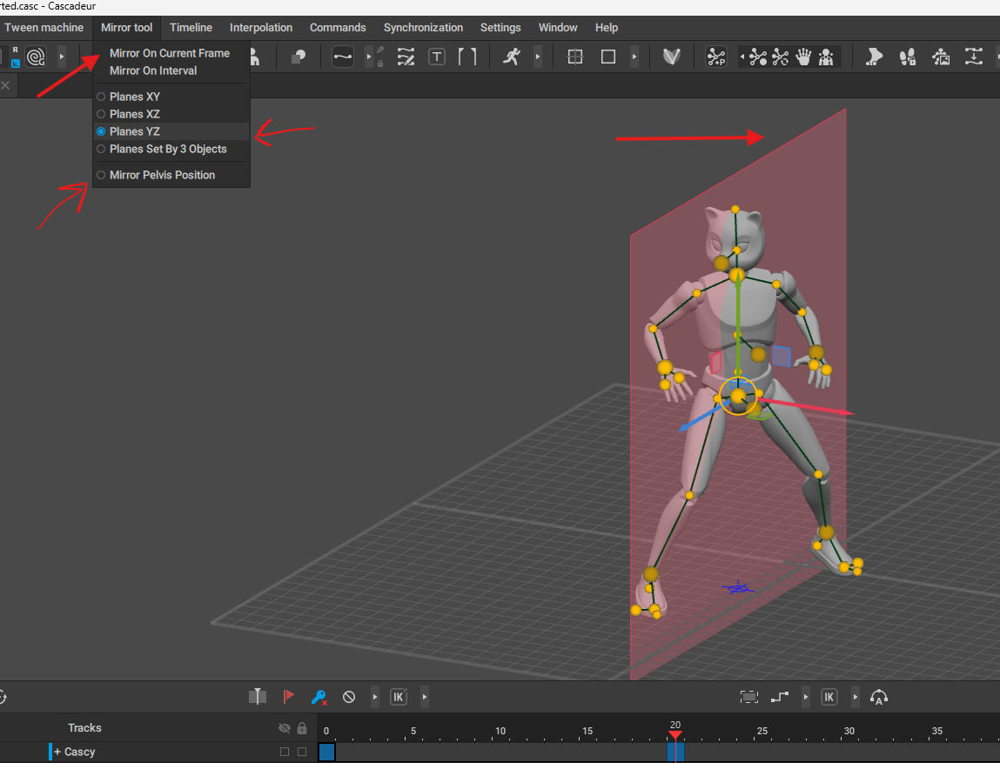
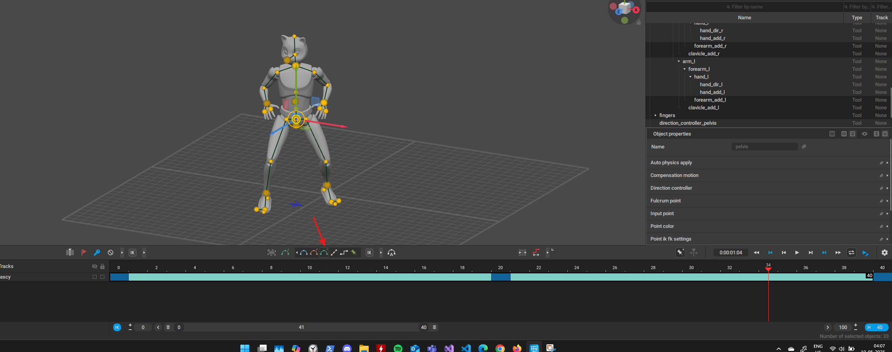
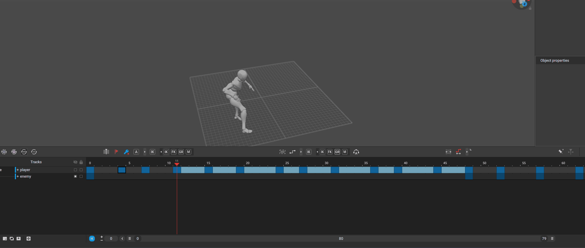
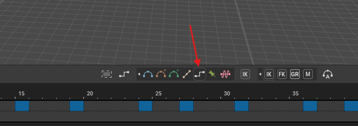

# animation basics

# frame

- 

## select multiple frame

- 
- left click any frame and drame to the next frame

## key

- move the frame to 20 or whatever
- 
- press f or this button

## add more or remove more

- select the frame and press `+` or `-`

## move

- press middle mouse button and drag

## copy the frame

- 
- move the slider to the key you want to copy
- hold shift + middle mouse and drag to a new frame time

## mirror frame

- 
- disable mirror pelvis
- select the planes direction
- click on "Mirror on current frame"

## add frames in between (interpolation)

## bezier interpolation

- 
- select the frames [refer](./animation.md#select-multiple-frame)

## step - removes all inbetween animation

- 
- select the frames
- expand the interpolation or step panel
- click on step
- 
