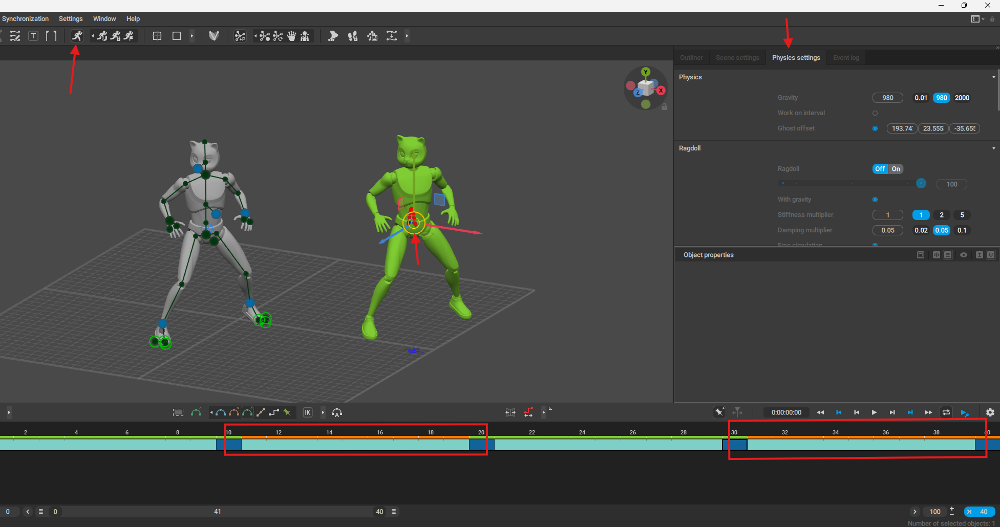
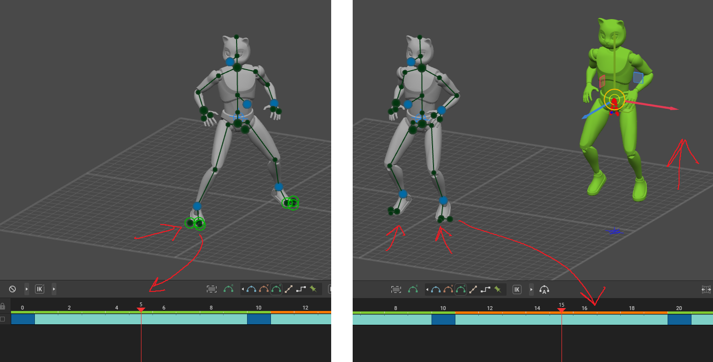
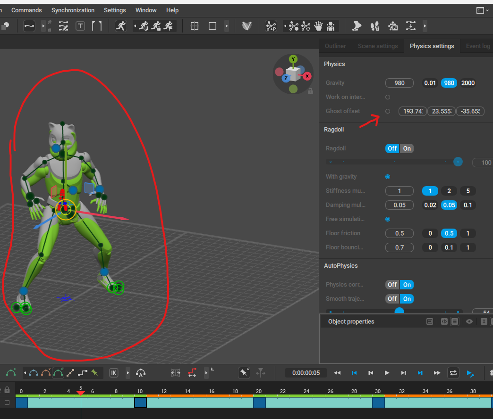
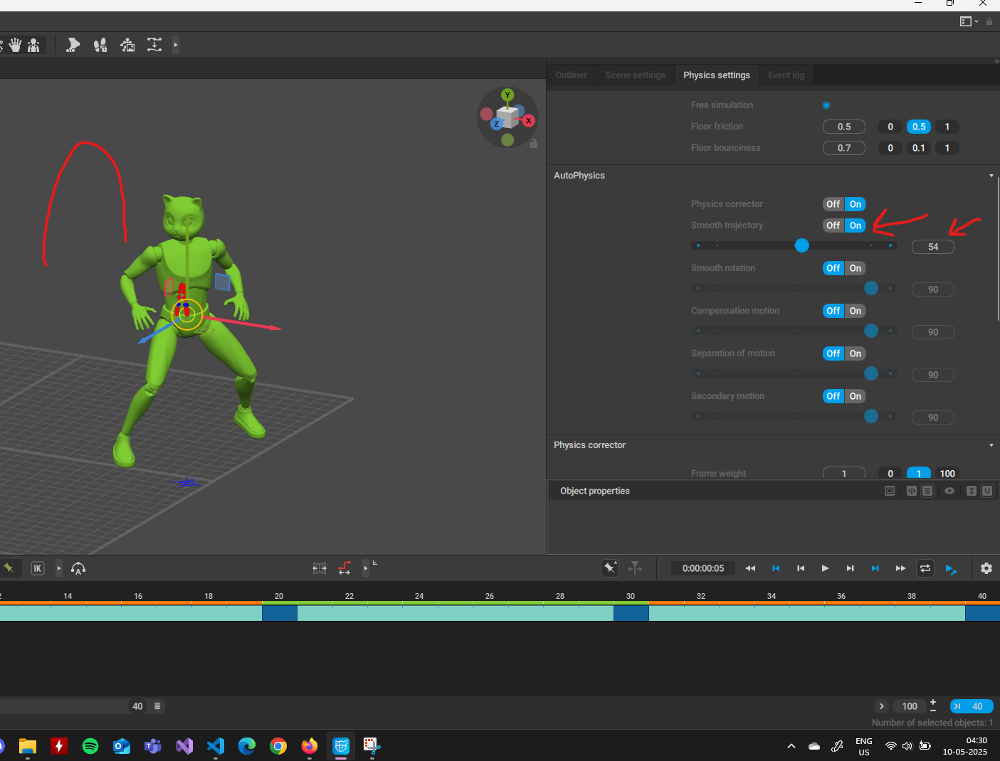
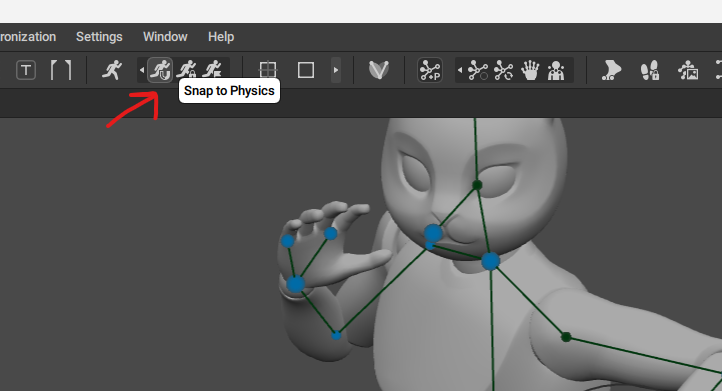
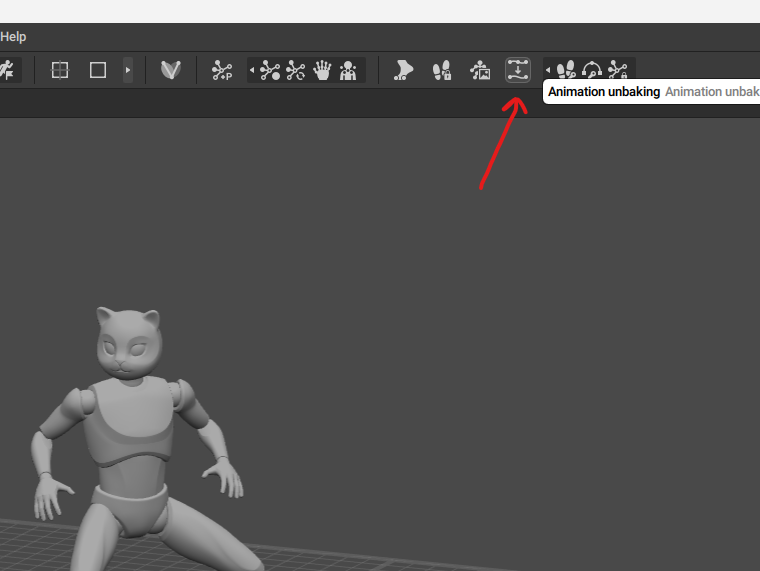
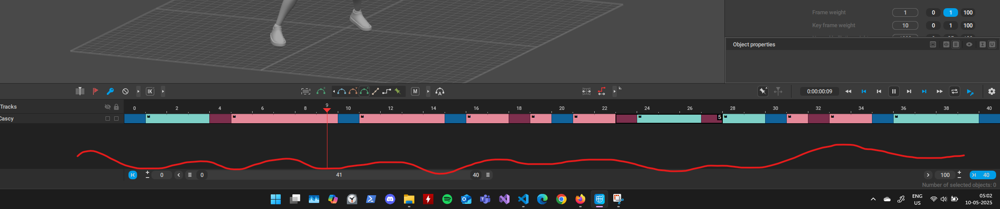

# auto physics

- 
    - move the ghost which the manipulator

## when is auto physics added

- 
- when the green dots (fulcrum moves)
  - i.e. in the orange color frames the auto physics is added

## ghost mode

- 

## smooth trajectory

for added bouncyness

- 

## bake physics

- 

## unbake

to re enable the animation keys unbake it

- 
- 