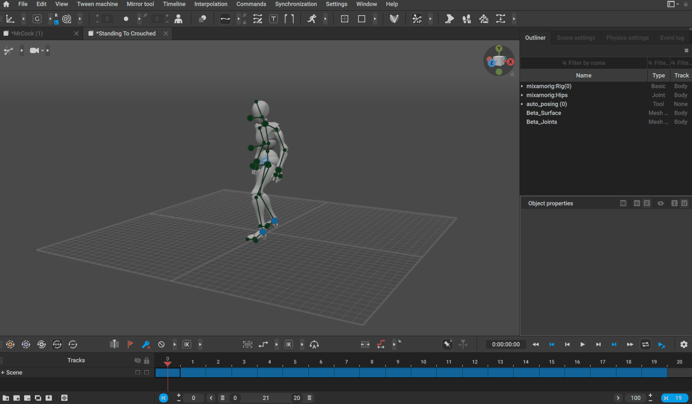
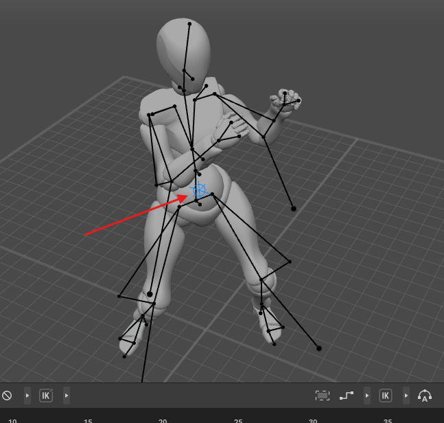
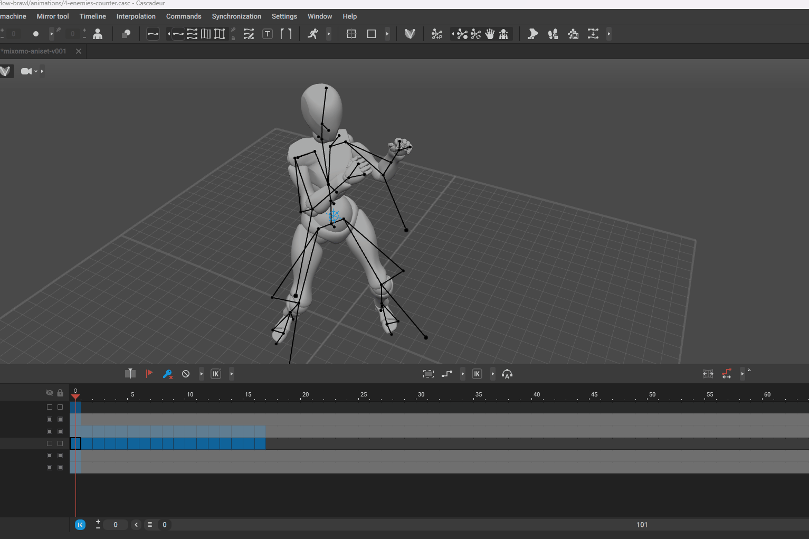
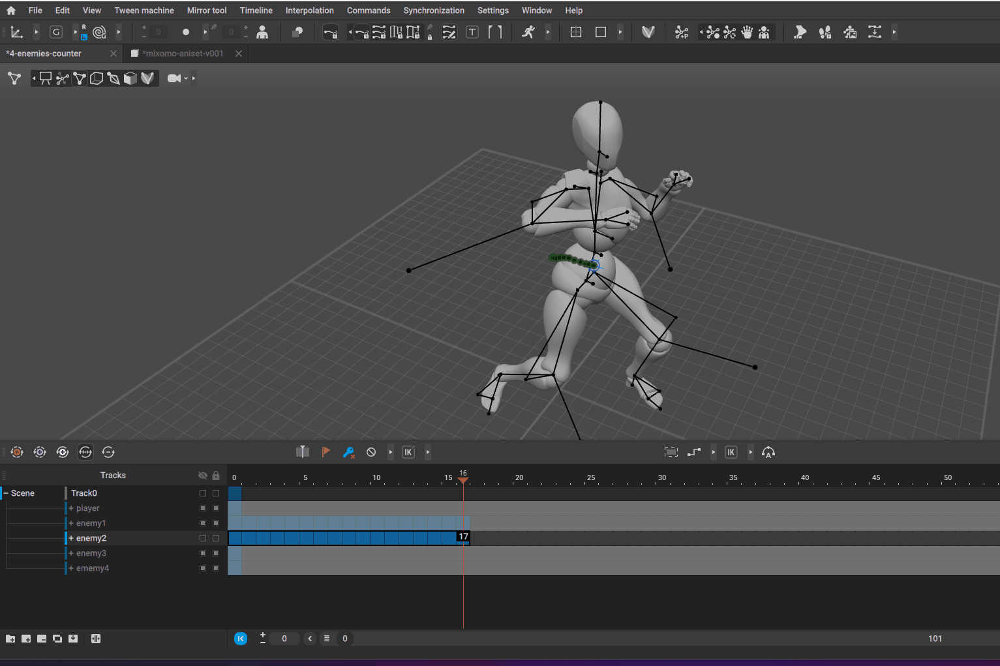
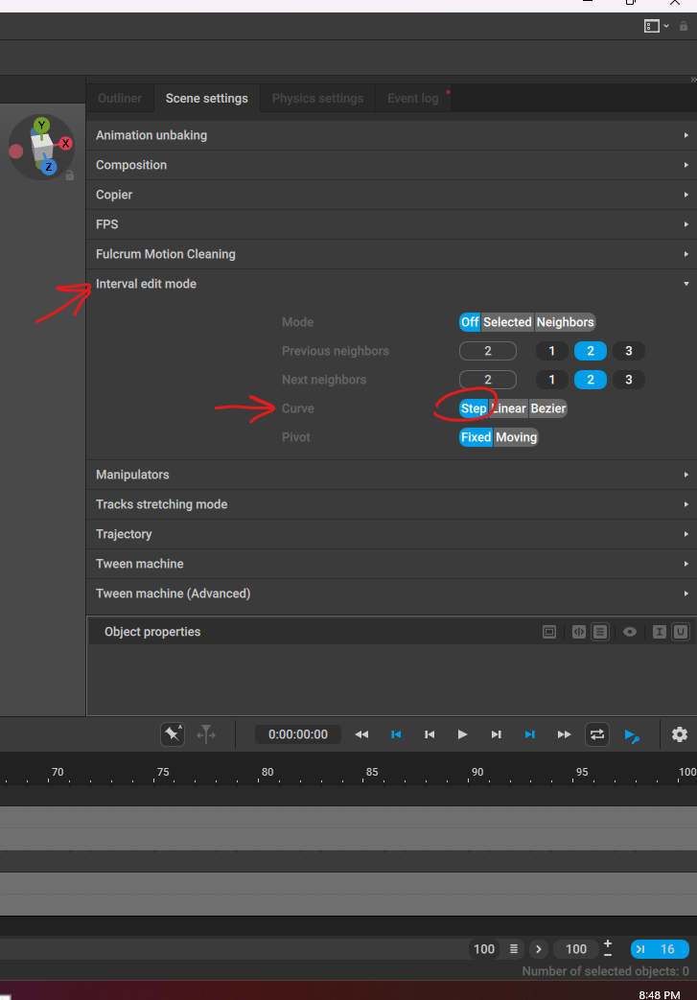
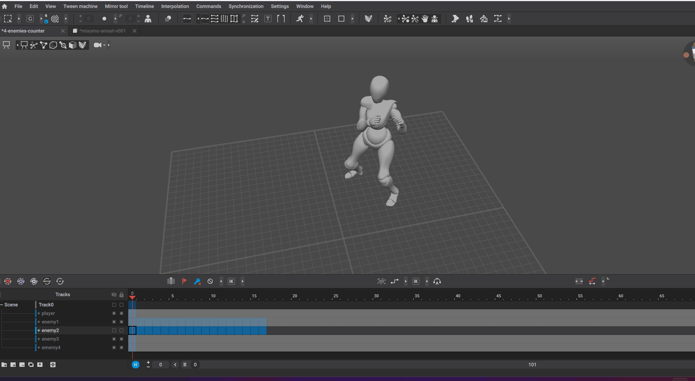

# Retarget

## copy entire animation to a different armature or rig

- first make sure both the armature are setup for auto pose
  - also the armature bones placement should be nearly same or else the retarget copy/paste will fail
- 

## move the entire model with animations

- select the root of the model
- goto "Autoposing mode" or "point control mode"
- 
- enable 'Trajectory Edit Mode'
- 
- select only the trajectory points
- 
- move using gizmo

## Rotate the entire model with animations

- make sure the 'curve' is set to step
- 
- 
- select all the points
- select all the frames
- enable rotation gizmo
- enable "Interval edit mode"
- rotate
- disable "Interval edit mode"
