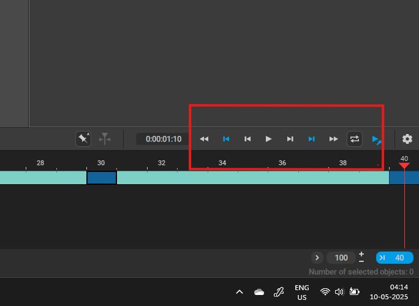
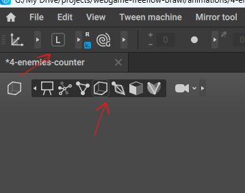
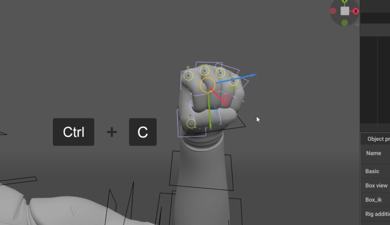
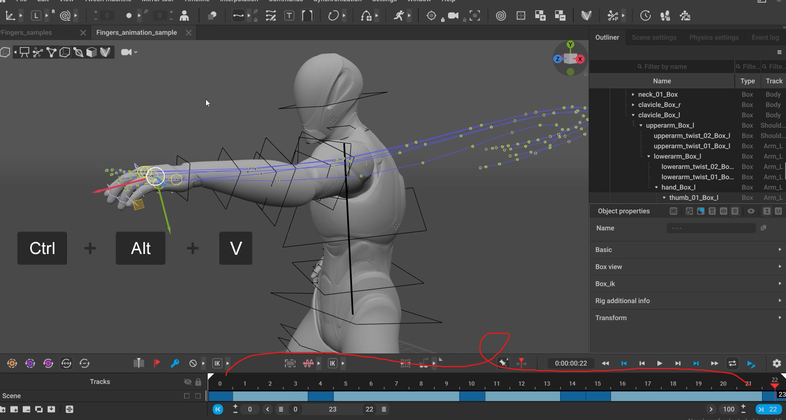

# Animations Viewport

# menu

- 

# copy by bones

- go to the "Scene" from where you want to copy the bones positions
- go to box select mode
- switch to local axes (in both the scene)
- 
- select the boxes you want to copy
- 
- ctrl + c
- go to the destination scene
- select the exact same bones (i.e. the boxes)
- select the timeline
- ctrl + alt + v
- 

**Note:** [or refer this video - 04:59 Time](https://www.youtube.com/watch?v=xr6g2-EAp5k&t=42s)
