# Cascadeur

# start - reset or new scene

- press the home button at the top left corner

# Viewport

## movement

- alt + click to rotate
- alt + middle to pan
- alt + right to zoom

## move entire mesh (without auto pose)

- 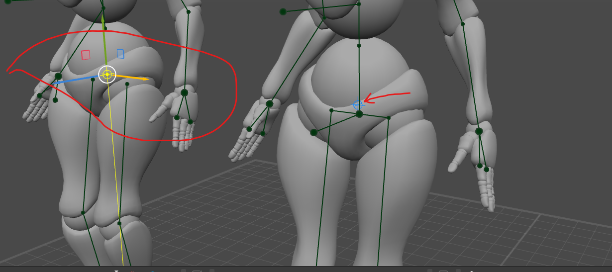
- the blue marker is the root bone, move that and it will move the entire mesh without applying the auto pose

## hide the mesh

- using the animation track, we can click on the view button
- 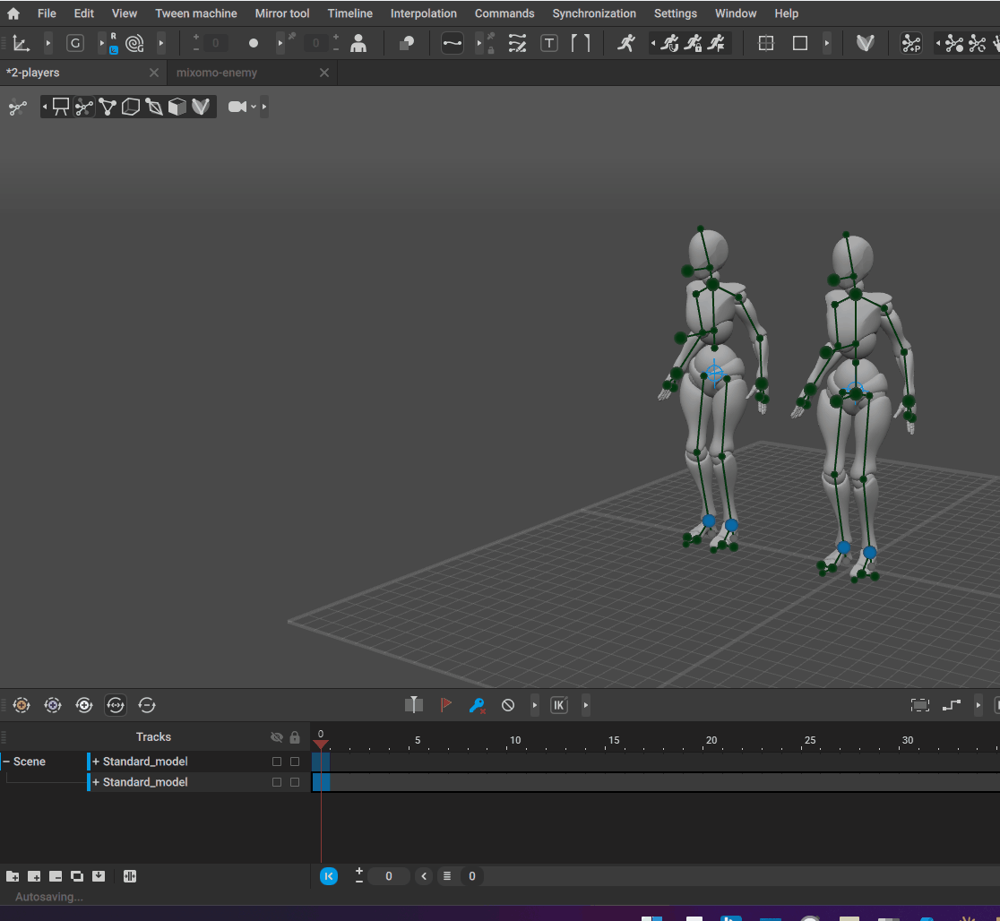

## hide the bones or control points

- v

### unhide the bones or control points

- alt + v

## No animation keyframe to mesh

- click on the lock in tracks
- 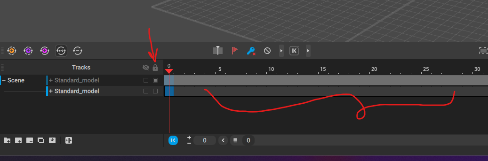

# Tracks

## rename

- right click on track name, type the name

# Manipulators (gizmo)

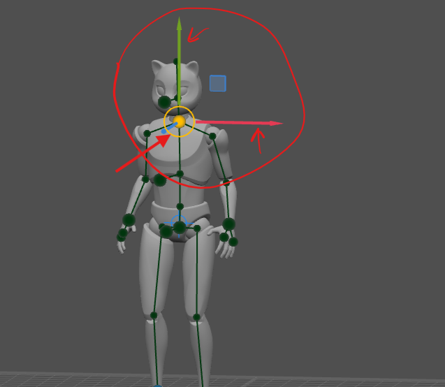

## Modes

- global or local
- 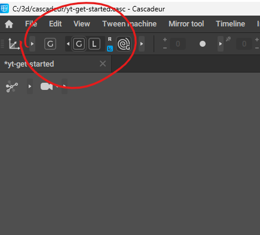
    - global for along the floor or env
    - local for rotating along the characters body parts
        - like rotating the limbs

## select

- 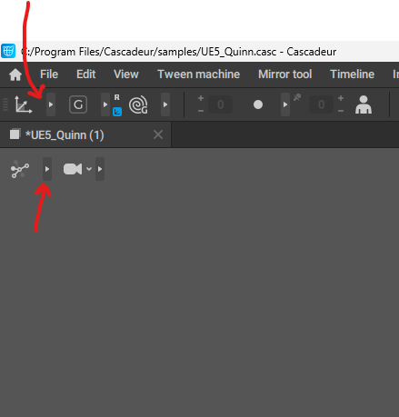
- after opening
- 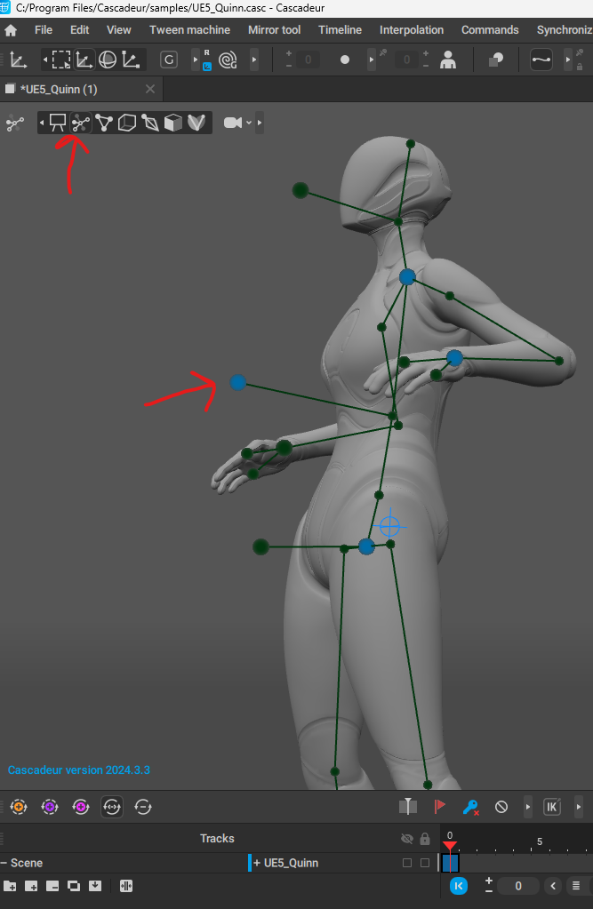
- note that select and moving the bone freezes it

### all

- 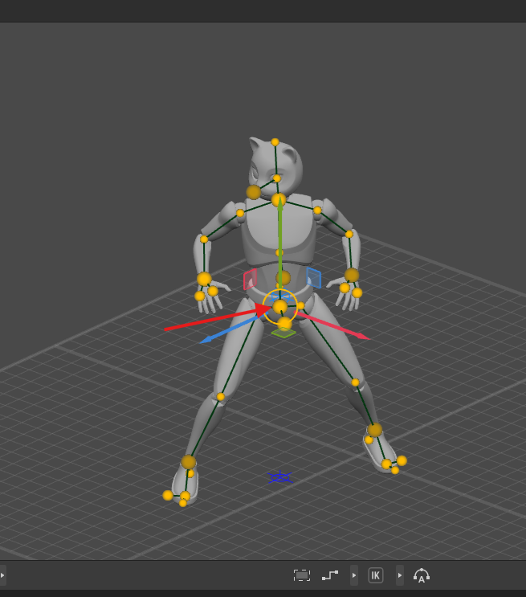
    -double click on pelvis to select all points

### unfreeze the bone

- click on the bone
- shift + z
- or click this
  - 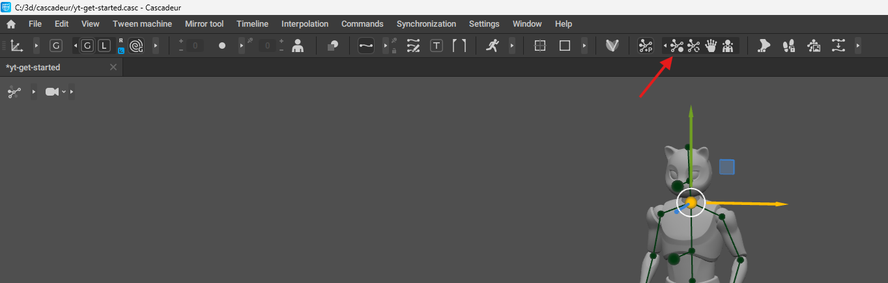

# Rigging Setup

- 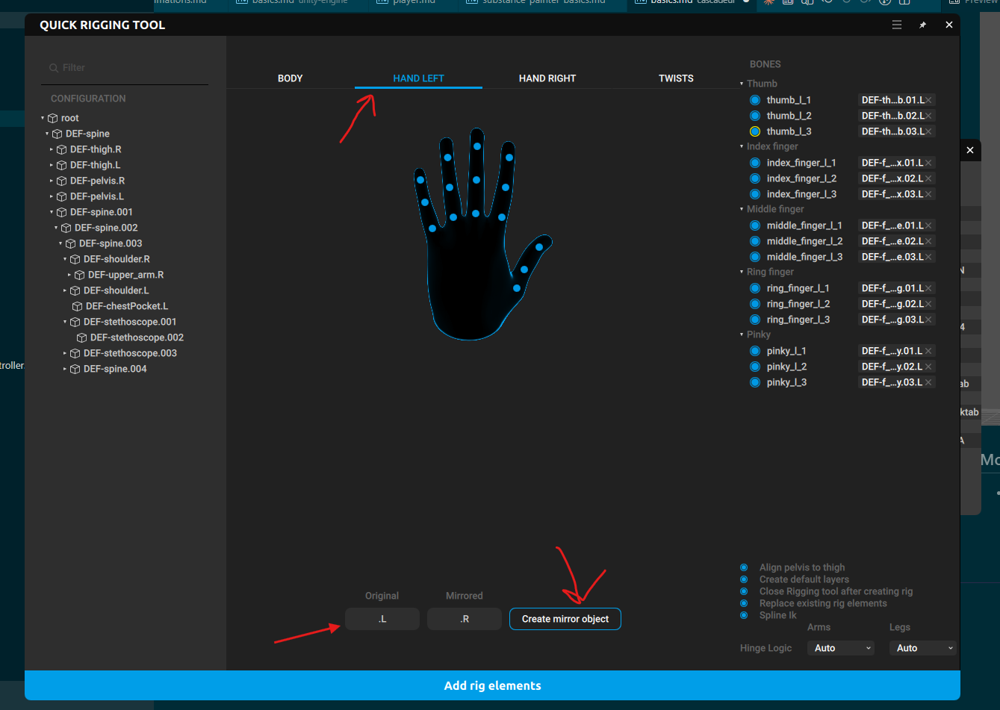
- fill the left or right side only
- then add the letters distinguishing the sides (ex .L and .R)
- so if left hand is manually filled, original is .L and mirrored is .R
- go to right hand and click on `Create Mirror object`

## enable fingers

- 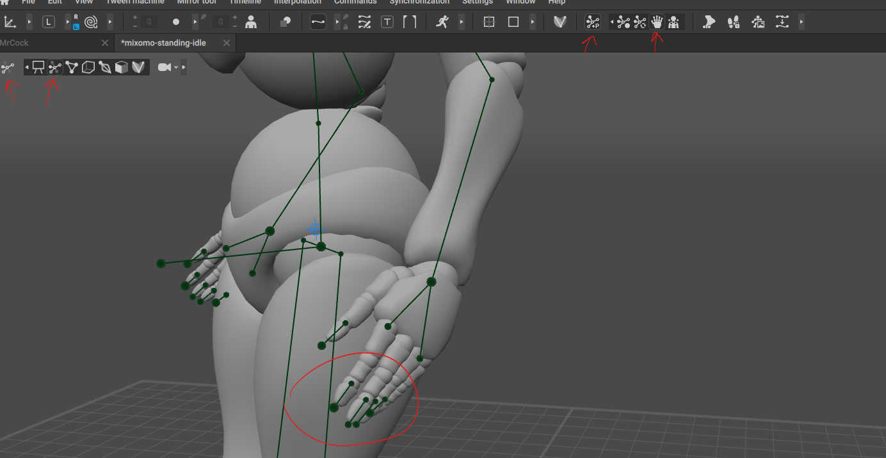

# Import

## how to import 2 rigged character in 1 scene

- first create 2 scnes with individual rigged charactor setting up the auto physics
- then import the other one into first scene
- 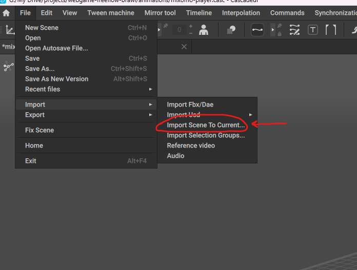
