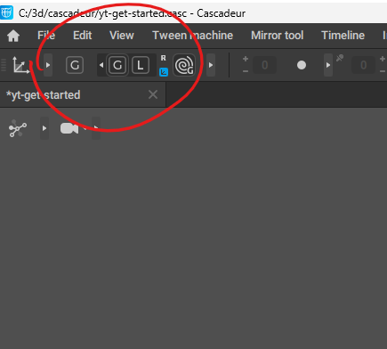
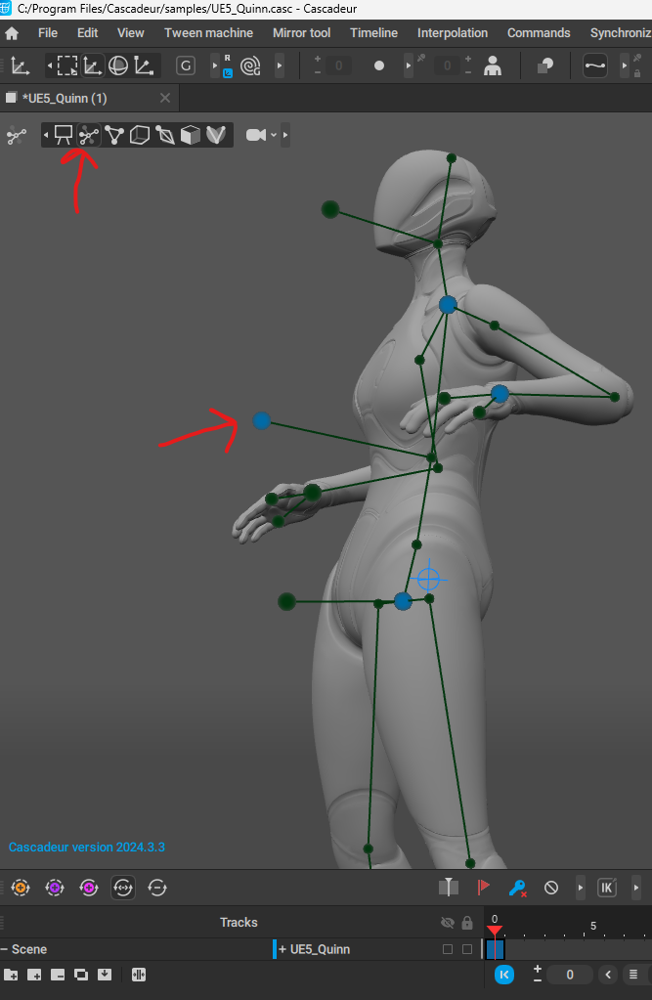

# Cascadeur

# start - reset or new scene

- press the home button at the top left corner

# Viewport

## movement

- alt + click to rotate
- alt + middle to pan
- alt + right to zoom

# Manipulators

## Modes

- global or local
- 
    - global for along the floor or env
    - local for rotating along the characters body parts
        - like rotating the limbs

## select

- 
- after opening
- 
- note that select and moving the bone freezes it

### all

- 
    -double click on pelvis to select all points

### unfreeze the bone

- click on the bone
- shift + z
- or click this
  - 
