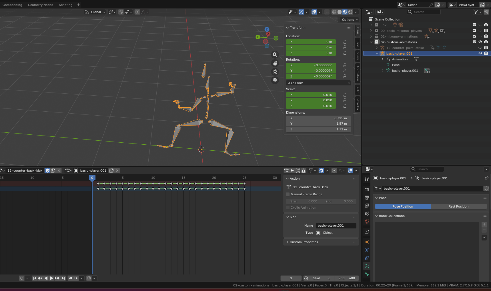
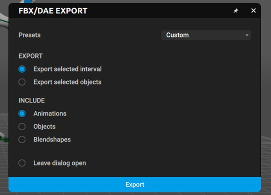
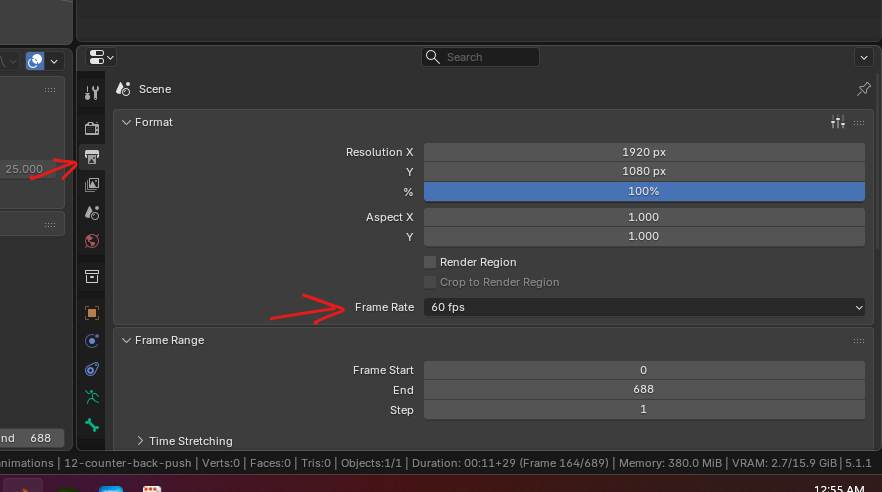
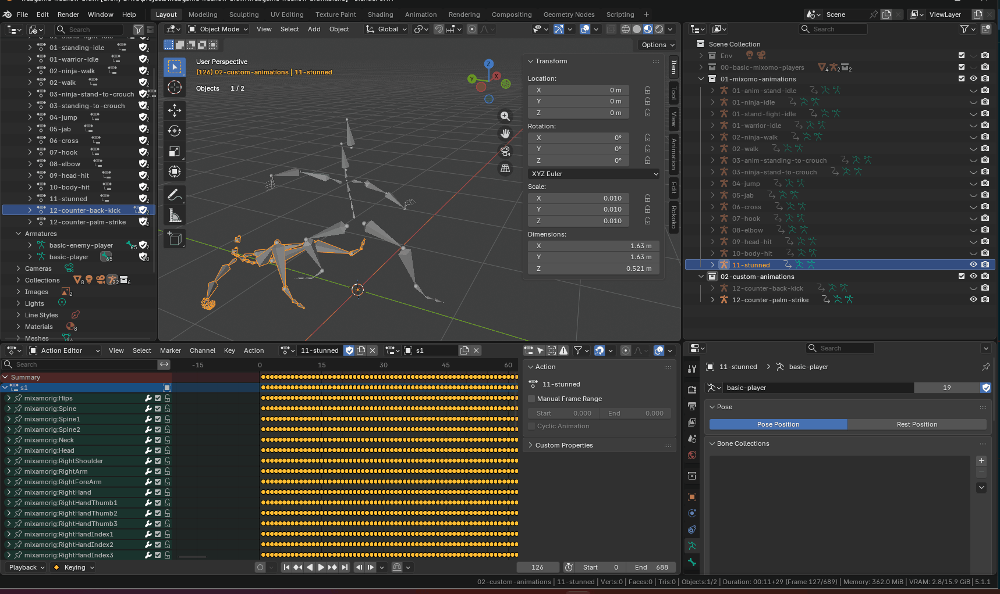

# control points snapping back

- 
- the issue is we have moved the track frame, but not added any keyframe
- as we slide the frames, add the keyframe

# Red square on some joints

- 
- this happens if u press `r`, press `r` again

# After retarget copy / paste, moving any auto pose controls snaps the entire rig

- 
- select the points
- lock the auto control points that you need with shift + z
- 
- or this button
- 

**Note:** we can also do this for all frames using "Interval Edit mode"

# Exported animation from cascuader does not match the original armature in blender

- 
- the model which was exported with a specific `Pose` and armature, when animated and reimported in blender, fails to match its original armature
- fix is always export and import with mesh
- 

# Slow speed of animations

- do NOT use uncheck `export translate animations` in cascuader, it slows down the animations
  - this [tutorial](https://youtube.com/shorts/NsT2dHwPiwI?si=AriDlxWcL4IGq-TL) recommends it, but keep it enabled
- also make sure the sampling rate in blender is 60FPS
- 

# in place or in-place animations issues

## Position of the charactor model using it is odd

- 
- delete the extra channel just below the root channel
  - in the above example its `basic-player`
