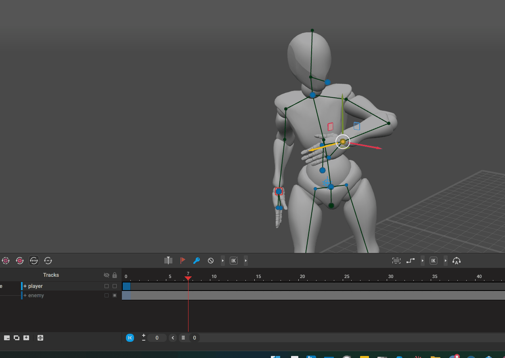
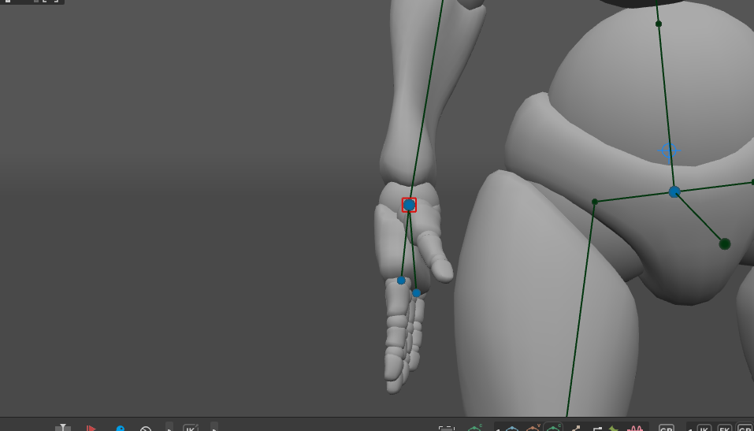
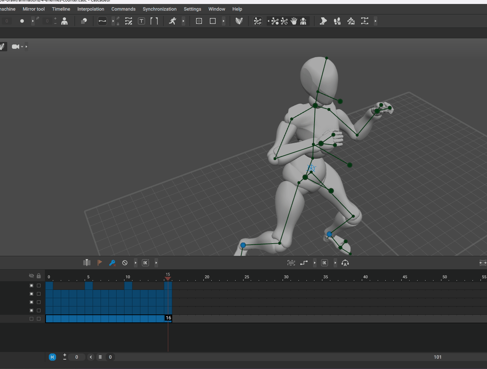
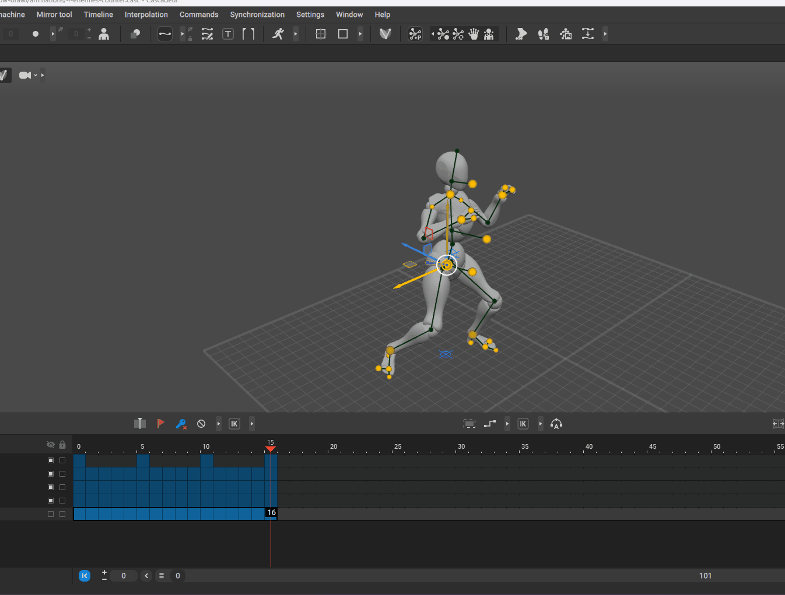
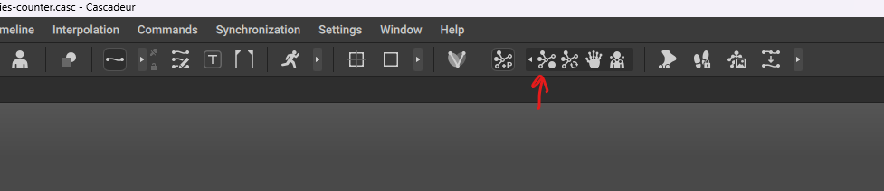

# control points snapping back

- 
- the issue is we have moved the track frame, but not added any keyframe
- as we slide the frames, add the keyframe

# Red square on some joints

- 
- this happens if u press `r`, press `r` again

# After retarget copy / paste, moving any auto pose controls snaps the entire rig

- 
- select the points
- lock the auto control points that you need with shift + z
- 
- or this button
- 

**Note:** we can also do this for all frames using "Interval Edit mode"
