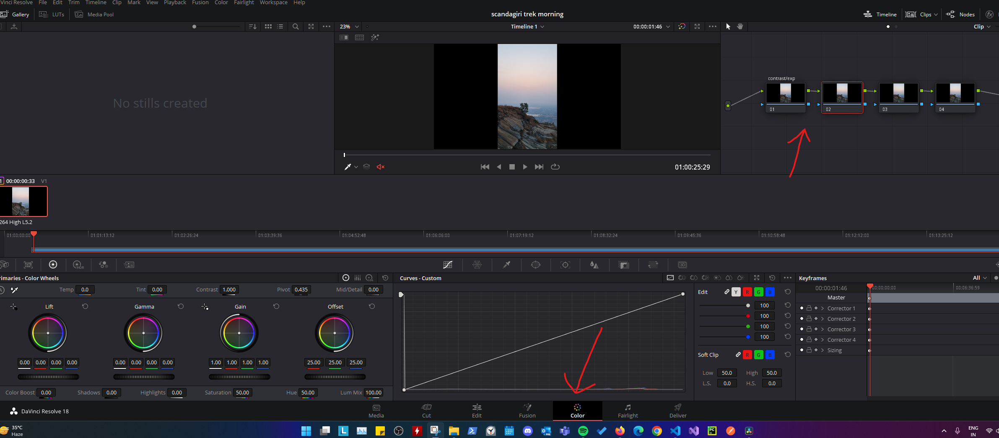
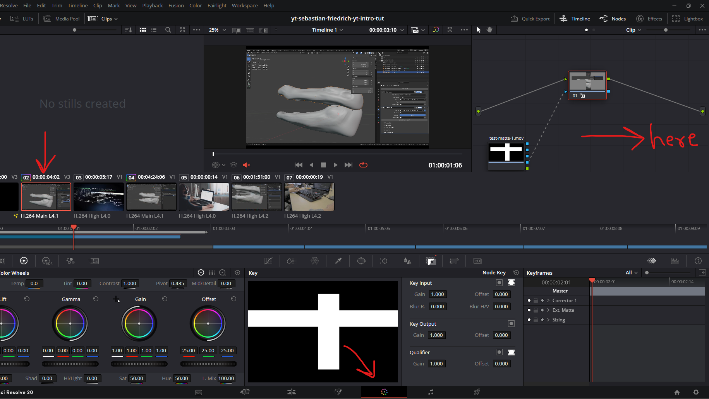
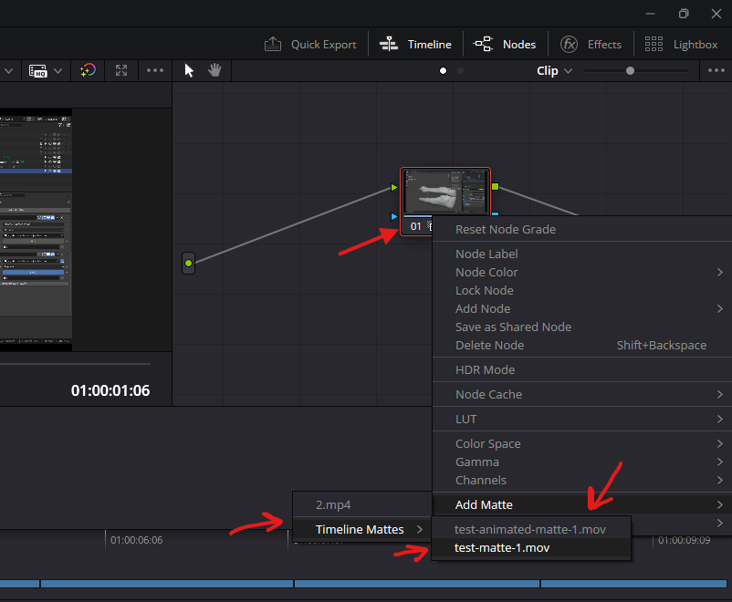
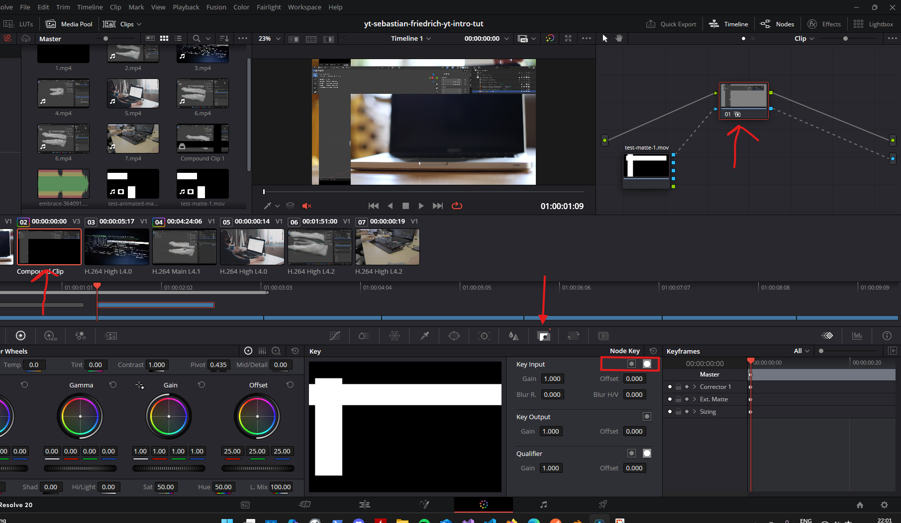
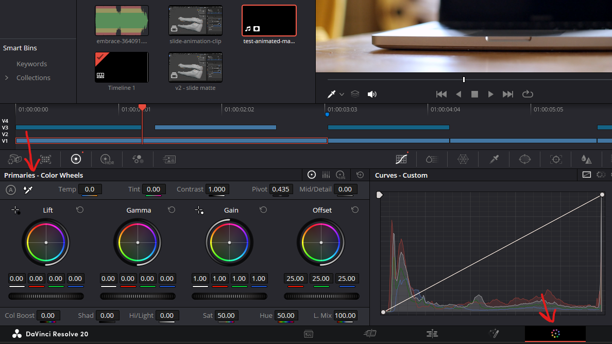
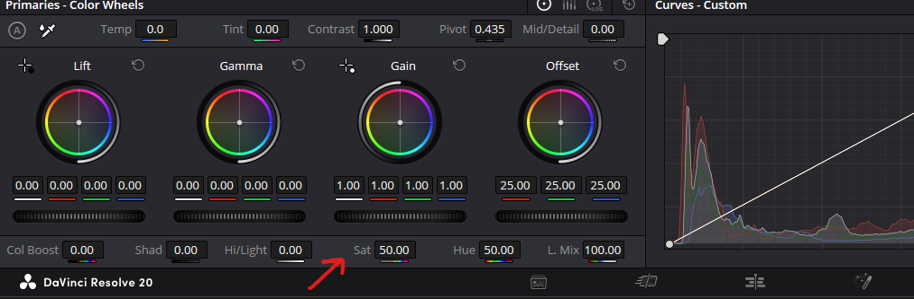
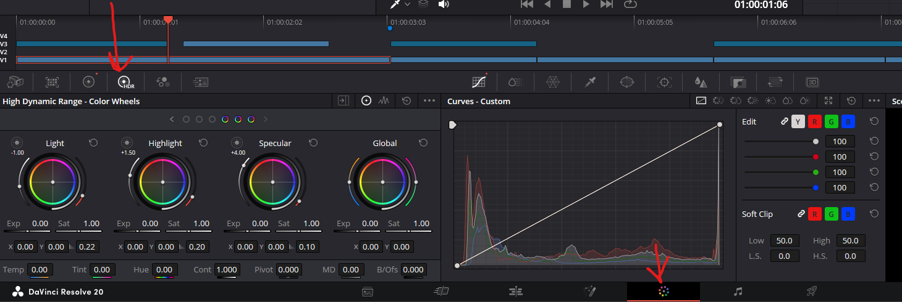
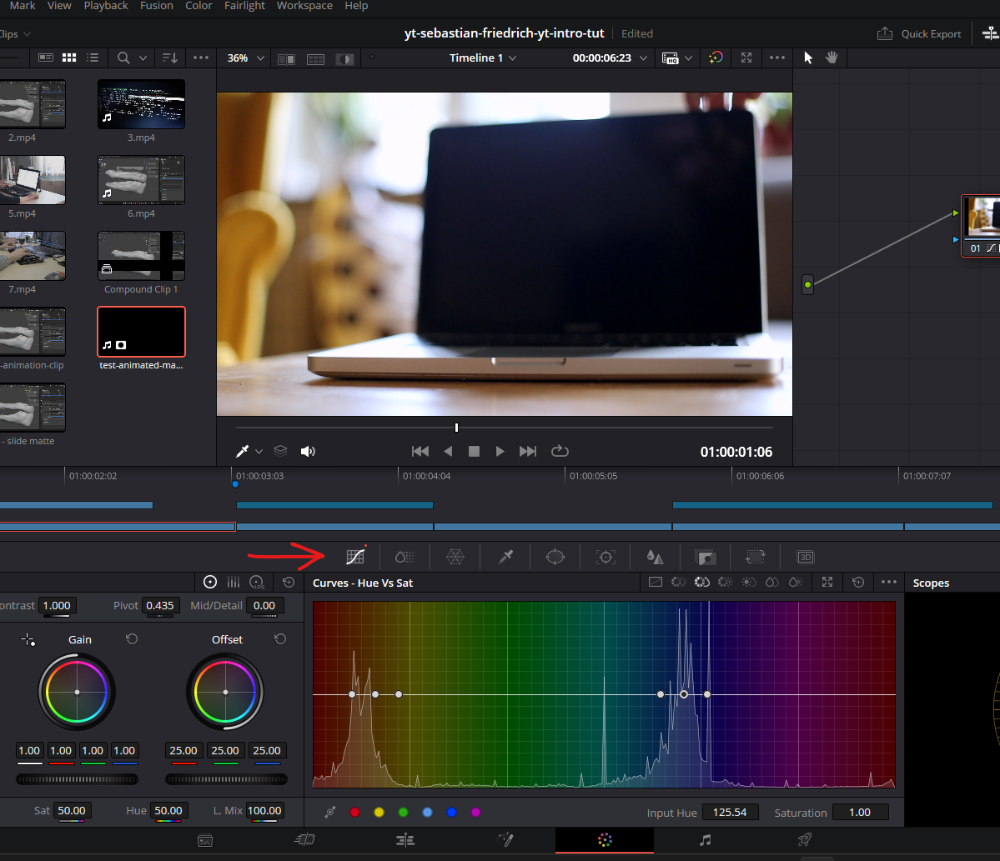
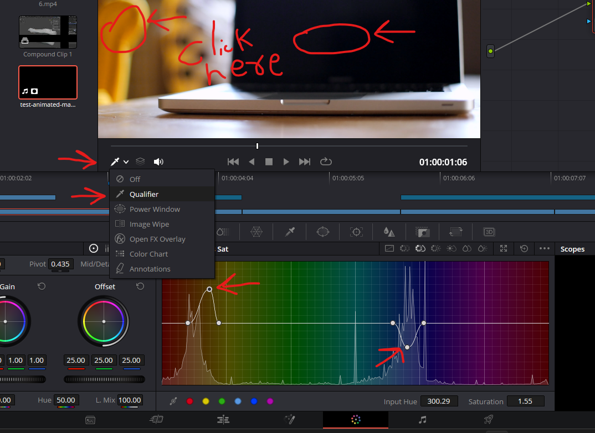

# color editor

## add node

- right click on the node
- add node
- serial node

## add alpha output to clip

- **Note:**

  - its better to group the clip as a ["New compound clip"](./edit.md#group-clips-compound), so that the matte and clip timeline are synced
  - otherwise we have to adjust the clips in Davinci edit mode

 

- 
- right click here and select "Add Alpha Output"
- a blue dot will appear below the green dot
- right click on the clip and add matte -> timeline -> `<select your matte from media pool>`
- 

## invert the matte (invert alpha)

- 
- select the video clip
- select the rectangle icon (Node key)
- click the key input icons to have desired result

## Primaries - COlor Wheels

- 

### change color

- modify the offset

### saturation

- 

## HDR

- 

### global saturation

- more aware of the scene
- 

## Color Graph

- adjust the hue, sat etc based on the colors instead of global setting
- 

### pick the color from video

- 
- the color picked from the video will be marked on the graph
- adjust the middle dot up or down for color levels

**Note:** right click on dots on the graph to remove them
